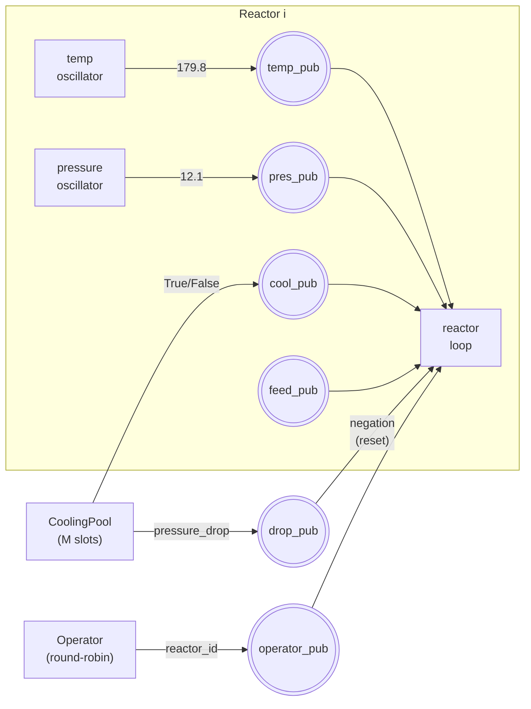
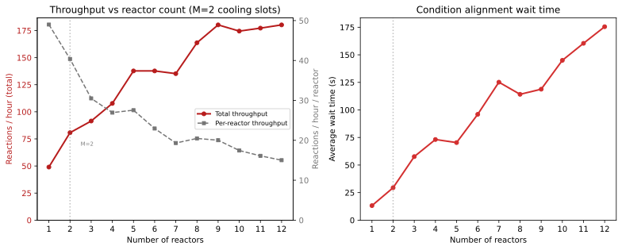
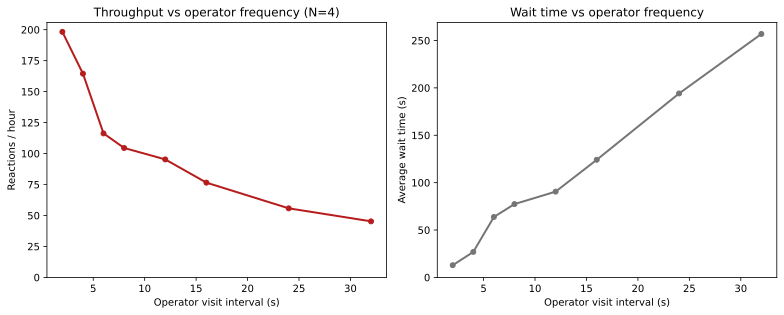

# Case Study: Batch Chemical Reactor

This case study builds a simulation of batch chemical reactors sharing
cooling-water infrastructure and a single operator.  Unlike the previous
studies that focus on queues, delays, and routing, this one is about
**concurrent condition alignment** — the reactor can only start when five
independent, asynchronous conditions are *simultaneously* true.

The full source is in
[`projects/chemical_reactor.py`](https://github.com/majvan/DSSim/blob/master/projects/chemical_reactor.py).

---

## Requirements and Problem Definition

We want to simulate **N batch reactors** sharing **M cooling-water slots**
and a single operator.  Before a reaction can start, every reactor must have
all five conditions true at the same moment:

```
           temp_pub ──┐
                      │  REEVALUATE
           pres_pub ──┤  REEVALUATE
                      │                    ┌───────────┐
           cool_pub ──┤  REEVALUATE  ──▶   │ DSCircuit │──▶  ready!
                      │                    │  (AND)    │
           feed_pub ──┤  REEVALUATE        └───────────┘
                      │                         ▲
       operator_pub ──┘  PULSED                 │
                                                │ RESET
           drop_pub ──────── negation ──────────┘
```

| Condition | Source | Signal type | Why this type |
|---|---|---|---|
| Temperature at setpoint (±5 °C) | Independent oscillator process | **REEVALUATE** | Drifts in and out of range |
| Pressure at setpoint (±0.5 bar) | Independent oscillator process | **REEVALUATE** | Drifts in and out of range |
| Cooling water allocated | Shared pool (M slots, FIFO) | **REEVALUATE** | Granted/revoked as others finish |
| Feed valve open | Position sensor confirms | **REEVALUATE** | Re-confirms periodically |
| Operator batch-release | Round-robin visits | **PULSED** | Must coincide — ignored if conditions not met |
| Cooling header pressure drop | Shared cooling pool timer | **negation** | Clears all cached states — reactor must re-verify |

Three questions drive the simulation:

1. How does total throughput scale with the number of reactors when cooling
   slots are limited?
2. How does the operator's visit frequency affect throughput?
3. What is the optimal number of reactors for a fixed number of cooling
   slots?

### Identified components

| Component | Responsibility | Endpoints |
|---|---|---|
| `CoolingPool` | FIFO allocation of M cooling-water slots; periodic pressure drop | Signals each reactor's `cooling_pub`; shared `drop_pub` |
| `Operator` | Round-robin visits, fires PULSED release command | Shared `operator_pub` |
| `Reactor` | Condition circuit, reaction execution, metrics | 4 per-reactor publishers + shared `operator_pub` + `drop_pub` |

### Why DSCircuit?

The five conditions are **genuinely independent and asynchronous** — they
arrive in unpredictable order, and some toggle on and off over time.  This
is not a sequential ceremony that collapses to a chain of `gwait()` calls.

Without DSCircuit you would need:

- manual state tracking for each condition
- manual subscription to all five publishers
- explicit re-evaluation on every event
- special handling of PULSED (edge-triggered, must not latch)

DSCircuit reduces all of that to a single declarative expression:

```python
ready = f_temp & f_pres & f_cool & f_feed & f_op & (-f_drop)
ready.set_one_shot(False)   # stays attached across reaction cycles
yield from ready.gwait()
```

The `(-f_drop)` negation adds a reset trigger: when a cooling header
pressure drop fires, all five positive filters' cached states are atomically
cleared.  The reactor must wait for every condition to re-establish from
scratch.  No other simulation framework offers this as a built-in primitive.

---

## Design Approach

Each reactor runs three concurrent processes:

1. **Temperature oscillator** — publishes actual sensor readings (°C) that
   cycle between in-range and drifted values.
2. **Pressure oscillator** — same pattern, independent timing.
3. **Reactor loop** — requests cooling, opens the feed valve, waits for
   the DSCircuit to fire, runs the reaction, releases cooling.

The operator is a separate process that visits each reactor in round-robin
order, sending the reactor's ID on a shared `operator_pub`.



---

## Component 1 — CoolingPool

The cooling pool is a FIFO allocator that also generates periodic transient
pressure drops on the shared cooling header:

```python
class CoolingPool:
    """Manages M cooling-water slots among N reactors (FIFO allocation)."""

    def __init__(self, sim, slots, drop_interval=1800, drop_jitter=0.3):
        self.sim = sim
        self.available = slots
        self._waiting = []
        self._allocated = []
        self.drop_pub = DSPub(name='cooling.drop', sim=sim)
        self.drop_interval = drop_interval
        self.drop_jitter = drop_jitter

    def start(self):
        self.sim.schedule(0, self._drop_timer())

    def _drop_timer(self):
        """Periodic transient pressure drop on the cooling header."""
        while True:
            jitter = uniform(-self.drop_jitter, self.drop_jitter)
            yield from self.sim.gwait(self.drop_interval * (1 + jitter))
            self.drop_pub.signal('pressure_drop')
            # Pressure recovers — re-confirm cooling to allocated reactors
            yield from self.sim.gwait(uniform(5, 15))
            for reactor in self._allocated:
                reactor.cooling_pub.signal(True)

    def request(self, reactor):
        if self.available > 0:
            self.available -= 1
            self._allocated.append(reactor)
            reactor.cooling_pub.signal(True)
        else:
            self._waiting.append(reactor)

    def release(self, reactor):
        if reactor not in self._allocated:
            return
        self._allocated.remove(reactor)
        reactor.cooling_pub.signal(False)
        if self._waiting:
            next_r = self._waiting.pop(0)
            self._allocated.append(next_r)
            next_r.cooling_pub.signal(True)
        else:
            self.available += 1
```

The pool manages two publishers: each reactor's `cooling_pub` (True/False
for slot allocation) and the shared `drop_pub` that fires when the cooling
header suffers a transient pressure loss.  After the drop, pressure recovers
and the pool re-confirms cooling to all allocated reactors.

---

## Component 2 — Operator

The operator visits each reactor in round-robin order. The published event
is the **reactor ID**, so each reactor's PULSED filter ignores visits
intended for other reactors:

```python
class Operator:
    """Single operator cycling through reactors."""

    def __init__(self, sim, reactors, operator_pub, interval=8):
        self.sim = sim
        self.reactors = reactors
        self.operator_pub = operator_pub
        self.interval = interval

    def start(self):
        self.sim.schedule(0, self._round_robin())

    def _round_robin(self):
        idx = 0
        while True:
            yield from self.sim.gwait(self.interval)
            reactor = self.reactors[idx]
            self.operator_pub.signal(reactor.reactor_id)
            idx = (idx + 1) % len(self.reactors)
```

All reactors share the same `operator_pub`.  With **source scoping**, the
operator event only reaches each reactor's `f_op` filter — it never
contaminates the temperature or pressure filters despite travelling through
the same circuit.

---

## Component 3 — Reactor

The reactor is the centrepiece. Its `__init__` creates four per-reactor
publishers plus references the shared `operator_pub`:

```python
class Reactor(DSComponent):

    def __init__(self, reactor_id, cooling_pool, operator_pub, ...):
        super().__init__(**kwargs)
        self.reactor_id = reactor_id
        self.cooling_pool = cooling_pool
        self.operator_pub = operator_pub

        # Per-reactor publishers (independent signal sources)
        self.temp_pub = DSPub(name=f'{self.name}.temp', sim=self.sim)
        self.pres_pub = DSPub(name=f'{self.name}.pres', sim=self.sim)
        self.cooling_pub = DSPub(name=f'{self.name}.cooling', sim=self.sim)
        self.feed_pub = DSPub(name=f'{self.name}.feed', sim=self.sim)

        self.reactions_completed = 0
        self.total_wait_time = 0.0
```

### Temperature and pressure oscillators

Each oscillator publishes **actual sensor readings** (float values) that
alternate between in-range and drifted:

```python
def _temp_oscillator(self):
    sp, tol = self.temp_setpoint, self.temp_tolerance
    while True:
        # In range — reading within tolerance
        self.temp_pub.signal(sp + uniform(-tol * 0.5, tol * 0.5))
        yield from self.sim.gwait(uniform(15, 25))
        # Drifted — reading outside tolerance
        self.temp_pub.signal(sp + tol * uniform(1.5, 3.0))
        yield from self.sim.gwait(uniform(8, 15))
```

The filter does not see True/False — it sees `179.8` or `192.3`.  The
**range check lives in the condition**, not in the oscillator:

```python
f_temp = self.sim.filter(
    cond=lambda e, s=sp_t, t=tol_t: abs(e - s) <= t,
    sigtype=REEVALUATE,
    eps=[self.temp_pub],
)
```

### Building the DSCircuit

The circuit and its filters are created **once** during `start()`, with
`one_shot=False` so they stay attached across reaction cycles.  Because
every filter uses REEVALUATE (or PULSED for the operator), its state
naturally tracks the live condition — there is no need to recreate or
reset filters between iterations:

```python
def _build_circuit(self):
    sp_t, tol_t = self.temp_setpoint, self.temp_tolerance
    sp_p, tol_p = self.pres_setpoint, self.pres_tolerance

    self.f_temp = self.sim.filter(
        cond=lambda e, s=sp_t, t=tol_t: abs(e - s) <= t,
        sigtype=REEVALUATE, eps=[self.temp_pub],
    )
    self.f_pres = self.sim.filter(
        cond=lambda e, s=sp_p, t=tol_p: abs(e - s) <= t,
        sigtype=REEVALUATE, eps=[self.pres_pub],
    )
    self.f_cool = self.sim.filter(sigtype=REEVALUATE, eps=[self.cooling_pub])
    self.f_feed = self.sim.filter(sigtype=REEVALUATE, eps=[self.feed_pub])
    self.f_op   = self.sim.filter(
        cond=lambda e, rid=self.reactor_id: e == rid,
        sigtype=PULSED, eps=[self.operator_pub],
    )
    self.f_drop = self.sim.filter(eps=[self.drop_pub])

    self.ready = (self.f_temp & self.f_pres & self.f_cool
                  & self.f_feed & self.f_op & (-self.f_drop))
    self.ready.set_one_shot(False)
```

The reactor loop is then just a `gwait()` call per cycle:

```python
def _reactor_loop(self):
    while True:
        t0 = self.sim.time
        self.cooling_pool.request(self)
        feed_proc = self.sim.schedule(0, self._open_feed_valve())

        result = yield from self.ready.gwait()
        # result is a dict mapping each filter to the event that satisfied it:
        # {f_temp: 179.8, f_pres: 12.1, f_cool: True, f_feed: True, f_op: 3}

        if not feed_proc.finished():
            feed_proc.abort()

        rx_time = uniform(*self.reaction_time)
        yield from self.sim.gwait(rx_time)
        self.reactions_completed += 1
        self.cooling_pool.release(self)
```

The `gwait()` return value is a dict mapping each filter to the **actual
event** that satisfied it — the raw sensor reading, not just True/False.
This means you can log the exact temperature and pressure at the moment
the circuit fired, without maintaining separate state variables.

Each filter's `eps` parameter binds it to a specific set of **endpoints**
(publishers).  When `temp_pub` signals a reading, only `f_temp` receives
it and re-evaluates — `f_pres`, `f_cool`, `f_feed`, and `f_op` are not
subscribed to `temp_pub` and keep their cached state.

This is source scoping: the filter itself attaches to its publishers, not
the circuit.  Events from one publisher never reach filters bound to a
different publisher.

---

## How the signal types work together

Consider a scenario with a single reactor during one cycle:

| Time | Event | f_temp | f_pres | f_cool | f_feed | f_op | Circuit |
|---:|---|:---:|:---:|:---:|:---:|:---:|---|
| 0.0 | Cooling allocated | — | — | **T** | — | — | waiting |
| 1.2 | Feed valve confirms | — | — | T | **T** | — | waiting |
| 2.1 | Temp 179.8 °C (in range) | **T** | — | T | T | — | waiting |
| 5.4 | Pressure 12.1 bar (in range) | T | **T** | T | T | — | waiting |
| 8.0 | Operator visits — **PULSED** | T | T | T | T | **T** | **fired!** |

### PULSED: operator pulse wasted by temperature drift

| Time | Event | f_temp | f_pres | f_cool | f_feed | f_op | Circuit |
|---:|---|:---:|:---:|:---:|:---:|:---:|---|
| 2.1 | Temp 179.8 °C | **T** | — | T | T | — | waiting |
| 5.4 | Pressure 12.1 bar | T | **T** | T | T | — | waiting |
| 7.0 | Temp 192.3 °C (drifted!) | **F** | T | T | T | — | waiting |
| 8.0 | Operator visits | F | T | T | T | T | **not fired** — pulse wasted |
| 11.3 | Temp 180.2 °C (recovered) | **T** | T | T | T | — | waiting |
| 16.0 | Operator visits again | T | T | T | T | **T** | **fired!** |

The PULSED operator signal at t=8 was ignored because temperature had
drifted.  The operator's next visit at t=16 coincided with all conditions
being green.  This is the core mechanism that makes PULSED different from
LATCH — the signal does not latch.

### REEVALUATE vs LATCH: drift detection

What if temperature used **LATCH** instead of REEVALUATE?  The filter
latches after the first match and never flips back:

| Time | Event | f_temp (LATCH) | f_pres | f_cool | f_feed | f_op | Circuit |
|---:|---|:---:|:---:|:---:|:---:|:---:|---|
| 2.1 | Temp 179.8 °C | **T** (latched) | — | T | T | — | waiting |
| 5.4 | Pressure 12.1 bar | T | **T** | T | T | — | waiting |
| 7.0 | Temp 192.3 °C (drifted!) | T (still latched!) | T | T | T | — | waiting |
| 8.0 | Operator visits | T | T | T | T | **T** | **fired — BUG!** |

With LATCH the circuit fires at t=8 even though the actual temperature is
192.3 °C — well outside tolerance.  REEVALUATE prevents this by
re-evaluating the condition on every new reading.

### Negation: cooling pressure drop resets the circuit

Now consider a pressure drop on the cooling header while the reactor is
waiting for conditions to align:

| Time | Event | f_temp | f_pres | f_cool | f_feed | f_op | Circuit |
|---:|---|:---:|:---:|:---:|:---:|:---:|---|
| 2.1 | Temp 179.8 °C | **T** | — | T | T | — | waiting |
| 5.4 | Pressure 12.1 bar | T | **T** | T | T | — | waiting |
| 6.0 | **Cooling pressure drop!** | **—** | **—** | **—** | **—** | — | **all cleared** |
| 11.0 | Cooling re-confirmed | — | — | **T** | — | — | waiting |
| 12.3 | Feed valve re-confirms | — | — | T | **T** | — | waiting |
| 14.1 | Temp 180.1 °C | **T** | — | T | T | — | waiting |
| 17.8 | Pressure 11.9 bar | T | **T** | T | T | — | waiting |
| 24.0 | Operator visits | T | T | T | T | **T** | **fired!** |

At t=6 the negated `(-f_drop)` fires, atomically clearing all five positive
filters.  The reactor must wait for every condition to re-establish from
scratch — cooling recovery at t=11, feed valve re-confirmation at t=12.3,
fresh sensor readings, and finally a new operator visit at t=24.

This is the feature that no other simulation framework offers as a
built-in primitive.  In salabim you would need to manually set each of the
five State objects back to False from an external callback.  In SimPy it
would require recreating all one-shot events.

---

## Running the simulation

```python
from projects.chemical_reactor import run_simulation

r = run_simulation(n_reactors=4, cooling_slots=2)
print(f"Completed: {r['total_completed']}")
print(f"Throughput: {r['throughput_per_hour']:.1f} reactions/hour")
print(f"Avg wait: {r['avg_wait_time']:.1f} s")
```

---

## Reading the results

### Reactor scaling

Sweeping the number of reactors from 1 to 12 with 2 cooling-water slots
reveals the contention tradeoff:



**Left panel — throughput:** Total throughput grows sub-linearly and
saturates.  Per-reactor throughput drops steadily because reactors queue for
cooling, and while they wait, temperature and pressure drift — so conditions
must re-align after each allocation.

**Right panel — wait time:** The average time a reactor spends waiting for
all five conditions to align grows from ~12 s with one reactor to ~176 s
with twelve.  Beyond N = M (the grey line), every additional reactor
increases contention without proportionally increasing output.

### Operator frequency sensitivity

Fixing N = 4 and sweeping the operator's visit interval from 2 s to 32 s
shows how the PULSED trigger dominates throughput:



With frequent visits (2 s interval) the operator catches nearly every green
window — throughput is ~196 reactions/hour.  At 32 s intervals most green
windows are missed and throughput drops to ~51/hour.  This confirms that the
operator's **PULSED timing genuinely matters** and cannot be replaced with a
latching (LATCH) signal.

---

## Comparison with other simulation frameworks

### Why not SimPy?

SimPy's events are **one-shot** — once triggered, they stay triggered
forever.  There is no REEVALUATE or PULSED concept.  `AllOf` / `AnyOf` only
work with one-shot events.  For toggling conditions, the only option is a
**polling loop**:

```python
# SimPy — manual state machine
def _reactor_loop(self):
    while True:
        req = self.cooling_pool.request()
        yield req                           # blocking resource
        self.has_cooling = True

        yield self.env.timeout(uniform(1, 3))
        self.feed_open = True

        # No way to "wait until boolean over changing state is true".
        # Must register with operator and poll.
        ready = False
        while not ready:
            visit = self.env.event()
            self.operator.register(self.reactor_id, visit)
            yield visit                     # wait for operator
            if (self._temp_ok() and self._pres_ok()
                    and self.has_cooling and self.feed_open):
                ready = True
            # else: pulse wasted, wait for next visit
```

The temperature and pressure state is checked by polling `self.temp_reading`
— a shared mutable field written by the oscillator process.  There is no
event when the condition crosses the threshold; the reactor only discovers it
when the operator visits.

### Why not salabim?

Salabim has `sim.State` and `Component.wait((s1, v1), (s2, v2), all=True)`,
which is closer — waiters are re-checked whenever any monitored state
changes.  But two gaps remain:

```python
# salabim — boolean States, PULSED as set/reset hack
class Reactor(sim.Component):
    def process(self):
        yield self.request(self.cooling_pool)
        self.cool_state.set(True)

        yield self.hold(sim.Uniform(1, 3)())
        self.feed_state.set(True)

        yield self.wait(
            (self.temp_state, True),
            (self.pres_state, True),
            (self.cool_state, True),
            (self.feed_state, True),
            (self.op_state, True),
            all=True,
        )
```

1. **Condition logic is split:** The oscillator decides True/False and sets a
   boolean State.  The `abs(reading - setpoint) <= tolerance` filter is
   buried inside the oscillator, far from the `wait()`.  In DSSim, the
   condition lambda lives next to the circuit.

2. **PULSED is a hack:** The operator must call `op_state.set(True)` then
   immediately `op_state.set(False)`, relying on salabim's internal
   evaluation order to fire the waiting component between the two calls.
   In DSSim, `PULSED` is a first-class `SignalType`.

3. **Actual values are lost:** States hold only True/False.  If you later
   want to log what the temperature *was* when the circuit fired, you need a
   separate variable.  In DSSim the `gwait()` return value is a dict of
   `{filter: event}` — e.g. `{f_temp: 179.8, f_pres: 12.1, ...}`.

### Summary

| Capability | DSSim (DSCircuit) | SimPy | salabim |
|---|---|---|---|
| AND of independent toggling conditions | `f1 & f2 & f3 & f4 & f5` | Polling loop | `wait(all=True)` |
| REEVALUATE (level-sensitive) | Built-in `SignalType` | Shared mutable state | `State` value changes |
| PULSED (edge-triggered, no latch) | Built-in `SignalType` | Manual event + check | `set(True); set(False)` hack |
| Negation / atomic reset | `& (-f_drop)` — one expression | Recreate all events | Manually set each State to False |
| Condition co-location | Lambda in `filter(..., eps=[...])`, next to circuit | Split across oscillator | Split across oscillator |
| Actual event values on fire | `gwait()` returns `{filter: event}` dict | Manual | Manual |
| Source scoping | Direct via filter `eps` binding | N/A (manual callbacks) | N/A |

!!! tip "Try it"
    Run the simulation directly:

    ```
    python projects/chemical_reactor.py
    ```

