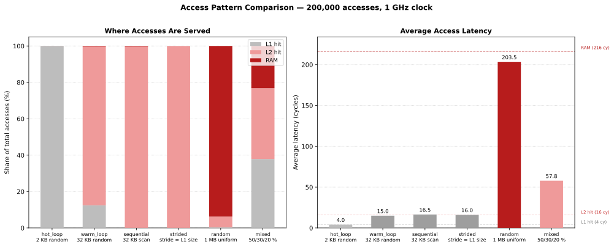
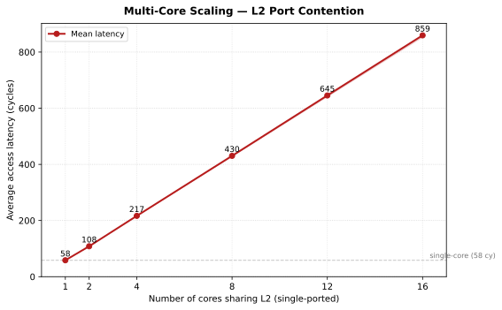

# Case Study: CPU Memory Hierarchy

This case study builds a simulation of a CPU core accessing data through a
three-level memory hierarchy. It follows the same design approach as the
Traffic Light study: define requirements, build and test each component in
isolation, then integrate everything.

The full source is in
[`projects/cpu_cache_lite.py`](https://github.com/majvan/DSSim/blob/master/projects/cpu_cache_lite.py).

---

## Requirements and Problem Definition

We want to simulate a **CPU core issuing read requests** and measure the
resulting access-latency distribution across a realistic memory hierarchy.

```
CPU core
  │
  ▼  4 cycles (hit)
┌──────────────────────────────┐
│  L1 Cache  (4 KB)            │  direct-mapped, 64 lines × 64 B
└──────────────────────────────┘
  │ miss  (+12 cycles)
  ▼
┌──────────────────────────────┐
│  L2 Cache  (64 KB)           │  4-way set-associative, LRU, 256 sets × 4 ways × 64 B
└──────────────────────────────┘
  │ miss  (+200 cycles)
  ▼
┌──────────────────────────────┐
│  RAM                         │  unbounded, always available
└──────────────────────────────┘
```

Latencies are **additive** along the miss path:

| Outcome | Total cycles |
|---|---:|
| L1 hit | 4 |
| L2 hit (L1 miss) | 4 + 12 = 16 |
| RAM fetch (both miss) | 4 + 12 + 200 = 216 |

### Identified components

| Component | Responsibility |
|---|---|
| `L1Cache` | Direct-mapped lookup; on miss delegates to `L2Cache` |
| `L2Cache` | 4-way set-associative lookup with LRU; on miss fetches from RAM |
| `RAM` | Access counter, no logic needed |
| CPU process | Drives the workload; records per-request latency |

### Workload

| Tier | Weight | Address range | Expected behaviour |
|---|---:|---|---|
| Hot | 50 % | 0 – 2 KB | Fits in L1 after warm-up |
| Warm | 30 % | 0 – 32 KB | Fits in L2, conflicts in L1 |
| Cold | 20 % | 0 – 1 MB | Mostly RAM misses |

---

## Design Approach

The memory hierarchy is a **synchronous, call-stack-shaped** access pattern:
the CPU issues one request, waits for the answer, then issues the next.
L1 checks its tags; on a miss it asks L2; L2 checks its tags; on a miss it
fetches from RAM. Control returns back up the chain and the CPU resumes.

Two DSSim styles could model this. It is worth understanding why the simpler
one was chosen.

### Why not publishers, subscribers, and DSDelay blocks?

The crossroad study uses publishers and subscribers because its events are
**asynchronous and fan-out**: one traffic light state change wakes up many
waiting vehicles, and a vehicle can be routed to any of four output arms.
Publishers and routing tiers are the right tool for that.

A cache hierarchy has neither of those properties:

- **No fan-out.** A request from the CPU always goes to exactly one next level
  — L1, then L2, then RAM. No routing, no tier selection.
- **No concurrency between request and response.** The CPU does not do anything
  else while waiting for its data. There is no producer and consumer running in
  parallel; there is only one actor descending a call stack.
- **Tight latency coupling.** The total access time is the sum of per-level
  delays along the miss path. With publisher/delay blocks you would need a
  request publisher, a response publisher, and a DSDelay at each tier boundary
  — six objects for two boundaries — and the latency calculation would be
  implicit in the timing rather than visible in the code.

### The generator chain

Instead, each cache level exposes an `access(addr, next_level)` generator.
`yield from` chains them together so the call stack mirrors the hardware:

```python
# CPU suspends here until L1 (and potentially L2 and RAM) have all completed
yield from l1.access(addr, l2)
```

Inside `l1.access`:

```python
yield from self.sim.gsleep(L1_CYCLES * CYCLE)   # model L1 lookup time
if self.lookup(addr):
    self.hits += 1
else:
    self.misses += 1
    yield from l2.access(addr, self)             # descend to L2
```

The total simulated time that elapses between the two `sim.time` readings in
the CPU is exactly the sum of all `gsleep` calls along the miss path — no
manual latency arithmetic needed. The code structure and the timing model are
the same thing.

---

## Component 1 — L1 Cache

The L1 cache is **direct-mapped**: each 64-byte block maps to exactly one slot.
The slot index is `block_number % 64`. A tag collision evicts the resident
block silently (read-only model — no dirty state).

```python
from dssim import DSSimulation, LiteLayer2

CLOCK_HZ    = 1_000_000_000
CYCLE       = 1.0 / CLOCK_HZ
L1_CYCLES   = 4
L2_CYCLES   = 12
BLOCK_BYTES = 64
BLOCK_MASK  = ~(BLOCK_BYTES - 1)
L1_LINES    = 64

class L1Cache:
    def __init__(self, sim):
        self.sim   = sim
        self._tags = [None] * L1_LINES
        self.hits  = 0
        self.misses = 0

    def _index_and_block(self, addr):
        block = (addr & BLOCK_MASK) >> 6
        index = block % L1_LINES
        return index, block

    def lookup(self, addr):
        index, block = self._index_and_block(addr)
        return self._tags[index] == block

    def fill(self, addr):
        index, block = self._index_and_block(addr)
        self._tags[index] = block

    def access(self, addr, l2):
        yield from self.sim.gsleep(L1_CYCLES * CYCLE)
        if self.lookup(addr):
            self.hits += 1
        else:
            self.misses += 1
            yield from l2.access(addr, self)   # l2 calls self.fill() on success
```

### Isolated test

Use a `MockL2` that simply fills L1 after sleeping the L2 latency.
The test shows a hit on the second access, and a conflict miss when a
different block maps to the same L1 slot.

```python
sim = DSSimulation(layer2=LiteLayer2)
l1  = L1Cache(sim)

class MockL2:
    def access(self, addr, l1):
        yield from sim.gsleep(L2_CYCLES * CYCLE)
        l1.fill(addr)

l2_mock = MockL2()
log = []

def cpu():
    for addr, label in [
        (0x0000, "cold miss"),
        (0x0000, "repeat — L1 hit"),
        (0x0040, "new block, cold miss"),
        (0x0040, "repeat — L1 hit"),
        (0x1000, "maps to same L1 slot as 0x0000 — conflict miss"),
        (0x0000, "0x0000 was evicted by 0x1000 — miss again"),
    ]:
        t0 = sim.time
        yield from l1.access(addr, l2_mock)
        cycles = round((sim.time - t0) / CYCLE)
        outcome = "HIT " if cycles == L1_CYCLES else "MISS"
        log.append(f"addr={addr:#06x}  {outcome}  {cycles:3d} cycles  # {label}")

sim.schedule(0, cpu())
sim.run()

for line in log:
    print(line)
print(f"\nL1  hits={l1.hits}  misses={l1.misses}")
```

```
addr=0x0000  MISS   16 cycles  # cold miss
addr=0x0000  HIT     4 cycles  # repeat — L1 hit
addr=0x0040  MISS   16 cycles  # new block, cold miss
addr=0x0040  HIT     4 cycles  # repeat — L1 hit
addr=0x1000  MISS   16 cycles  # maps to same L1 slot as 0x0000 — conflict miss
addr=0x0000  MISS   16 cycles  # 0x0000 was evicted by 0x1000 — miss again

L1  hits=2  misses=4
```

`0x1000` (block 64) and `0x0000` (block 0) both map to L1 slot 0 because
`64 % 64 == 0`. The second access to `0x0000` misses because slot 0 now holds
block 64 — this is the classic direct-mapped **conflict miss**.

---

## Component 2 — L2 Cache

The L2 cache is **4-way set-associative** with **LRU replacement**.
Each set holds up to 4 blocks; the least-recently-used block is evicted when
a 5th block maps to the same set.

LRU is tracked with Python's `OrderedDict` — the MRU block is at the back,
the LRU block at the front:

```python
from collections import OrderedDict

MEM_CYCLES = 200
L2_SETS    = 256
L2_WAYS    = 4
L2_PORTS   = 1      # concurrent request ports (models L2 arbitration)

class L2Cache:
    def __init__(self, sim, ram, n_ports=L2_PORTS):
        self.sim   = sim
        self.ram   = ram
        self._sets = [OrderedDict() for _ in range(L2_SETS)]
        self.hits  = 0
        self.misses = 0
        self._port = sim.unit_resource(amount=n_ports, capacity=n_ports)

    def _set_and_block(self, addr):
        block   = (addr & BLOCK_MASK) >> 6
        set_idx = block % L2_SETS
        return set_idx, block

    def lookup(self, addr):
        set_idx, block = self._set_and_block(addr)
        s = self._sets[set_idx]
        if block in s:
            s.move_to_end(block)   # promote to MRU
            return True
        return False

    def fill(self, addr):
        set_idx, block = self._set_and_block(addr)
        s = self._sets[set_idx]
        if block not in s:
            if len(s) >= L2_WAYS:
                s.popitem(last=False)   # evict LRU
            s[block] = True

    def access(self, addr, l1):
        yield from self._port.gget()      # acquire one L2 port
        try:
            yield from self.sim.gwait(L2_CYCLES * CYCLE)
            if self.lookup(addr):
                self.hits += 1
                l1.fill(addr)
            else:
                self.misses += 1
                yield from self.sim.gwait(MEM_CYCLES * CYCLE)
                self.ram.accesses += 1
                self.fill(addr)
                l1.fill(addr)
        finally:
            self._port.put_nowait()       # release the port


class RAM:
    def __init__(self):
        self.accesses = 0
```

The `_port` resource acts as a semaphore with `n_ports` tokens. `gget()` blocks until a token is available; `put_nowait()` in the `finally` block returns the token unconditionally. With the default `L2_PORTS = 1` only one core can be inside L2 (or RAM) at a time — subsequent cores queue up and wait, exactly as a real single-ported L2 would arbitrate between concurrent requests.

`sim.unit_resource()` creates a `DSLiteUnitResource` — a specialisation of `DSLiteResource` for 1-unit-only acquire/release. Because the L2 port is always taken and returned one token at a time, the unit variant is the right fit: it stores waiting processes directly by identity (no per-request `_Waiter` object is allocated) and its dispatch loop counts available tokens rather than comparing an `amount` field per waiter. It also omits the speculative `_request_dispatch()` call in the blocking path of `gget()` — the general resource fires that event to handle a corner case that can only arise with variable-size amounts, which is impossible in a 1-unit resource.

### Isolated test — LRU eviction

Blocks whose `block_number % 256 == 0` all map to **set 0**. Fill all 4 ways,
then insert a 5th block and verify that the original LRU entry was evicted
while the three more-recently-used entries survive.

```python
sim = DSSimulation(layer2=LiteLayer2)
ram = RAM()
l2  = L2Cache(sim, ram)

class MockL1:
    def fill(self, addr): pass
l1_mock = MockL1()

# Blocks 0, 256, 512, 768 all map to L2 set 0
b0, b256, b512, b768 = [b << 6 for b in (0, 256, 512, 768)]
b1024 = 1024 << 6

def cpu():
    for addr, label in [
        (b0,   "fill way 0 (block 0)"),
        (b256, "fill way 1 (block 256)"),
        (b512, "fill way 2 (block 512)"),
        (b768, "fill way 3 (block 768) — set full"),
        (b1024,"5th block → evicts LRU (block 0)"),
        (b256, "block 256 still cached — hit"),
        (b512, "block 512 still cached — hit"),
        (b768, "block 768 still cached — hit"),
        (b0,   "block 0 was evicted — miss"),
    ]:
        t0 = sim.time
        yield from l2.access(addr, l1_mock)
        cycles = round((sim.time - t0) / CYCLE)
        outcome = f"HIT   {cycles:3d} cy" if cycles == L2_CYCLES else f"MISS  {cycles:3d} cy  (→ RAM)"
        print(f"addr={addr:#08x}  block={addr>>6:4d}  {outcome}  # {label}")

sim.schedule(0, cpu())
sim.run()
print(f"\nL2  hits={l2.hits}  misses={l2.misses}  RAM accesses={ram.accesses}")
```

```
addr=0x000000  block=   0  MISS  212 cy  (→ RAM)  # fill way 0 (block 0)
addr=0x004000  block= 256  MISS  212 cy  (→ RAM)  # fill way 1 (block 256)
addr=0x008000  block= 512  MISS  212 cy  (→ RAM)  # fill way 2 (block 512)
addr=0x00c000  block= 768  MISS  212 cy  (→ RAM)  # fill way 3 (block 768) — set full
addr=0x010000  block=1024  MISS  212 cy  (→ RAM)  # 5th block → evicts LRU (block 0)
addr=0x004000  block= 256  HIT    12 cy           # block 256 still cached — hit
addr=0x008000  block= 512  HIT    12 cy           # block 512 still cached — hit
addr=0x00c000  block= 768  HIT    12 cy           # block 768 still cached — hit
addr=0x000000  block=   0  MISS  212 cy  (→ RAM)  # block 0 was evicted — miss

L2  hits=3  misses=6  RAM accesses=6
```

Block 0 was the LRU entry and gets evicted when block 1024 arrives. Blocks
256, 512, and 768 survive because they were accessed after block 0.

---

## System Integration — CPU + Full Hierarchy

Wire the three components together into a complete simulation. The CPU process
walks the workload and measures latency on every access using `sim.time`.

```python
import random
from collections import OrderedDict
from dssim import DSSimulation, LiteLayer2

# (L1Cache, L2Cache, RAM definitions from above)

HOT_SIZE    =  2 * 1024
WARM_SIZE   = 32 * 1024
COLD_RANGE  =  1 * 1024 * 1024
HOT_WEIGHT  = 0.50
WARM_WEIGHT = 0.30

def make_workload(n, seed=42):
    rng = random.Random(seed)
    addrs = []
    for _ in range(n):
        r = rng.random()
        if r < HOT_WEIGHT:
            addr = rng.randrange(0, HOT_SIZE)
        elif r < HOT_WEIGHT + WARM_WEIGHT:
            addr = rng.randrange(0, WARM_SIZE)
        else:
            addr = rng.randrange(0, COLD_RANGE)
        addrs.append(addr & BLOCK_MASK)
    return addrs

def run(n_accesses=200_000, seed=42):
    sim      = DSSimulation(layer2=LiteLayer2)
    ram      = RAM()
    l2       = L2Cache(sim, ram)
    l1       = L1Cache(sim)
    workload = make_workload(n_accesses, seed)
    latencies = []

    def cpu():
        for addr in workload:
            t0 = sim.time
            yield from l1.access(addr, l2)
            latencies.append(sim.time - t0)

    sim.schedule(0, cpu())
    sim.run()

    # ── print statistics ────────────────────────────────────────────────────
    total_l1 = l1.hits + l1.misses
    total_l2 = l2.hits + l2.misses
    l1_rate  = 100.0 * l1.hits / total_l1 if total_l1 else 0
    l2_rate  = 100.0 * l2.hits / total_l2 if total_l2 else 0
    ram_rate = 100.0 * ram.accesses / total_l1 if total_l1 else 0
    avg_ns   = sum(latencies) / len(latencies) * 1e9 if latencies else 0

    print(f"\n{'─'*52}")
    print(f"  CPU Cache Simulation  —  {n_accesses:,} accesses")
    print(f"{'─'*52}")
    print(f"  L1  hits {l1.hits:>8,}  misses {l1.misses:>7,}   hit rate {l1_rate:5.1f} %")
    print(f"  L2  hits {l2.hits:>8,}  misses {l2.misses:>7,}   hit rate {l2_rate:5.1f} % (of L1 misses)")
    print(f"  RAM accesses         {ram.accesses:>7,}            ({ram_rate:.1f} % of total)")
    print(f"{'─'*52}")
    print(f"  Average latency  {avg_ns / (1e9/CLOCK_HZ):6.1f} cycles  ({avg_ns:.2f} ns)")
    print(f"{'─'*52}\n")
```

```
────────────────────────────────────────────────────
  CPU Cache Simulation  —  200,000 accesses
────────────────────────────────────────────────────
  L1  hits   75,750  misses 124,250   hit rate  37.9 %
  L2  hits   77,872  misses  46,378   hit rate  62.7 % (of L1 misses)
  RAM accesses          46,378            (23.2 % of total)
────────────────────────────────────────────────────
  Average latency    57.8 cycles  (57.83 ns)
────────────────────────────────────────────────────
```

### Reading the results

- **L1 hit rate 37.9 %** — lower than the 50 % hot-access weight because many
  hot accesses conflict in the direct-mapped L1. Warm addresses evict hot
  blocks whenever they land on the same slot.
- **L2 hit rate 62.7 %** — the 32 KB warm set fits comfortably in the 64 KB
  L2, so warm misses from L1 are served from L2.
- **RAM accesses 23.2 %** — driven almost entirely by the 20 % cold-access
  fraction; a small fraction of warm misses also reach RAM after cold accesses
  evict warm blocks from L2.
- **Average 57.8 cycles** matches the analytical formula:

```
avg = L1_CYCLES + miss_rate_L1 × (L2_CYCLES + miss_rate_L2 × MEM_CYCLES)
    = 4 + 0.621 × (12 + 0.373 × 200)
    = 57.8 cycles
```

The simulated mean and the formula agree to two decimal places, confirming
the timing model is correct.

---

## Access Pattern Comparison

The mixed workload above is only one of many possible access patterns. Real
programs exhibit very different behaviour depending on their data-access
structure. Six representative patterns are included in the project file:

| Pattern | Generator | Description |
|---|---|---|
| `hot_loop` | `make_workload_hot` | Random accesses in a 2 KB region — fits entirely in L1 after warm-up |
| `warm_loop` | `make_workload_warm` | Random accesses in a 32 KB region — fits in L2, conflicts in L1 |
| `sequential` | `make_workload_sequential` | Block-by-block scan of 32 KB, repeated — every scan evicts L1 entries |
| `strided` | `make_workload_strided` | Stride = L1 size (4 KB): all 8 blocks map to the same L1 slot |
| `random` | `make_workload_random` | Uniform random across 1 MB — neither cache fits the working set |
| `mixed` | `make_workload` | 50 % hot / 30 % warm / 20 % cold (the benchmark from earlier) |

Each generator produces a list of block-aligned addresses; `_run_one` drives a
fresh simulation for each list:

```python
def make_workload_hot(n, seed=42):
    rng = random.Random(seed)
    return [rng.randrange(0, HOT_SIZE) & BLOCK_MASK for _ in range(n)]

def make_workload_warm(n, seed=42):
    rng = random.Random(seed)
    return [rng.randrange(0, WARM_SIZE) & BLOCK_MASK for _ in range(n)]

def make_workload_sequential(n, region=32 * 1024):
    return [(i * BLOCK_BYTES) % region for i in range(n)]

def make_workload_strided(n, stride=None):
    if stride is None:
        stride = L1_LINES * BLOCK_BYTES   # 4096 bytes — one full L1
    n_unique = 8
    return [((i % n_unique) * stride) for i in range(n)]

def make_workload_random(n, seed=42):
    rng = random.Random(seed)
    return [rng.randrange(0, COLD_RANGE) & BLOCK_MASK for _ in range(n)]

def _run_one(workload):
    sim = DSSimulation(layer2=LiteLayer2)
    ram = RAM()
    l2  = L2Cache(sim, ram)
    l1  = L1Cache(sim)
    latencies = []

    def cpu():
        for addr in workload:
            t0 = sim.time
            yield from l1.access(addr, l2)
            latencies.append(sim.time - t0)

    sim.schedule(0, cpu())
    sim.run()
    return l1, l2, ram, latencies

def compare_patterns(n=200_000):
    patterns = [
        ("hot_loop   — 2 KB random (fits in L1)",         make_workload_hot(n)),
        ("warm_loop  — 32 KB random (fits in L2)",        make_workload_warm(n)),
        ("sequential — 32 KB scan, repeated",             make_workload_sequential(n)),
        ("strided    — stride=4 KB, 8 distinct blocks",   make_workload_strided(n)),
        ("random     — 1 MB uniform",                     make_workload_random(n)),
        ("mixed      — 50% hot / 30% warm / 20% cold",    make_workload(n)),
    ]
    print(f"\n{'─'*72}")
    print(f"  Access pattern comparison  —  N={n:,}  (1 GHz, cycles)")
    print(f"{'─'*72}")
    print(f"  {'Pattern':<46} {'L1 hit':>6}  {'L2 hit':>6}  {'RAM':>7}  {'avg cy':>7}")
    print(f"{'─'*72}")
    for label, wl in patterns:
        l1, l2, ram, lat = _run_one(wl)
        tl1 = l1.hits + l1.misses
        tl2 = l2.hits + l2.misses
        l1r = 100.0 * l1.hits / tl1
        l2r = 100.0 * l2.hits / tl2 if tl2 else 0.0
        avg = sum(lat) / len(lat) / CYCLE
        print(f"  {label:<46} {l1r:5.1f}%  {l2r:5.1f}%  {ram.accesses:>7,}  {avg:>7.1f}")
    print(f"{'─'*72}\n")
```

### Results

```
────────────────────────────────────────────────────────────────────────
  Access pattern comparison  —  N=200,000  (1 GHz, cycles)
────────────────────────────────────────────────────────────────────────
  Pattern                                        L1 hit   L2 hit      RAM   avg cy
────────────────────────────────────────────────────────────────────────
  hot_loop   — 2 KB random (fits in L1)         100.0%    0.0%       32      4.0
  warm_loop  — 32 KB random (fits in L2)         12.4%   99.7%      512     15.0
  sequential — 32 KB scan, repeated               0.0%   99.7%      512     16.5
  strided    — stride=4 KB, 8 distinct blocks      0.0%  100.0%        8     16.0
  random     — 1 MB uniform                        0.4%    5.9%  187,496    203.5
  mixed      — 50% hot / 30% warm / 20% cold      37.9%   62.7%   46,378     57.8
────────────────────────────────────────────────────────────────────────
```

### Analysis

**hot_loop — 4.0 cycles (best possible)**

The 2 KB working set contains only 32 distinct cache blocks. After the first
pass all 32 slots are cached in L1 and every subsequent access hits. The 32
RAM accesses are the 32 cold misses on the very first pass. This is the ideal
case — L1 hit rate 100 %, average latency equals the L1 hit latency.

**warm_loop — 15.0 cycles**

The 32 KB working set has 512 distinct blocks — more than the 64 L1 slots.
L1 hit rate is only 12.4 % because random accesses cause frequent L1
conflicts. However, all 512 blocks fit in the 64 KB L2 (256 sets × 4 ways),
so 99.7 % of L1 misses are caught by L2. Average latency ≈ 4 + 12 = 16 cycles
minus the 12 % L1 hits that save the L2 lookup.

**sequential — 16.5 cycles**

A sequential scan evicts each L1 block before it can be reused: block 64
overwrites block 0 in slot 0, block 65 overwrites block 1 in slot 1, and so
on. L1 hit rate is 0 %. All 512 distinct blocks fit in L2, so the cost is
always 4 + 12 = 16 cycles. The slight extra 0.5 cycles comes from a small
fraction of L2 cold misses during the very first sweep before L2 is warmed.

**strided — 16.0 cycles**

A stride equal to the L1 size (4 096 bytes = 64 lines × 64 bytes) means
every access maps to **slot 0** of the direct-mapped L1. Each new block
immediately evicts the previous one, so L1 hit rate is 0 %. Only 8 distinct
blocks are ever accessed and they all fit in a single L2 set (all 8 share
`set_idx = 0`). After the 8 initial cold misses every access is served by L2
at 16 cycles. This pattern is the worst case for a direct-mapped cache but
trivial for a set-associative one.

**random — 203.5 cycles**

Uniform random across 1 MB reaches 16 384 distinct blocks — far more than
either cache can hold. Both L1 (0.4 %) and L2 (5.9 %) are nearly useless.
Almost every access (93.7 %) goes to RAM at 216 cycles. Average latency is
just below 216 because the rare cache hits pull the mean down slightly.

**mixed — 57.8 cycles**

The blended workload illustrates how program locality shapes the effective
memory system performance. The 50 % hot accesses are cheap (L1 when not
evicted), the 30 % warm accesses are served by L2, and the 20 % cold accesses
pay the full RAM penalty. The result is a weighted average that matches the
analytical formula:

```
avg = L1_CYCLES + miss_rate_L1 × (L2_CYCLES + miss_rate_L2 × MEM_CYCLES)
    = 4 + 0.621 × (12 + 0.373 × 200)  =  57.8 cycles
```

The following chart visualises the six patterns side by side — left panel
shows where accesses are served (L1 / L2 / RAM), right panel shows the
resulting average latency:



---

## Multi-Core: Shared L2 Contention

Extend the model to four CPU cores. Each core has its **own private L1** but
all four share one L2 and one RAM. This mirrors real multi-core topology and
is the main scenario of this simulation — multiple concurrent processes
contending for the shared L2 is what makes it interesting both architecturally
and as a simulator benchmark.

The shared L2 is now a true **multi-producer resource**: every core can issue
a request to it at any simulation time, independently of the others. This is
exactly the scenario where the **PubSubLayer2 component model** — reusable
objects with publisher/subscriber endpoints — is a natural fit: the L2 would
be modelled as a standalone component with an input endpoint that accepts
requests from any number of cores and a response endpoint that signals the
requesting core when the data is ready. For this study the generator-chain
approach is sufficient because the request-response path is still synchronous
(a core waits for its own reply before issuing the next request), but in a
model where cores can issue prefetch requests and continue running, or where
the L2 can proactively broadcast invalidations, PubSubLayer2 components would
be the right design.

The only structural change from single-core is the outer loop that creates one
`L1Cache` and one CPU generator per core. DSSim handles the interleaving
automatically at every `gsleep` — no locks, no explicit synchronisation.

```python
def run(n_cores=4, n_accesses=200_000, seed=42):
    sim = DSSimulation(layer2=LiteLayer2)
    ram = RAM()
    l2  = L2Cache(sim, ram)          # shared between all cores; single-ported by default

    all_stats = []
    for core_id in range(n_cores):
        l1        = L1Cache(sim)     # private L1 per core
        latencies = []
        all_stats.append((core_id, l1, latencies))
        workload  = make_workload(n_accesses, seed=seed + core_id)

        def cpu(l1=l1, latencies=latencies, workload=workload):
            for addr in workload:
                t0 = sim.time
                yield from l1.access(addr, l2)
                latencies.append(sim.time - t0)

        sim.schedule(0, cpu())       # all generators start at time 0

    sim.run()
    # … print per-core and shared-L2 statistics
```

```
────────────────────────────────────────────────────────────
  CPU Cache Simulation  —  4 cores × 200,000 accesses
────────────────────────────────────────────────────────────
  Core 0:  L1 hit  37.9 %   avg 214.1 cy
  Core 1:  L1 hit  37.7 %   avg 214.5 cy
  Core 2:  L1 hit  37.4 %   avg 215.0 cy
  Core 3:  L1 hit  37.3 %   avg 215.1 cy
────────────────────────────────────────────────────────────
  Shared L2:  hit rate 62.9 %   RAM accesses 185,089
────────────────────────────────────────────────────────────
```

### Reading the results

- **All four cores show symmetric L1 hit rates (~37–38 %)** — different seeds
  produce similar but independent access patterns; no core starves the other.
- **Average latency jumped to ~214 cycles** (from 57.8 cy in single-core).
  The single L2 port serialises all four cores: when a core misses in L1 it
  must queue for the port before it can even start the 12-cycle L2 lookup.
  With four cores competing, the mean queuing wait is roughly 3 × (L2 +
  miss-rate × MEM) cycles — the direct cost of port contention.
- **Shared L2 hit rate 62.9 %** is unchanged from the single-core run.
  The port serialises access but does not change the cache contents; each
  core still sees the same hit/miss pattern as before.
- **RAM accesses 185 K** — almost exactly 4 × 46 K, confirming the seeds
  produce nearly disjoint working sets with no meaningful cross-core L2
  warming at this access count.
- **DSSim interleaves the four generators without any explicit locking.**
  The `_port` resource handles all the queuing. When a core calls
  `gget()` and no token is available, DSSim parks it on the resource's
  internal wait-list and advances simulation time to the next event.
- **Concurrent events at the same timestamp** arise constantly: all four
  cores sleep for `L1_CYCLES * CYCLE` simultaneously after each access. This
  is the event-scheduling pattern where DSSim's `TQBinTree` time queue (which
  groups events by timestamp into FIFO buckets) is most efficient.

Sweeping from 1 to 16 cores shows how L2 port contention dominates latency:



With a single-ported L2, average latency grows roughly linearly with core
count as cores queue for the shared port.  The L2 hit rate stays stable
because each core's workload has the same locality profile.

!!! tip "Try it"
    Set `n_ports=4` (or `float('inf')`) to remove the L2 bottleneck and
    observe the latency drop back to ~57 cy — the difference isolates the
    pure queuing cost. Alternatively, pass the same `seed` to all cores to
    watch the **shared L2 hit rate improve** as cores warm each other's lines.

---

## Bonus: CPU Interrupt Simulation

### Motivation

Real CPUs do not run one workload continuously. Hardware interrupts fire at
unpredictable times — timer ticks, I/O completions, network packets — and
force the processor to save its current context, execute an **interrupt
service routine (ISR)**, and then restore and resume the original work.

From a cache perspective, interrupts matter because the ISR accesses a
**different working set** — its own code and data at dedicated addresses —
that may evict lines belonging to the main process from L1. When the main
process resumes, some of its hot data has been displaced and must be
reloaded from L2 or RAM. This is **cache pollution**, and it raises the
effective average latency of the main workload.

### How interrupts work in DSSim

Both LiteLayer2 and PubSubLayer2 let any process interrupt another by
injecting an exception: `sim.signal(exc, target)` delivers `exc` to
`target` at the current simulation time, and `target` raises it the moment
it is next resumed — no matter how deep in the `yield from` chain it is
suspended (`l1.access → l2.access → sim.gsleep`). The exception travels
up until the first matching `except` handler catches it. The CPU process
only needs to wrap its access loop in a `try/except CpuInterrupt` block.

The `try/finally` in `L2Cache.access` makes this safe: if the interrupt
fires while the CPU holds the L2 port, the `finally` block releases the
token as the exception unwinds — no deadlock, no leak.

### New constants

```python
ISR_BASE     = 0x0F00_0000   # ISR data region — far from main working set
ISR_SIZE     = 512            # 512 B = 8 blocks — fits entirely in L1
ISR_ACCESSES = 40             # accesses per ISR invocation
IRQ_MEAN_CY  = 5_000          # mean cycles between interrupts (exponential)
```

The 8 ISR blocks map to L1 slots 0–7 (because `ISR_BASE >> 6` is divisible
by 64). The hot working set of the main process also maps to slots 0–31.
Every ISR invocation therefore evicts 8 of those 32 hot lines.

### Interrupt exception

```python
class CpuInterrupt(Exception):
    """Delivered to the CPU process to preempt its current memory access."""
    pass
```

Using a real `Exception` subclass means it propagates automatically through
every `gsleep`/`gwait` frame up to the first `except CpuInterrupt` handler.

### Interrupt controller

```python
def irq_controller():
    irq_rng  = random.Random(seed ^ 0xCAFE)
    mean_sec = IRQ_MEAN_CY * CYCLE
    while not cpu_proc.finished():
        yield from sim.gsleep(irq_rng.expovariate(1.0 / mean_sec))
        if not cpu_proc.finished():
            cpu_proc.signal(CpuInterrupt())
```

`sim.gsleep()` inside `irq_controller` delegates to that process's own
`DSProcess.gsleep`, which uses the `AlwaysFalse` condition — it ignores
every ordinary event and only wakes on timeout or an incoming exception.
The controller checks `cpu_proc.finished()` after each sleep to avoid
signalling a completed process (a no-op, but cleaner to guard).

### Modified CPU loop

The CPU wraps each access in a `try/except` block. If interrupted, it runs
the ISR inline and then retries the same address (`i` is not incremented).

```python
# Fixed ISR working set — same 40 accesses every invocation
isr_rng = random.Random(seed ^ 0xDEAD)
isr_wl  = [ISR_BASE + (isr_rng.randrange(ISR_SIZE) & BLOCK_MASK)
           for _ in range(ISR_ACCESSES)]

def cpu():
    i = 0
    while i < len(workload):
        addr = workload[i]
        t0 = sim.time
        try:
            yield from l1.access(addr, l2)
            latencies.append(sim.time - t0)
            i += 1
        except CpuInterrupt:
            # ISR runs on the same core — uses the same L1/L2.
            # Cache pollution: ISR blocks may evict main-process hot lines.
            for isr_addr in isr_wl:
                yield from l1.access(isr_addr, l2)
            isr_count[0] += 1
            # Do NOT increment i — retry the interrupted access.
```

The latency timer (`t0`) is reset before each retry, so reported latencies
reflect the cost of each *completed* access, not the wasted partial time
before the interrupt.

### Integration

```python
from dssim import DSSimulation, PubSubLayer2
import random

def run_with_interrupts(n_accesses=200_000, seed=42):
    sim = DSSimulation(layer2=PubSubLayer2)
    ram = RAM()
    l2  = L2Cache(sim, ram)
    l1  = L1Cache(sim)

    workload  = make_workload(n_accesses, seed)
    latencies    = []
    isr_count    = [0]
    isr_l1_hits  = [0]
    isr_l1_miss  = [0]

    isr_rng = random.Random(seed ^ 0xDEAD)
    isr_wl  = [ISR_BASE + (isr_rng.randrange(ISR_SIZE) & BLOCK_MASK)
               for _ in range(ISR_ACCESSES)]

    def cpu():
        i = 0
        while i < len(workload):
            addr = workload[i]
            t0 = sim.time
            try:
                yield from l1.access(addr, l2)
                latencies.append(sim.time - t0)
                i += 1
            except CpuInterrupt:
                # Snapshot L1 counters so ISR accesses can be counted separately.
                h0, m0 = l1.hits, l1.misses
                for isr_addr in isr_wl:
                    yield from l1.access(isr_addr, l2)
                isr_l1_hits[0] += l1.hits   - h0
                isr_l1_miss[0] += l1.misses - m0
                isr_count[0]   += 1

    cpu_proc = sim.schedule(0, cpu())   # DSProcess — usable as a signal target

    def irq_controller():
        irq_rng  = random.Random(seed ^ 0xCAFE)
        mean_sec = IRQ_MEAN_CY * CYCLE
        while not cpu_proc.finished():
            yield from sim.gsleep(irq_rng.expovariate(1.0 / mean_sec))
            if not cpu_proc.finished():
                cpu_proc.signal(CpuInterrupt())

    sim.schedule(0, irq_controller())
    sim.run()

    # Main-process-only L1 stats (subtract ISR accesses from the shared counter).
    main_l1_hits = l1.hits   - isr_l1_hits[0]
    main_l1_miss = l1.misses - isr_l1_miss[0]
    main_l1_tot  = main_l1_hits + main_l1_miss
    main_l1_rate = 100.0 * main_l1_hits / main_l1_tot if main_l1_tot else 0

    isr_tot      = isr_l1_hits[0] + isr_l1_miss[0]
    isr_l1_rate  = 100.0 * isr_l1_hits[0] / isr_tot if isr_tot else 0

    total_l2  = l2.hits + l2.misses
    l2_rate   = 100.0 * l2.hits / total_l2 if total_l2 else 0
    avg_ns    = sum(latencies) / len(latencies) * 1e9 if latencies else 0

    print(f"\n{'─'*52}")
    print(f"  CPU Cache + Interrupts  —  {n_accesses:,} accesses")
    print(f"{'─'*52}")
    print(f"  L1  hits {main_l1_hits:>8,}  misses {main_l1_miss:>7,}   hit rate {main_l1_rate:5.1f} %  (main)")
    print(f"  L2  hits {l2.hits:>8,}  misses {l2.misses:>7,}   hit rate {l2_rate:5.1f} %  (main+ISR)")
    print(f"  RAM accesses          {ram.accesses:>7,}")
    print(f"  ISR invocations       {isr_count[0]:>7,}  (ISR L1 hit rate {isr_l1_rate:.1f} %)")
    print(f"{'─'*52}")
    print(f"  Average latency  {avg_ns/(1e9/CLOCK_HZ):6.1f} cycles  ({avg_ns:.2f} ns)  (main)")
    print(f"{'─'*52}\n")
```

### Results

```
────────────────────────────────────────────────────
  CPU Cache + Interrupts  —  200,000 accesses
────────────────────────────────────────────────────
  L1  hits   56,950  misses 143,050   hit rate  28.5 %  (main)
  L2  hits  115,464  misses  46,386   hit rate  71.3 %  (main+ISR)
  RAM accesses           46,386
  ISR invocations         2,350  (ISR L1 hit rate 80.0 %)
────────────────────────────────────────────────────
  Average latency   58.9 cycles  (58.90 ns)  (main)
────────────────────────────────────────────────────
```

Both the L1 hit rate and average latency are for the **main process only**
— ISR accesses are subtracted from the shared L1 counter, so the numbers
are directly comparable with the uninterrupted run:

| Metric | No interrupts | With interrupts | Change |
|---|---:|---:|---|
| Main L1 hit rate | 37.9 % | 28.5 % | −9.4 pp |
| Main avg latency | 57.8 cy | 58.9 cy | +1.1 cy |
| RAM accesses | 46,378 | 46,386 | ≈ unchanged |
| ISR invocations | — | 2,350 | |

### Analysis

**Cache pollution drives the L1 hit-rate drop.** Each ISR invocation evicts
8 main-process blocks from L1 slots 0–7. With 2,350 ISRs that is 18,800
extra L1 misses for the main workload out of 200,000 accesses — a 9.4 pp
drop from 37.9 % to 28.5 %. The evicted blocks are hot data (blocks 0–7 of
the 2 KB hot set), so immediately after each ISR the CPU pays L2-hit
latency (16 cy) instead of L1-hit latency (4 cy) for those lines until
they are re-warmed.

**Average latency rises modestly (+1.1 cy).** Although the L1 hit rate
drops sharply, most extra L1 misses are caught by L2 — the hot blocks are
almost always resident there. Each miss costs 4 + 12 = 16 cycles instead of
4 cycles, adding 12 cycles per miss. Spread over 200,000 accesses the net
effect is small. The ISR execution time itself does not appear in the main
latency distribution because the interrupted access is retried from scratch.

**ISR is cheap after warm-up.** The ISR working set is 8 blocks — it fits
entirely in L1 after the very first invocation. Subsequent ISRs are served
80 % from L1; only the 8 initial cold misses per invocation go to L2.

**L2 hit rate improves in the combined view.** The extra L1 misses (hot
blocks evicted by the ISR) are all served from L2, which raises the
combined L2 hit rate from 62.7 % to 71.3 %. This is not a real improvement
for the main process — it reflects the ISR repeatedly re-fetching its own
8 blocks through L2.
