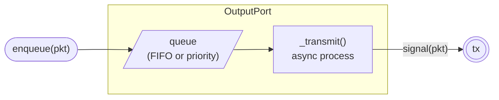
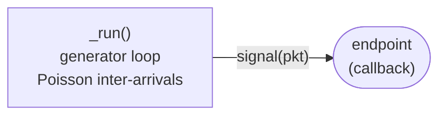
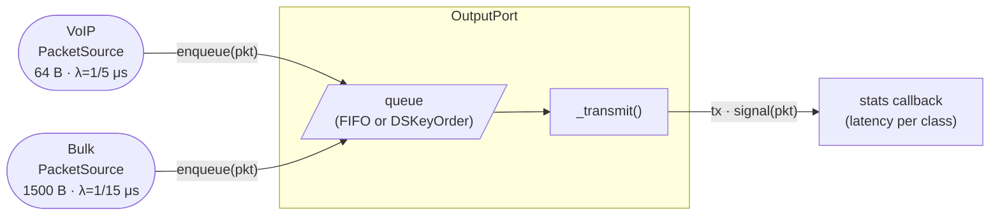
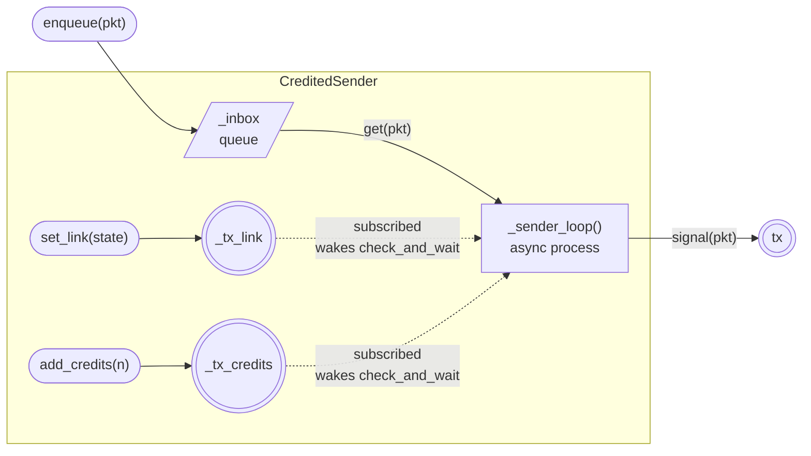
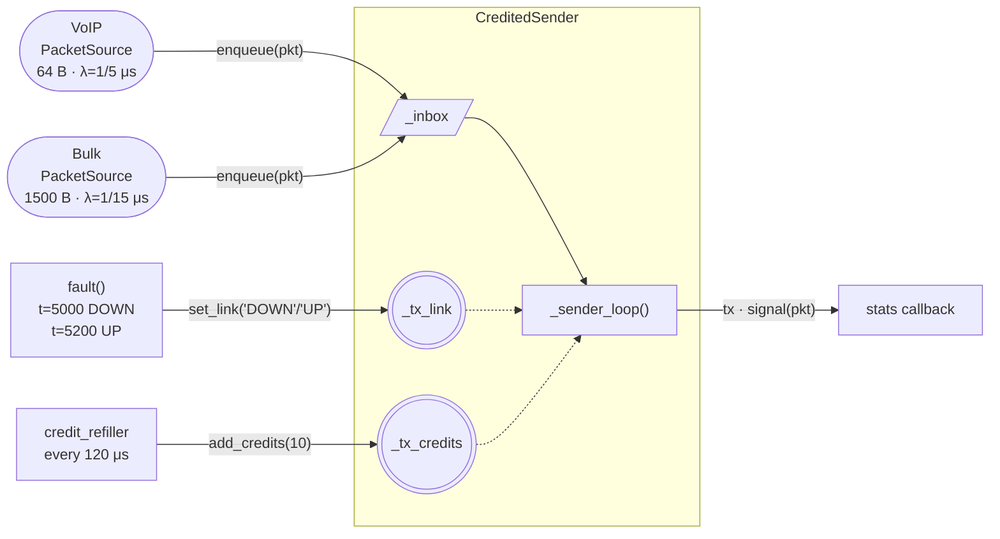

# Case Study: Network Packet Switch

This case study builds a simulation of a single switch output port forwarding two traffic classes. It follows the same isolate-test-integrate approach as the previous studies: define requirements, test each component in isolation, then wire everything together.

---

## Requirements and Problem Definition

We want to simulate a **single output port** of a 1 Gbps network switch. Two traffic classes compete for the same egress link:

| Class | Packet size | Arrival | Priority |
|---|---|---|---|
| VoIP | 64 B | Poisson, mean 5 μs | High (0) |
| Bulk | 1 500 B | Poisson, mean 15 μs | Low (7) |

Offered load is approximately 90 %:

- VoIP: 64 B / 5 μs = 12.8 B/μs (10.2 % of link)
- Bulk: 1 500 B / 15 μs = 100.0 B/μs (80.0 % of link)
- Total: 112.8 B/μs vs 125 B/μs capacity (1 Gbps = 125 bytes/μs)

Three questions drive the simulation:

1. What is the 99th-percentile queuing latency for VoIP packets under FIFO scheduling?
2. How does a priority queue change that?
3. How does credit-based flow control behave when the link goes DOWN?

### Identified components

| Component | Responsibility | Endpoints |
|---|---|---|
| `Packet` | Data object carrying size, priority, and birth timestamp | — |
| `OutputPort` | Queues packets, serialises them onto the link | `tx` — fires each packet after transmission |
| `PacketSource` | Generates packets with Poisson inter-arrival times | — |
| `CreditedSender` | Output port with credit and link-state gating via `sim.wait(lambda)` | `tx` — fires each forwarded packet |

---

## Component 1 — Packet

`Packet` is a plain dataclass. `tx_time` converts a packet's byte size to the number of microseconds required to clock it out of a 1 Gbps port.

```python
from dataclasses import dataclass

LINK_BYTES_PER_US = 125        # 1 Gbps

@dataclass
class Packet:
    dst:      int
    size:     int               # bytes
    priority: int   = 4         # 0 = highest, 7 = lowest
    born:     float = 0.0       # simulation time at enqueue (μs)
    started:  float = 0.0       # simulation time at start-of-service (μs)

    def tx_time(self):
        return self.size / LINK_BYTES_PER_US   # μs
```

---

## Component 2 — OutputPort

`OutputPort` owns a single FIFO (or priority) queue and one async process that pulls packets and sleeps for the corresponding transmission time. Latency is recorded at the moment a packet reaches the head of the queue — the time from enqueue to start-of-service.



```python
from dssim import DSSimulation, DSComponent
from dssim.base_components import DSKeyOrder

class OutputPort(DSComponent):
    """Serialises packets onto a 1 Gbps link via a FIFO or priority queue."""

    def __init__(self, capacity=200, policy=None, **kwargs):
        super().__init__(**kwargs)

        queue_kwargs = dict(capacity=capacity, name=self.name + '.q')
        if policy is not None:
            queue_kwargs['policy'] = policy
        self.queue = self.sim.queue(**queue_kwargs)

        self.tx    = self.sim.publisher(name=self.name + '.tx')
        self.drops = 0

    def start(self):
        self.sim.process(self._transmit()).schedule(0)

    def enqueue(self, pkt):
        pkt.born = self.sim.time
        if not self.queue.put_nowait(pkt):
            self.drops += 1

    async def _transmit(self):
        while True:
            pkt = await self.queue.get(timeout=float('inf'))
            pkt.started = self.sim.time          # record start-of-service
            await self.sim.sleep(pkt.tx_time())
            self.tx.signal(pkt)
```

### Isolated test

Send three packets to a FIFO port. The arrival order matters: Bulk (1 500 B, priority=7) at t=0, Bulk (1 500 B, priority=7) at t=1 μs, VoIP (64 B, priority=0) at t=2 μs.

```python
from dssim import DSSimulation, DSComponent
from dssim.base_components import DSKeyOrder

# (Packet, OutputPort definitions from above)

def run_isolated(policy=None):
    sim  = DSSimulation()
    port = OutputPort(name='port', sim=sim, policy=policy)
    log  = []

    port.tx.add_subscriber(
        sim.callback(lambda p: log.append((sim.time, p.size, p.started - p.born))),
        port.tx.Phase.PRE,
    )
    port.start()

    def feeder():
        port.enqueue(Packet(dst=0, size=1500, priority=7))
        yield from sim.gwait(1)
        port.enqueue(Packet(dst=0, size=1500, priority=7))
        yield from sim.gwait(1)
        port.enqueue(Packet(dst=0, size=64,   priority=0))

    sim.schedule(0, feeder())
    sim.run(until=50)

    for t, size, qwait in log:
        print(f't={t:6.2f} μs  size={size:4d} B  queue_wait={qwait:6.2f} μs')
```

With no policy argument (FIFO), packets are dequeued in arrival order. The VoIP packet waits behind both bulk frames even though it has the higher priority:

- bulk1 (born=0): dequeued immediately at t=0, latency=0 μs, exits at t=12 μs
- bulk2 (born=1): dequeued at t=12, latency=11 μs, exits at t=24 μs
- voip  (born=2): dequeued at t=24, latency=22 μs, exits at t=24.51 μs

```
t= 12.00 μs  size=1500 B  queue_wait=  0.00 μs
t= 24.00 μs  size=1500 B  queue_wait= 11.00 μs
t= 24.51 μs  size=  64 B  queue_wait= 22.00 μs
```

Repeat with `policy=DSKeyOrder(key=lambda p: p.priority)` (lower value = higher priority). The VoIP packet jumps over bulk2 as soon as it is enqueued:

- bulk1 exits at t=12 μs (it was alone when it arrived — no reordering possible)
- voip dequeued at t=12 (priority=0 beats bulk2's priority=7), queue_wait=10 μs, exits at t=12.51 μs
- bulk2 dequeued at t=12.51, queue_wait=11.51 μs, exits at t=24.51 μs

```
t= 12.00 μs  size=1500 B  queue_wait=  0.00 μs
t= 12.51 μs  size=  64 B  queue_wait= 10.00 μs
t= 24.51 μs  size=1500 B  queue_wait= 11.51 μs
```

`DSKeyOrder` is imported from `dssim.base_components`. Passing it as the `policy` argument is the only code change needed to switch from FIFO to priority scheduling.

---

## Component 3 — PacketSource

`PacketSource` is a plain class (not a `DSComponent`) that drives an endpoint with Poisson-distributed inter-arrival times. Each call to `start()` schedules the generator loop.



```python
import random

class PacketSource:
    def __init__(self, sim, endpoint, interval, size, priority, label):
        self.sim      = sim
        self.endpoint = endpoint
        self.interval = interval   # mean inter-arrival (μs)
        self.size     = size
        self.priority = priority
        self.label    = label

    def start(self):
        self.sim.schedule(0, self._run())

    def _run(self):
        rng = random.Random(hash(self.label))
        while True:
            yield from self.sim.gwait(rng.expovariate(1.0 / self.interval))
            pkt = Packet(dst=0, size=self.size, priority=self.priority)
            self.sim.signal(pkt, self.endpoint)
```

The source signals packets directly to `port.enqueue`, which is registered as a callback endpoint. Using `hash(self.label)` as the RNG seed gives each traffic class a reproducible but independent arrival stream.

---

## Scenario 1 — QoS Priority Queuing

Wire two `PacketSource` instances (VoIP and Bulk) to one `OutputPort`. Run for 100 000 μs. First with FIFO, then with `DSKeyOrder`.



```python
import statistics
from dssim import DSSimulation, DSComponent
from dssim.base_components import DSKeyOrder

# (Packet, OutputPort, PacketSource definitions from above)

def run_scenario1(policy=None, duration=100_000):
    sim   = DSSimulation()
    port  = OutputPort(name='port', sim=sim, policy=policy)
    probe = port.queue.add_stats_probe()

    voip_cb = sim.callback(port.enqueue)
    bulk_cb = sim.callback(port.enqueue)

    voip_lat, bulk_lat = [], []

    def on_exit(pkt):
        qwait = pkt.started - pkt.born
        if pkt.priority == 0:
            voip_lat.append(qwait)
        else:
            bulk_lat.append(qwait)

    port.tx.add_subscriber(sim.callback(on_exit), port.tx.Phase.PRE)

    voip_src = PacketSource(sim, voip_cb, interval=5,  size=64,   priority=0, label='voip')
    bulk_src = PacketSource(sim, bulk_cb, interval=15, size=1500, priority=7, label='bulk')

    port.start()
    voip_src.start()
    bulk_src.start()
    sim.run(until=duration)
```

Per-class latency is split in the `on_exit` callback by `pkt.priority`; queue depth statistics come from `probe.stats()`.

**FIFO results** — VoIP and Bulk share the queue equally; neither class receives preferential treatment:

```
──────────────────────────────────────────────────────────────────
  FIFO output port — 100,000 μs  (1 Gbps link, 90 % offered load)
──────────────────────────────────────────────────────────────────
  VoIP (64 B)    packets: 19,966   drops: 0
                 latency avg:  48.1 μs   p50:  32.0 μs   p99: 235.6 μs
  Bulk (1500 B)  packets:  6,691   drops: 0
                 latency avg:  48.0 μs   p50:  31.9 μs   p99: 233.1 μs
  Queue  avg len: 12.81   max len:  85
──────────────────────────────────────────────────────────────────
```

**Priority results** — VoIP always jumps to the head of the queue:

```
──────────────────────────────────────────────────────────────────
  Priority output port — 100,000 μs  (1 Gbps link, 90 % offered load)
──────────────────────────────────────────────────────────────────
  VoIP (64 B)    packets: 19,967   drops: 0
                 latency avg:   5.4 μs   p50:   5.3 μs   p99:  11.9 μs
  Bulk (1500 B)  packets:  6,690   drops: 0
                 latency avg:  53.5 μs   p50:  35.6 μs   p99: 261.9 μs
  Queue  avg len:  4.66   max len:  31
──────────────────────────────────────────────────────────────────
```

### Reading the results

- Under FIFO, VoIP and Bulk are indistinguishable — both average around 48 μs and share a p99 above 230 μs. That tail latency is unacceptable for real-time voice, which requires end-to-end budgets in the tens of microseconds.
- Switching to priority drops VoIP average from 48.1 μs to 5.4 μs (an 9× improvement) and collapses the p99 from 235 μs to 12 μs. The non-preemptive priority bound is the residual service time of the packet currently being transmitted — at most one full bulk frame (1 500 B / 125 B/μs = 12 μs) plus zero queuing if VoIP traffic rate stays low.
- Bulk pays a modest cost: its average rises from 48.0 μs to 53.5 μs because every arriving VoIP packet pre-empts it in the queue. The total bytes forwarded is identical; priority scheduling only redistributes the latency budget.
- Queue depth drops sharply under priority (avg 4.66 vs 12.81) because VoIP packets drain immediately rather than sitting behind bulk frames.
- The only code change between FIFO and priority is `policy=DSKeyOrder(key=lambda p: p.priority)` on the queue constructor. No other logic changes.

---

## Scenario 2 — Credit-Based Flow Control

### Motivation

In real networks (InfiniBand, PCIe, Ethernet Priority Flow Control), a sender must pause when the receiver's buffer is full. The sender maintains a credit counter — each sent packet consumes one credit; the receiver periodically grants credits back as it drains its buffer. If credits run out, the sender blocks. If the link goes DOWN (e.g., a cable fault), the sender must also pause regardless of credits. Both conditions must be simultaneously true before the sender may proceed.

### Constants

```python
MAX_CREDITS      = 10    # packet slots in the receiver buffer
REFILL_INTERVAL  = 120   # μs between credit grants from receiver
```

### Component — CreditedSender

`CreditedSender` wraps an output port with credit and link-state gating. The state is kept in two plain instance variables (`_link_up` and `_credits`). Two publishers notify the sender loop when state changes. In `start()`, the sender process is permanently subscribed to both publishers so that any `set_link` or `add_credits` call wakes it during a `sim.wait`. The condition lambda reads the instance variables directly.



```python
from dssim import DSSimulation, DSComponent

# (Packet, tx_time, MAX_CREDITS, REFILL_INTERVAL from above)

class CreditedSender(DSComponent):
    """OutputPort with credit-based flow control and link-state gating."""

    def __init__(self, **kwargs):
        super().__init__(**kwargs)

        self._credits  = MAX_CREDITS
        self._link_up  = True

        self._inbox      = self.sim.queue(name=self.name + '._inbox')
        self._tx_link    = self.sim.publisher(name=self.name + '._tx_link')
        self._tx_credits = self.sim.publisher(name=self.name + '._tx_credits')

        self.tx             = self.sim.publisher(name=self.name + '.tx')
        self.pauses         = 0
        self.total_pause_us = 0.0

    def start(self):
        proc = self.sim.process(self._sender_loop())
        self._tx_link.add_subscriber(proc, self._tx_link.Phase.PRE)
        self._tx_credits.add_subscriber(proc, self._tx_credits.Phase.PRE)
        proc.schedule(0)

    def enqueue(self, pkt):
        pkt.born = self.sim.time
        self._inbox.put_nowait(pkt)

    def set_link(self, state: str):
        """'UP' or 'DOWN'. Immediately unblocks or blocks the sender."""
        self._link_up = (state == 'UP')
        self._tx_link.signal(state)

    def add_credits(self, n: int):
        """Grant n credits back from the receiver (capped at MAX_CREDITS)."""
        self._credits = min(self._credits + n, MAX_CREDITS)
        self._tx_credits.signal(self._credits)

    async def _sender_loop(self):
        while True:
            pkt = await self._inbox.get(timeout=float('inf'))

            t_wait = self.sim.time
            await self.sim.check_and_wait(
                cond=lambda e: self._link_up and self._credits > 0
            )
            if self.sim.time > t_wait:
                self.pauses += 1
                self.total_pause_us += self.sim.time - t_wait

            self._credits -= 1
            self._tx_credits.signal(self._credits)

            pkt.started = self.sim.time
            await self.sim.sleep(pkt.tx_time())
            self.tx.signal(pkt)
```

The condition reads instance variables directly rather than event values. The process is subscribed to both publishers once in `start()` — compatible with any simulation layer. `check_and_wait` checks the condition immediately and only suspends if it is not yet satisfied; no manual `if` guard is needed. When waiting, any `set_link` or `add_credits` call delivers an event to the process and re-evaluates the lambda.

### Refill generator

The receiver grants credits back on a fixed schedule. In a real switch this would model the egress buffer draining rate.

```python
def credit_refiller(sender, sim):
    while True:
        yield from sim.gwait(REFILL_INTERVAL)
        sender.add_credits(MAX_CREDITS)   # receiver has drained its buffer
```

### Integration

Wire the VoIP and Bulk sources from Scenario 1 into a `CreditedSender`. Schedule one link fault at t=5 000 μs lasting 200 μs.



```python
import random
import statistics
from dssim import DSSimulation, DSComponent

# (Packet, tx_time, MAX_CREDITS, REFILL_INTERVAL, PacketSource,
#  CreditedSender, credit_refiller from above)

def run_credited(duration=10_000):
    sim    = DSSimulation()
    sender = CreditedSender(name='sender', sim=sim)

    voip_cb = sim.callback(sender.enqueue, name='voip_in')
    bulk_cb = sim.callback(sender.enqueue, name='bulk_in')

    voip_src = PacketSource(sim, voip_cb, interval=5,  size=64,   priority=0, label='voip')
    bulk_src = PacketSource(sim, bulk_cb, interval=15, size=1500, priority=7, label='bulk')

    sender.start()
    voip_src.start()
    bulk_src.start()
    sim.schedule(0, credit_refiller(sender, sim))

    # Link fault
    def fault():
        yield from sim.gwait(5000)
        sender.set_link('DOWN')
        yield from sim.gwait(200)
        sender.set_link('UP')

    sim.schedule(0, fault())
    sim.run(until=duration)
    ...
```

**Results:**

```
──────────────────────────────────────────────────────────────────
  Credit-based sender — 10,000 μs (link fault at t=5000–5200 μs)
──────────────────────────────────────────────────────────────────
  Packets forwarded:    826   drops: 0
  Credit pauses:         81   total pause: 7106 μs  (71.1 % of sim time)
  Link-down pause:        1   duration:    200 μs
  Avg latency: 3492.7 μs   p99: 6929.5 μs
──────────────────────────────────────────────────────────────────
```

### Reading the results

- There are 81 credit pauses totalling 7 106 μs — 71 % of the 10 000 μs simulation time. The sender is blocked most of the time because the refill interval (120 μs) is long relative to the burst drain time: 10 credits × average packet service time ~1.3 μs (mixed 64 B and 1 500 B traffic) = only ~13 μs of work before credits are exhausted, leaving the sender idle for the remaining ~107 μs until the next grant.
- The link fault at t=5 000–5 200 μs (200 μs) is captured as a single pause. During that window neither VoIP nor Bulk packets can be forwarded. A single `set_link('DOWN')` call is all that is needed to trigger the pause; `set_link('UP')` immediately resumes the sender — the lambda re-evaluates on the next wakeup event.
- High average latency (3 493 μs) reflects the credit starvation: packets queue in the inbox for multiple refill cycles before they can be sent. Reducing `REFILL_INTERVAL` or increasing `MAX_CREDITS` would bring latency down.
- The sender loop reads `self._link_up` and `self._credits` directly in the lambda — no filter or circuit objects are needed. The permanent subscription in `start()` ensures the process is woken whenever either state variable changes.

---

!!! tip
    For high-throughput runs, close the queue stats probe once validation is complete:

    ```python
    probe.close()
    ```

    `CreditedSender` uses only core DSSim primitives (`sim.check_and_wait`, publishers, queues) and is compatible with any simulation layer.
