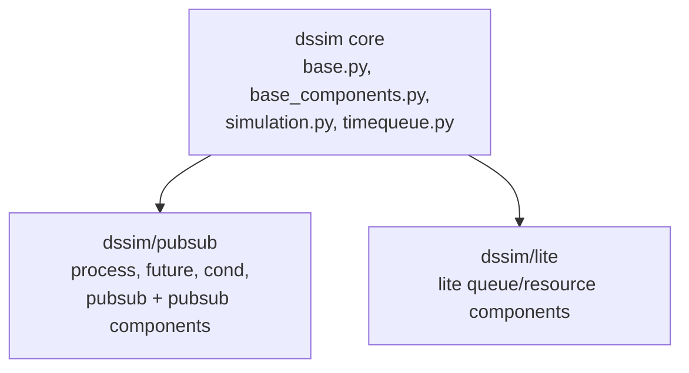

# Architecture

DSSim is organized around a core simulation runtime and layer-specific features.

## Core Runtime

- Event queue and dispatch
- Time progression
- Minimal scheduling and waiting primitives

## PubSub Layer

- Endpoint-based signaling
- Condition-aware waits
- DSProcess / DSFuture / DSFilter / DSCircuit
- Full pubsub components

## Lite Layer

- Lightweight waiting/scheduling usage
- Lite queue and resource components
- Lower-overhead path for simpler models
