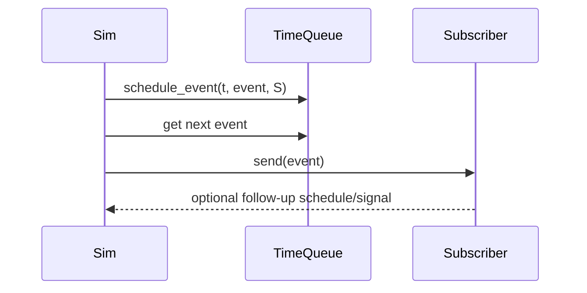

# Scheduling

## Core Flow

1. Schedule an event/process.
2. Simulation advances to next event time.
3. Subscriber receives event via `send`.
4. New events can be scheduled immediately or in the future.

## Wait Variants

- `wait` / `gwait`: return on first accepted event or timeout
- `sleep` / `gsleep`: ignore normal events until timeout
- `check_and_wait` / `check_and_gwait`: check condition first, then wait if needed
