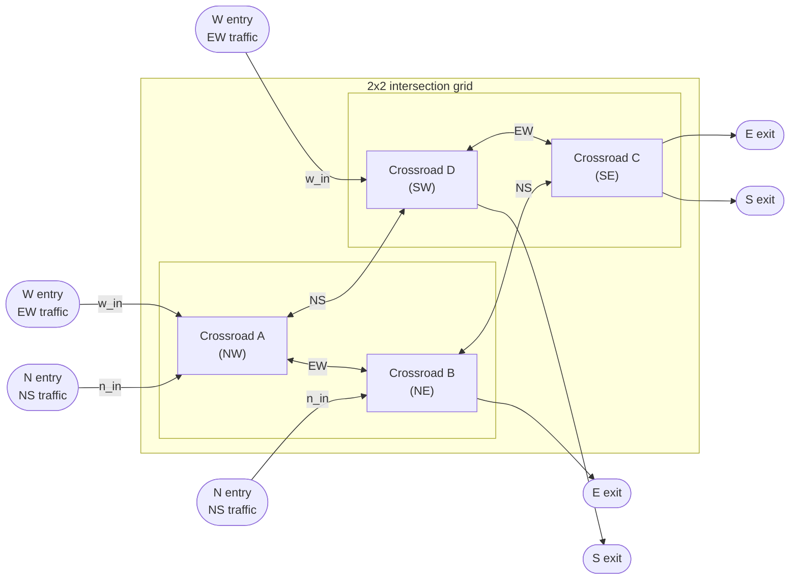
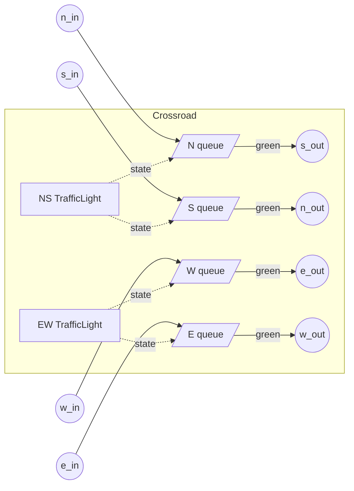

# Case Study: Traffic Light Network

This case study builds a simulation of four connected intersections arranged in a square grid, each with traffic lights for two directions. It follows the design approach from the previous page: define requirements, isolate components, test each one with probes, interconnect, then remove probes for throughput.

---

## Requirements and Problem Definition

We want to simulate a **2×2 grid of intersections**. Vehicles enter from the west and north, travel through the grid in one direction (west→east and north→south), and exit on the east and south sides. Each intersection has two sets of traffic lights — North–South and East–West — that must never both be green at the same time.

We want to measure per-intersection queue occupancy and throughput to find bottlenecks.



### Identified components

| Component | Responsibility | Endpoints |
|---|---|---|
| `TrafficLight` | Cycles RED → GREEN → YELLOW → RED on a timer | `tx` — publishes current state |
| `Crossroad` | Coordinates two lights; queues and releases vehicles | `n_in`, `s_in`, `w_in`, `e_in` — one per arm (rx); `n_out`, `s_out`, `w_out`, `e_out` — one per arm (tx) |
| `VehicleGenerator` | Creates vehicles at a fixed interval, feeds an endpoint | — |

---

## Component 1 — TrafficLight

A `TrafficLight` owns its own cycle. It publishes its state (`'red'`, `'green'`, `'yellow'`) on `tx` at every transition.

```python
from dssim import DSSimulation, DSComponent

GREEN_SECS  = 30
YELLOW_SECS = 5
RED_SECS    = 30

class TrafficLight(DSComponent):
    """Cycles RED → GREEN → YELLOW → RED indefinitely."""

    CYCLE = [('red', RED_SECS), ('green', GREEN_SECS), ('yellow', YELLOW_SECS)]

    def __init__(self, **kwargs):
        super().__init__(**kwargs)
        self.state = 'red'
        self.tx = self.sim.publisher(name=self.name + '.tx')

    def start(self, offset=0):
        """Begin cycling. offset (s) delays the first transition."""
        self.sim.process(self._run(offset)).schedule(0)

    async def _run(self, offset):
        if offset:
            await self.sim.sleep(offset)
        while True:
            for state, duration in self.CYCLE:
                self.state = state
                self.sim.signal(state, self.tx)
                await self.sim.sleep(duration)
```

### Isolated test with a log probe

```python
sim   = DSSimulation()
light = TrafficLight(name='light', sim=sim)

log = []
probe = sim.callback(lambda s: log.append((sim.time, s)))
light.tx.add_subscriber(probe, light.tx.Phase.PRE)

light.start()
sim.run(until=200)

for t, s in log:
    print(f"t={t:6.1f}  {s}")
```

```
t=   0.0  red
t=  30.0  green
t=  60.0  yellow
t=  65.0  red
t=  95.0  green
t= 125.0  yellow
t= 130.0  red
t= 160.0  green
t= 190.0  yellow
t= 195.0  red
```

The cycle is `RED(30) → GREEN(30) → YELLOW(5) → RED …` with period 65 s.

---

## Component 2 — Crossroad

A `Crossroad` contains two `TrafficLight` instances (NS and EW). They are interleaved: NS starts green, EW starts green only after the full NS green+yellow phase has passed. Vehicles that arrive on red wait in a queue; when the light turns green the queue is drained.

Each physical arm has its own input endpoint (rx), output endpoint (tx), and waiting queue — four arms, eight endpoints, four queues. For the one-way scenario (north→south, west→east), only the `n_*` and `w_*` endpoints carry traffic; the others are present for completeness.



```python
class Crossroad(DSComponent):
    """One intersection: two coordinated lights and four per-arm vehicle queues."""

    def __init__(self, **kwargs):
        super().__init__(**kwargs)

        self.ns_light = TrafficLight(name=self.name + '.ns', sim=self.sim)
        self.ew_light = TrafficLight(name=self.name + '.ew', sim=self.sim)

        # One queue per arm
        self.n_queue = self.sim.queue(name=self.name + '.n_q')
        self.s_queue = self.sim.queue(name=self.name + '.s_q')
        self.w_queue = self.sim.queue(name=self.name + '.w_q')
        self.e_queue = self.sim.queue(name=self.name + '.e_q')

        # Input endpoints — one per physical arm (rx)
        self.n_in = self.sim.callback(self._arrive_n, name=self.name + '.n_in')
        self.s_in = self.sim.callback(self._arrive_s, name=self.name + '.s_in')
        self.w_in = self.sim.callback(self._arrive_w, name=self.name + '.w_in')
        self.e_in = self.sim.callback(self._arrive_e, name=self.name + '.e_in')

        # Output endpoints — one per physical arm (tx)
        self.n_out = self.sim.publisher(name=self.name + '.n_out')
        self.s_out = self.sim.publisher(name=self.name + '.s_out')
        self.w_out = self.sim.publisher(name=self.name + '.w_out')
        self.e_out = self.sim.publisher(name=self.name + '.e_out')

        # React to light state changes
        self.ns_light.tx.add_subscriber(self.sim.callback(self._on_ns))
        self.ew_light.tx.add_subscriber(self.sim.callback(self._on_ew))

    def start(self, ns_offset=0):
        """Start both lights. ns_offset staggers the whole intersection for green-wave tuning."""
        self.ns_light.start(offset=ns_offset)
        # EW starts only after the NS green+yellow phase clears, so both lights
        # are never green at the same time.
        self.ew_light.start(offset=ns_offset + GREEN_SECS + YELLOW_SECS)

    def _arrive_n(self, vehicle):
        # Vehicle enters from the north and travels south.
        if self.ns_light.state == 'green':
            self.sim.signal(vehicle, self.s_out)   # pass straight through
        else:
            self.n_queue.put_nowait(vehicle)        # wait for green

    def _arrive_s(self, vehicle):
        # Vehicle enters from the south and travels north.
        if self.ns_light.state == 'green':
            self.sim.signal(vehicle, self.n_out)
        else:
            self.s_queue.put_nowait(vehicle)

    def _arrive_w(self, vehicle):
        # Vehicle enters from the west and travels east.
        if self.ew_light.state == 'green':
            self.sim.signal(vehicle, self.e_out)
        else:
            self.w_queue.put_nowait(vehicle)

    def _arrive_e(self, vehicle):
        # Vehicle enters from the east and travels west.
        if self.ew_light.state == 'green':
            self.sim.signal(vehicle, self.w_out)
        else:
            self.e_queue.put_nowait(vehicle)

    def _on_ns(self, state):
        # NS light changed state. On green, release all queued NS vehicles.
        if state == 'green':
            self._drain(self.n_queue, self.s_out)   # northbound queue exits south
            self._drain(self.s_queue, self.n_out)   # southbound queue exits north

    def _on_ew(self, state):
        # EW light changed state. On green, release all queued EW vehicles.
        if state == 'green':
            self._drain(self.w_queue, self.e_out)   # westbound queue exits east
            self._drain(self.e_queue, self.w_out)   # eastbound queue exits west

    def _drain(self, queue, out):
        # Flush every waiting vehicle from queue to the given output endpoint.
        # get_nowait returns one item or None when the queue is empty.
        while len(queue):
            item = queue.get_nowait()
            if item is None:
                break
            self.sim.signal(item, out)
```

### Isolated test with a QueueStatsProbe

```python
sim = DSSimulation()
crd = Crossroad(name='A', sim=sim)

n_probe = crd.n_queue.add_stats_probe()
w_probe = crd.w_queue.add_stats_probe()

def n_generator():
    while True:
        yield from sim.gwait(5)
        sim.signal({'arrived': sim.time}, crd.n_in)

def w_generator():
    while True:
        yield from sim.gwait(5)
        sim.signal({'arrived': sim.time}, crd.w_in)

crd.start()
sim.schedule(0, n_generator())
sim.schedule(0, w_generator())
sim.run(until=500)

n = n_probe.stats()
w = w_probe.stats()
print(f"N→S — avg queue: {n['time_avg_len']:.2f}  max queue: {n['max_len']}  total: {n['get_count']}")
print(f"W→E — avg queue: {w['time_avg_len']:.2f}  max queue: {w['max_len']}  total: {w['get_count']}")
```

```
N→S — avg queue: 2.11  max queue:  7  total: 54
W→E — avg queue: 2.52  max queue: 12  total: 54
```

Both directions process the same total — neither starves. W→E shows a slightly higher average queue because its green phase starts 35 s into the simulation; early-arriving vehicles accumulate before the first green.

---

## Routing Extension — Vehicles Choose Their Exit

With the base `Crossroad`, every vehicle entering from the north always exits south, and so on — straight-through only. Real intersections have turning movements. This step extends `Crossroad` so each entry arm distributes outgoing vehicles across exit arms according to a probability table.

The table maps each entry arm to a dict of `{exit_arm: weight}`. Weights do not need to sum to 1 — `random.choices` normalises them.

```python
import random
from collections import Counter, defaultdict

# Default: straight through on all arms (no turns)
DEFAULT_ROUTING = {
    'n': {'s': 1.0},
    's': {'n': 1.0},
    'w': {'e': 1.0},
    'e': {'w': 1.0},
}
```

Two additions to `Crossroad`: a `routing` constructor parameter, a `_pick_exit` helper, and an `_out` lookup dict. `_drain` gains a `from_arm` argument so every released vehicle draws its own exit independently.

```python
class Crossroad(DSComponent):
    """One intersection with configurable turn probabilities."""

    def __init__(self, routing=None, **kwargs):
        super().__init__(**kwargs)

        self.routing  = routing or DEFAULT_ROUTING

        self.ns_light = TrafficLight(name=self.name + '.ns', sim=self.sim)
        self.ew_light = TrafficLight(name=self.name + '.ew', sim=self.sim)

        # One queue per arm
        self.n_queue = self.sim.queue(name=self.name + '.n_q')
        self.s_queue = self.sim.queue(name=self.name + '.s_q')
        self.w_queue = self.sim.queue(name=self.name + '.w_q')
        self.e_queue = self.sim.queue(name=self.name + '.e_q')

        # Input endpoints — one per physical arm (rx)
        self.n_in = self.sim.callback(self._arrive_n, name=self.name + '.n_in')
        self.s_in = self.sim.callback(self._arrive_s, name=self.name + '.s_in')
        self.w_in = self.sim.callback(self._arrive_w, name=self.name + '.w_in')
        self.e_in = self.sim.callback(self._arrive_e, name=self.name + '.e_in')

        # Output endpoints — one per physical arm (tx)
        self.n_out = self.sim.publisher(name=self.name + '.n_out')
        self.s_out = self.sim.publisher(name=self.name + '.s_out')
        self.w_out = self.sim.publisher(name=self.name + '.w_out')
        self.e_out = self.sim.publisher(name=self.name + '.e_out')

        # Lookup: arm name → publisher (built after publishers exist)
        self._out = {'n': self.n_out, 's': self.s_out,
                     'w': self.w_out, 'e': self.e_out}

        # React to light state changes
        self.ns_light.tx.add_subscriber(self.sim.callback(self._on_ns))
        self.ew_light.tx.add_subscriber(self.sim.callback(self._on_ew))

    def _pick_exit(self, from_arm):
        """Weighted random draw from the routing table for this entry arm."""
        options = self.routing[from_arm]
        return random.choices(list(options), weights=options.values())[0]

    def start(self, ns_offset=0):
        """Start both lights. ns_offset staggers the whole intersection for green-wave tuning."""
        self.ns_light.start(offset=ns_offset)
        # EW starts only after the NS green+yellow phase clears, so both lights
        # are never green at the same time.
        self.ew_light.start(offset=ns_offset + GREEN_SECS + YELLOW_SECS)

    def _arrive_n(self, vehicle):
        # Vehicle enters from the north; pick exit now if light is green,
        # otherwise queue and pick at release time.
        if self.ns_light.state == 'green':
            self.sim.signal(vehicle, self._out[self._pick_exit('n')])
        else:
            self.n_queue.put_nowait(vehicle)

    def _arrive_s(self, vehicle):
        if self.ns_light.state == 'green':
            self.sim.signal(vehicle, self._out[self._pick_exit('s')])
        else:
            self.s_queue.put_nowait(vehicle)

    def _arrive_w(self, vehicle):
        if self.ew_light.state == 'green':
            self.sim.signal(vehicle, self._out[self._pick_exit('w')])
        else:
            self.w_queue.put_nowait(vehicle)

    def _arrive_e(self, vehicle):
        if self.ew_light.state == 'green':
            self.sim.signal(vehicle, self._out[self._pick_exit('e')])
        else:
            self.e_queue.put_nowait(vehicle)

    def _on_ns(self, state):
        # NS light changed state. On green, release all queued NS vehicles,
        # each independently choosing its exit direction.
        if state == 'green':
            self._drain(self.n_queue, 'n')
            self._drain(self.s_queue, 's')

    def _on_ew(self, state):
        if state == 'green':
            self._drain(self.w_queue, 'w')
            self._drain(self.e_queue, 'e')

    def _drain(self, queue, from_arm):
        # Flush every waiting vehicle; each picks its exit from the routing table.
        while len(queue):
            item = queue.get_nowait()
            if item is None:
                break
            self.sim.signal(item, self._out[self._pick_exit(from_arm)])
```

### Isolated test — verifying the routing distribution

Feed 300 vehicles from the north arm and 300 from the west arm. Tag each vehicle with its entry arm so the exit counters can be grouped by origin.

```python
random.seed(0)

ROUTING = {
    'n': {'s': 0.70, 'e': 0.20, 'w': 0.10},
    's': {'n': 0.70, 'w': 0.20, 'e': 0.10},
    'w': {'e': 0.60, 'n': 0.25, 's': 0.15},
    'e': {'w': 0.60, 's': 0.25, 'n': 0.15},
}

sim = DSSimulation()
crd = Crossroad(name='A', routing=ROUTING, sim=sim)

# Count exits per (entry arm, exit arm) pair
exits = defaultdict(Counter)
for arm in 'nswe':
    out = getattr(crd, arm + '_out')
    out.add_subscriber(sim.callback(lambda v, a=arm: exits[v['from']].update([a])))

N = 300

def feeder(endpoint, label):
    for _ in range(N):
        yield from sim.gwait(2)
        sim.signal({'from': label}, endpoint)

crd.start()
sim.schedule(0, feeder(crd.n_in, 'n'))
sim.schedule(0, feeder(crd.w_in, 'w'))
sim.run(until=N * 4)

for from_arm, label in [('n', 'north entry'), ('w', 'west entry')]:
    total = sum(exits[from_arm].values())
    print(f"\n{label} ({total} vehicles):")
    for to_arm in sorted(exits[from_arm]):
        cnt = exits[from_arm][to_arm]
        exp = ROUTING[from_arm].get(to_arm, 0) * 100
        print(f"  exit {to_arm}: {cnt:4d}  ({100*cnt/total:.0f}%,  expected {exp:.0f}%)")
```

```
north entry (300 vehicles):
  exit e:   64  (21%,  expected 20%)
  exit s:  200  (67%,  expected 70%)
  exit w:   36  (12%,  expected 10%)

west entry (300 vehicles):
  exit e:  179  (60%,  expected 60%)
  exit n:   75  (25%,  expected 25%)
  exit s:   46  (15%,  expected 15%)
```

The observed percentages match the table. With `DEFAULT_ROUTING` (no argument) the behaviour is identical to the base `Crossroad` — all vehicles go straight through.

---

## Component 3 — VehicleGenerator

`VehicleGenerator` takes a target endpoint directly. This keeps it decoupled from any particular crossroad design — it just signals vehicles to whatever endpoint it is given.

```python
class VehicleGenerator:
    """Creates vehicles at a fixed interval and signals them to an endpoint."""

    def __init__(self, sim, endpoint, interval, label):
        self.sim      = sim
        self.endpoint = endpoint
        self.interval = interval
        self.label    = label
        self._count   = 0

    def start(self):
        self.sim.schedule(0, self._run())

    def _run(self):
        while True:
            yield from self.sim.gwait(self.interval)
            self._count += 1
            vehicle = {'id': f'{self.label}-{self._count}', 'arrived': self.sim.time}
            self.sim.signal(vehicle, self.endpoint)
```

---

## System Integration — Four Crossroads

Wire the four crossroads into a 2×2 grid. Each pair of adjacent crossroads is connected in both directions: `e_out ↔ w_in` along the EW road and `s_out ↔ n_in` along the NS road. Each crossroad is started with a small `ns_offset` to create a **green wave** — vehicles that just cleared A are more likely to arrive at B or D when green.

```python
SIM_TIME = 3600  # 1 hour

sim = DSSimulation()

crd = {k: Crossroad(name=k, sim=sim) for k in 'ABCD'}

# Probes on the active queues (one-way traffic uses n and w arms only)
probes = {}
for name, c in crd.items():
    probes[f'{name}_n'] = c.n_queue.add_stats_probe()
    probes[f'{name}_w'] = c.w_queue.add_stats_probe()

# EW road top row: A ↔ B
crd['A'].e_out.add_subscriber(crd['B'].w_in)
crd['B'].w_out.add_subscriber(crd['A'].e_in)
# EW road bottom row: D ↔ C
crd['D'].e_out.add_subscriber(crd['C'].w_in)
crd['C'].w_out.add_subscriber(crd['D'].e_in)
# NS road left col: A ↔ D
crd['A'].s_out.add_subscriber(crd['D'].n_in)
crd['D'].n_out.add_subscriber(crd['A'].s_in)
# NS road right col: B ↔ C
crd['B'].s_out.add_subscriber(crd['C'].n_in)
crd['C'].n_out.add_subscriber(crd['B'].s_in)

# Green-wave offsets — stagger each intersection by approximate inter-crossing travel time
crd['A'].start(ns_offset=0)
crd['B'].start(ns_offset=12)   # ~travel time A → B
crd['D'].start(ns_offset=15)   # ~travel time A → D
crd['C'].start(ns_offset=25)   # ~travel time B → C or D → C

# Entry-point vehicle generators
generators = [
    VehicleGenerator(sim, crd['A'].w_in, 4, 'W-A'),   # west entry, top row
    VehicleGenerator(sim, crd['D'].w_in, 4, 'W-D'),   # west entry, bottom row
    VehicleGenerator(sim, crd['A'].n_in, 3, 'N-A'),   # north entry, left column
    VehicleGenerator(sim, crd['B'].n_in, 3, 'N-B'),   # north entry, right column
]
for g in generators:
    g.start()

sim.run(until=SIM_TIME)

print(f"{'Queue':<10} {'avg len':>8} {'max len':>8} {'total':>8}")
print("-" * 40)
for key, probe in probes.items():
    s = probe.stats()
    print(f"{key:<10} {s['time_avg_len']:>8.2f} {s['max_len']:>8} {s['get_count']:>8}")
```

```
Queue       avg len  max len    total
----------------------------------------
A_n            3.23       12      639
A_w            2.51       16      489
B_n            3.24       13      643
B_w            1.93       19      654
C_n            2.79       18      882
C_w            1.58       22      618
D_n            3.27       17      914
D_w            2.57       19      492
```

### Reading the results

- **D_n and C_n carry more load than A_n and B_n** (914 and 882 vs 639 and 643) — the downstream crossroads accumulate through traffic from upstream in addition to their own entry generators.
- **B_w (654) slightly exceeds A_w (489)** because it absorbs eastbound vehicles that cleared A on top of its own west-entry arrivals.
- **Queue lengths remain moderate** — max queues of 17–22 items, because vehicles are distributed evenly across both arms and the green-wave offsets reduce burst accumulation.

These observations pinpoint where physical infrastructure (longer green phases, extra lanes) would help most in a real-world study.

---

## Removing Probes for High Throughput

Once the model is validated, remove probes before a long production run:

```python
for probe in probes.values():
    probe.close()

sim.run(until=SIM_TIME * 100)
```

Or guard them with a flag during development:

```python
ENABLE_PROBES = False

if ENABLE_PROBES:
    for name, c in crd.items():
        probes[f'{name}_n'] = c.n_queue.add_stats_probe()
        probes[f'{name}_w'] = c.w_queue.add_stats_probe()
```

!!! tip
    For maximum throughput, switch from `DSSimulation()` (PubSubLayer2) to `DSSimulation(layer2=LiteLayer2)`. Probes are PubSubLayer2-only, so remove them before switching layers.

---

## Bonus: Travel Delays Between Crossroads

The integration above wires crossroads with direct publisher→subscriber connections, which means vehicles teleport instantly between intersections. Real roads have a finite travel time. Adding that travel time reveals how green-wave timing interacts with inter-crossroad distance.

### The `DSDelay` component

`DSDelay` sits between a publisher and a subscriber. Every event that arrives on its `.rx` input is re-emitted on its `.tx` output after a fixed simulated time. The `sim.delay()` factory creates one:

```python
# Instead of:
crd['A'].e_out.add_subscriber(crd['B'].w_in)

# With a 12-second travel time:
a_to_b = sim.delay(12, name='A_to_B')
crd['A'].e_out.add_subscriber(a_to_b.rx)
a_to_b.tx.add_subscriber(crd['B'].w_in)
```

### Updated wiring

Replace every direct crossroad-to-crossroad connection with a delay component. The travel times below match the green-wave offsets already baked into the `start()` calls — EW roads are 12 s apart, NS roads are 15 s:

```python
EW_DELAY = 12   # seconds between east-west crossroads
NS_DELAY = 15   # seconds between north-south crossroads

# EW top row: A <-> B
a_to_b = sim.delay(EW_DELAY, name='A_to_B')
b_to_a = sim.delay(EW_DELAY, name='B_to_A')
crd['A'].e_out.add_subscriber(a_to_b.rx); a_to_b.tx.add_subscriber(crd['B'].w_in)
crd['B'].w_out.add_subscriber(b_to_a.rx); b_to_a.tx.add_subscriber(crd['A'].e_in)

# EW bottom row: D <-> C
d_to_c = sim.delay(EW_DELAY, name='D_to_C')
c_to_d = sim.delay(EW_DELAY, name='C_to_D')
crd['D'].e_out.add_subscriber(d_to_c.rx); d_to_c.tx.add_subscriber(crd['C'].w_in)
crd['C'].w_out.add_subscriber(c_to_d.rx); c_to_d.tx.add_subscriber(crd['D'].e_in)

# NS left column: A <-> D
a_to_d = sim.delay(NS_DELAY, name='A_to_D')
d_to_a = sim.delay(NS_DELAY, name='D_to_A')
crd['A'].s_out.add_subscriber(a_to_d.rx); a_to_d.tx.add_subscriber(crd['D'].n_in)
crd['D'].n_out.add_subscriber(d_to_a.rx); d_to_a.tx.add_subscriber(crd['A'].s_in)

# NS right column: B <-> C
b_to_c = sim.delay(NS_DELAY, name='B_to_C')
c_to_b = sim.delay(NS_DELAY, name='C_to_B')
crd['B'].s_out.add_subscriber(b_to_c.rx); b_to_c.tx.add_subscriber(crd['C'].n_in)
crd['C'].n_out.add_subscriber(c_to_b.rx); c_to_b.tx.add_subscriber(crd['B'].s_in)
```

### Output: aligned delays (12 s EW, 15 s NS)

```
Queue       avg len  max len    total
----------------------------------------
A_n            3.23       12      639
A_w            2.51       16      489
B_n            3.24       13      643
B_w            0.00        0        0
C_n            0.34        1       36
C_w            0.26        1       27
D_n            0.00        0        0
D_w            2.57       19      492
```

**B_w, D_n, C_n, C_w drop to near zero** — vehicles released from the upstream crossroad arrive at the downstream crossroad exactly as its light turns green, so they pass straight through without ever queuing. This is the green-wave effect: the `ns_offset` values (0, 12, 15, 25) were chosen to match the 12 s and 15 s travel times, so the advancing green front carries traffic through the grid with minimal stopping.

### What happens with misaligned delays?

Change the travel times to values the green-wave offsets were not tuned for (e.g., 20 s EW, 22 s NS) and the cascade benefit disappears:

```
Queue       avg len  max len    total
----------------------------------------
A_n            3.23       12      639
A_w            2.51       16      489
B_n            3.24       13      643
B_w            0.95        2      108
C_n            1.40        3      162
C_w            1.14        3      133
D_n            1.13        3      126
D_w            2.57       19      492
```

Intermediate crossroads now accumulate meaningful queues again because vehicles arrive during red phases. The model makes it straightforward to sweep over travel times and find the `ns_offset` values that minimise total queuing across the grid.
