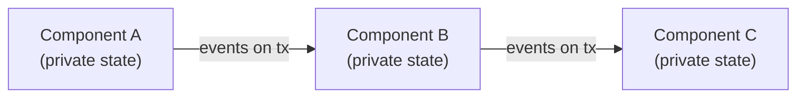

# Designing a Larger System

The three examples in [First Simulation](first-sim.md) show the mechanics of DSSim. Once your model grows beyond a few processes, you need a deliberate structure. This page describes a practical approach that scales from a handful of components to complex multi-component systems.

The approach has four steps:

1. Split the system into isolated-state components
2. Define the messages each endpoint carries
3. Test each component alone
4. Interconnect the components and observe the event flow

!!! tip "Use PubSubLayer2 for larger systems"
    The patterns described on this page — delivery tiers, `val=False` pass-through, PRE-phase probes, condition filtering — are all PubSubLayer2 features. LiteLayer2 is well-suited for small, throughput-focused models, but as a system grows the observability and routing control of PubSubLayer2 pays off quickly. If you started with LiteLayer2, switching is a one-line change at construction time.

---

## Step 1 — Split Into Isolated-State Components

A large simulation is easiest to build, test, and debug when each component **owns only its own state** and communicates exclusively through its endpoints. No component reads or writes another component's internals directly.

Each component has:

- **Input endpoints** — where it receives events from the outside world.
- **Output endpoints** — where it sends events to whoever is wired downstream.
- **Private state** — fields that are updated as events flow, but never touched from outside.



A component that receives an event, updates its own state, and produces output events is **self-contained**: it can be instantiated alone, driven with synthetic inputs, and verified without the rest of the system.

This isolation is the main property that keeps a large model manageable. If a component depends on another component's internal state, testing it in isolation becomes impossible and failures are hard to locate.

---

## Step 2 — Define Endpoint Messages

Before writing any component logic, decide what each endpoint carries.

A message contract specifies:

- The **Python type** of the event object — a dataclass, a plain dict, a string, an integer, or any other object.
- The **direction** — input (arriving at this endpoint) or output (leaving it).
- The **semantics** — what the event means and under what circumstances it is sent.

Writing these down first forces clarity before any code is written. Changes to a contract later require updating only the two components on either side of a connection, not the whole system.

```python
from dataclasses import dataclass

@dataclass
class FrameReady:
    """Fired by the framer on tx when a complete frame has been assembled."""
    frame_id: int
    payload: bytes
    timestamp: float

@dataclass
class Ack:
    """Fired by the receiver on tx_ack when a frame is accepted."""
    frame_id: int
```

Using typed objects makes the contract machine-checkable and makes test assertions straightforward.

---

## Step 3 — Test Each Component in Isolation

With clear endpoint contracts, each component can be tested alone. The pattern is always the same:

1. Create a simulation with only the component under test.
2. Drive its input endpoint(s) with synthetic events.
3. Capture its output endpoint(s) with a logging callback.
4. Assert the captured events match the expected sequence.

```python
from dssim import DSSimulation
from mymodel import Framer, FrameReady   # the component under test

sim = DSSimulation()
framer = Framer(name="framer", sim=sim)

# Capture everything the framer emits on its output endpoint
output_events = []
obs = sim.callback(lambda e: output_events.append(e))
framer.tx.add_subscriber(obs, framer.tx.Phase.PRE)

# Drive the framer with synthetic byte events
for byte in [0x7E, 0x01, 0x02, 0x7E]:   # start, data, data, end
    sim.schedule_event(1, byte, framer.rx)

sim.run(until=10)

assert len(output_events) == 1
assert isinstance(output_events[0], FrameReady)
assert output_events[0].payload == bytes([0x01, 0x02])
```

!!! tip "Debug probes during development"
    If a test fails and the output is not what you expect, add PRE-phase observers
    on intermediate internal publishers to see the step-by-step event flow inside
    the component. Remove or disable them once the component is verified. See
    [Chapter 8](../user-guide/08-probes.md) for the full probing API.

Collect these component-level tests into a test suite. Each component should have its own test module with a small simulation that exercises its normal paths, boundary conditions, and timeout handling. Running the suite after every change confirms that individual components remain correct as the rest of the model grows.

---

## Step 4 — Interconnect and Observe the Event Flow

Once individual components pass their tests, wire them together. Each connection is a single `add_subscriber` call:

```python
framer.tx.add_subscriber(encoder.rx, framer.tx.Phase.CONSUME)
encoder.tx.add_subscriber(transmitter.rx, encoder.tx.Phase.CONSUME)
```

### Broadcast messages — CONSUME tier with pass-through

The `CONSUME` tier stops delivery at the first subscriber that accepts the event. This is the right choice when only one component should process each message — a queue drain, a resource claim, a request that exactly one handler answers.

For **broadcast** messages that every connected component should receive, there are two options depending on the component's role:

- **`PRE` tier** — intended for pure observers: loggers, probes, monitors that watch the event stream but have no role in processing it. All PRE subscribers always run before any `CONSUME` decision is made.
- **`CONSUME` tier with `val=False`** — intended for components that are part of the processing pipeline but must not block others from receiving the same event. The component receives and processes the event, returns `False` to signal "not claimed", and delivery continues to the next `CONSUME` subscriber. Because `PRE` is guaranteed to have already finished at this point, using `CONSUME` with `val=False` clearly separates pipeline participants from passive observers.

```python
async def status_monitor(status_pub):
    with sim.consume(status_pub):
        while True:
            event = await sim.wait(val=False)   # receive but do not consume
            if event is None:
                break
            print(f"t={sim.time}  status: {event}")
```

With `val=False`, the monitor processes every status event while all other subscribers registered on the same publisher still receive it unchanged. See [Section 5.8](../user-guide/05-processes.md#advanced-non-consuming-subscription-via-valfalse) for the full explanation.

When you need to observe what is crossing a connection — to confirm the wiring is correct or to track down an integration bug — attach a PRE-phase observer at the connection point. A PRE observer always runs before the consumer sees the event, so it never interferes with normal delivery:

```python
# Log every event crossing the framer → encoder boundary
trace = sim.callback(lambda e: print(f"t={sim.time}  framer→encoder: {e}"))
framer.tx.add_subscriber(trace, framer.tx.Phase.PRE)
```

For richer integration traces, put the observer in a process so it can record timing, count events, or check ordering:

```python
async def trace_process():
    with sim.observe_pre(framer.tx):
        while True:
            event = await sim.wait(timeout=1000)
            if event is None:
                break
            print(f"t={sim.time}  crossing: {event}")

sim.schedule(0, trace_process())
```

Remove or gate trace observers behind a debug flag before moving to performance runs. Logging in PRE phase adds overhead proportional to event volume.

### POST_HIT and POST_MISS probes

Two more tiers are useful for debugging the consume outcome:

- **`POST_HIT`** fires after a consumer accepted the event. The payload is a dict `{'consumer': <who_consumed>, 'event': <original_event>}`. The `consumer` field directly identifies which subscriber claimed the event — no guesswork needed.
- **`POST_MISS`** fires when no consumer accepted the event. The payload is the original event unchanged. Useful for spotting events that fell through due to missing handlers or misconfigured wiring.

Both callbacks can be wired to the same probe function since they are registered on separate tiers:

```python
def on_post_hit(payload):
    print(f"t={sim.time}  consumed by {payload['consumer'].name}: {payload['event']}")

def on_post_miss(event):
    print(f"t={sim.time}  NOT consumed: {event}")

framer.tx.add_subscriber(sim.callback(on_post_hit),  framer.tx.Phase.POST_HIT)
framer.tx.add_subscriber(sim.callback(on_post_miss), framer.tx.Phase.POST_MISS)
```

Note that the two callbacks receive **different payload shapes** — `POST_HIT` wraps the event in a dict so the consumer is available, while `POST_MISS` delivers the raw event directly. This is why they are kept as separate functions even though both can be attached to the same publisher.

---

## Summary

| Step | What you do | Why |
|---|---|---|
| Isolate state | Each component owns only its own state; all communication through endpoints | Components become independently testable and replaceable |
| Define contracts | Name and type every message before writing logic | Catches design errors early; makes assertions straightforward |
| Test in isolation | Drive inputs synthetically; assert captured outputs | Failures are local and easy to diagnose |
| Interconnect and observe | Wire with `add_subscriber`; attach PRE observers for tracing | Integration bugs are visible at the connection point |
