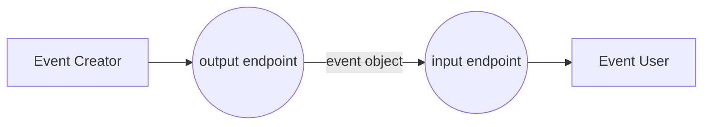
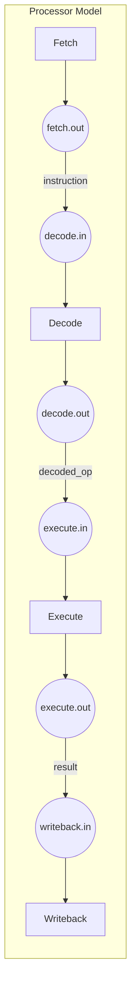
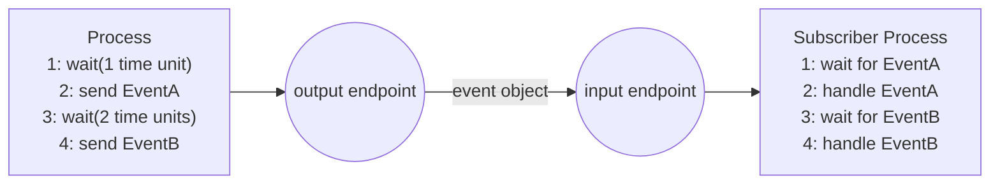
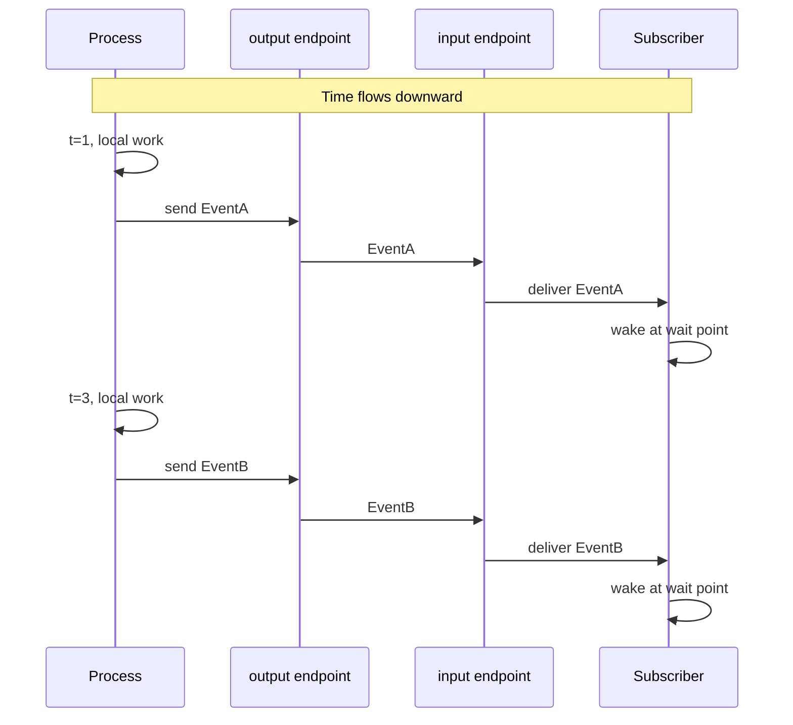
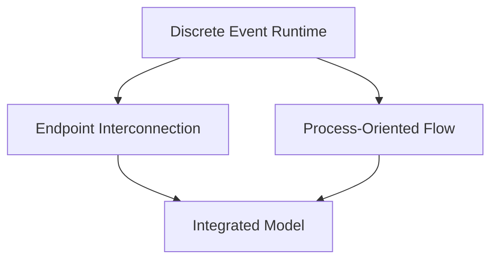

# Chapter 1: About DSSim

## 1.1 What DSSim Is

DSSim is a discrete-event simulation (DES) framework written in Python. Instead of advancing time continuously, DSSim jumps from one scheduled event to the next. This makes models easier to reason about when system behavior is naturally event-driven: packet arrivals, hardware interrupts, queue operations, resource grants, and process wakeups.

DSSim supports two complementary modeling styles and lets you combine them freely in the same simulation:

- **Endpoint interconnection** — components wired together through input/output ports, events flowing between them like signals on a bus.
- **Process-oriented** — behavior described as a sequence of steps and waits, closer to how you would write a protocol or workflow in plain code.

See [Chapter 3](03-pubsub-layer2.md) and [Chapter 5](05-processes.md) for the full treatment of each style.

## 1.2 Project Goals

### Code Less, Use More

DSSim is designed so that the amount of code you write stays small relative to what the simulation does. Rich behavior — event routing, condition filtering, process lifecycle, resource contention, preemption — is provided by the framework out of the box. Your model code focuses on _what_ the system does, not on the scheduling machinery underneath.

The goal is that a well-written DSSim model reads like a description of the system behavior, not like a hand-rolled event loop.

### Modularity

DSSim is built in clearly separated layers, each usable independently:

- **Layer 0 — Time Queue**: ordered event scheduling, the engine's sole source of time ordering.
- **Layer 1 — Simulation Engine**: event dispatch, process context switching, time advancement.
- **Layer 2 — Event Routing**: two selectable profiles — lightweight Lite and full-featured PubSub.
- **Layer 3 — Components**: queues, resources, timers, hardware models — all built on Layer 2.
- **Layer 4 — Agents**: `DSAgent`, self-driving components with queue and resource helpers.
- **Layer 5 — Shims**: SimPy, salabim, and asyncio compatibility adapters.

Lower layers impose no dependency on layers above. Higher-layer components are composed entirely from lower-layer primitives, so you can build your own at the same level if needed. See [Chapter 2](02-core-concepts.md) for the full stack breakdown.

### Usage Paradigm

DSSim does not force a single coding style. Two paradigms are supported and can be mixed freely within the same simulation:

- **Callback-driven** — plain functions wired to event endpoints. Natural for hardware-style dataflow: a signal arrives at an input port, a function runs, a signal is sent to an output port.
- **Process-oriented** — generators or coroutines with explicit wait points. Natural for stateful workflows: a process waits for a condition, acts, waits again.

Both paradigms connect through the same event endpoints. You choose the style that best matches each part of your model.

### Events of Any Type

In DSSim, an event is any Python object. There is no base class to inherit from, no wrapping required. You can send an integer, a string, a dataclass, a hardware packet, an exception, or `None`. The framework routes whatever you give it.

This matters when connecting components: the sender defines the event type, and the receiver inspects it however it sees fit — pattern matching, isinstance checks, attribute access, or just equality. No adapter layer is needed between components that agree on a shared object type.

`None` is the one value with a conventional meaning across all built-in components: every blocking API returns `None` when its timeout expires. This makes `None` a reliable "nothing happened within the deadline" sentinel — your code checks for it, handles the timeout, and moves on. Real events are always non-`None`.

### Timeout Everywhere

Waiting without a deadline is a common source of simulation bugs — a process blocks forever because an expected event never arrives. DSSim makes this impossible to overlook: **every blocking API accepts an explicit `timeout` parameter**.

```python
item    = await queue.get(timeout=5)          # get from queue, give up after 5
amount  = await resource.get(timeout=10)      # acquire resource, give up after 10
event   = await sim.wait(timeout=2, cond=...) # wait for condition, give up after 2
```

When the timeout expires, the call returns `None`. There is no special exception to catch and no separate timeout mechanism to wire up. The timeout is part of the call signature — you see it, you decide it, every time.

### Third-Party Component Interoperability

DSSim's event interface is an open Python protocol, not a closed framework. Any component that implements `send(event)` is a valid subscriber. This means your simulated component can connect directly to a component written by someone else — or to code migrated from another DES framework — without any bridging layer. DSSim ships parity shims for SimPy, salabim, and asyncio that let migrated code and native DSSim code share the same event loop without modification. See [Chapter 9](09-shims.md).

### Performance

DSSim's core dispatch path is benchmarked continuously. Throughput depends on routing complexity, subscriber count, and the hardware running the simulation. LiteLayer2 has lower per-event overhead than PubSubLayer2 because it carries no tier routing or condition evaluation machinery. See [Chapter 11](11-benchmarks.md) for benchmark methodology and relative trade-off guidelines.

## 1.3 What DSSim Is Not

DSSim is intentionally scoped. It is not a continuous-time numerical solver and does not try to be a hard real-time scheduler tied to wall-clock execution.

If your task is ODE-heavy physical simulation, use a numerical integration tool. If your task is event causality, scheduling policy, queueing, protocol behavior, or contention analysis, DSSim is the right class of tool.

## 1.4 Dependency Philosophy

The core simulation runtime uses only the Python standard library. That keeps the engine portable, easy to embed, and easy to maintain in constrained environments. Optional tooling can still be added around DSSim, but the core imposes no external runtime dependencies.

## 1.5 DES Concepts Used in DSSim

Most DES frameworks lean toward one of two styles. DSSim supports both and lets you mix them in the same model.

### 1) Core idea: event creator and event user

At the smallest level, an event model always has a creator and a user. One side creates an event object, the other side consumes or observes it. In DSSim, the connection between them is an explicit Python object, so routing is programmable.



### 2) Endpoint Interconnection Approach

In endpoint interconnection modeling, you assemble a system from components and wire their endpoints together. This is close to a hardware or block-diagram mindset: each component has input/output ports and events flow through the links between them.

The figure below shows a simplified processor pipeline. Event objects move from one stage to the next via endpoint objects:



An endpoint can be a passive port object or an active process that waits for input, transforms it, and forwards it downstream. Both appear as ordinary Python objects from the outside.

### 3) Process-Oriented Approach

In process-oriented modeling, the primary unit is the process itself. Instead of wiring ports first, you describe behavior as a sequence of waits and actions. The process suspends at explicit wait points and resumes when the right event arrives.



### 4) Event Flow Over Time

The sequence diagram below makes time explicit. Read it top to bottom as simulation time advances: the process sends events at specific moments, and the subscriber wakes at the matching wait points.



### 5) Integration in DSSim

In DSSim these styles are not isolated. A process can wait on endpoint conditions, and endpoint routing can wake process logic. This lets you keep the clearest abstraction in each part of the model without committing the whole simulation to one style.



## 1.6 Key Takeaways

DSSim is a discrete-event runtime that combines endpoint wiring and process-oriented thinking. It keeps the scheduling machinery out of your model code, stays dependency-free at its core, and scales from simple timed callbacks to complex multi-paradigm hardware models.
