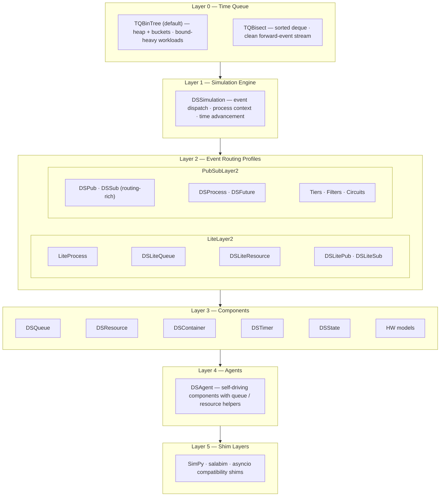

# Chapter 2: Core Design Concepts

## 2.1 The Stack

DSSim is organized in six layers. Each layer builds on the one below it and can be used independently.



### Layer 0 — Time Queue

The time queue is the engine's memory. Every scheduled event is stored as a `(time, subscriber, event_object)` tuple in a sorted structure. When the simulation runs, it repeatedly pops the earliest bucket and delivers the events inside it.

- Insert: O(log n) search into a sorted list of time buckets.
- Pop: O(1) removal of the front bucket.
- Zero-time events bypass the sorted structure and are always drained before advancing time.

Nothing at this layer knows about processes, publishers, or routing. It is a pure scheduling primitive.

DSSim ships two Layer 0 implementations, selectable at construction time via the `timequeue=` parameter:

```python
from dssim import DSSimulation, TQBinTree, TQBisect

sim = DSSimulation()                        # TQBinTree — default
sim = DSSimulation(timequeue=TQBisect)      # TQBisect
```

**`TQBinTree`** (default) uses a min-heap of timestamps plus one FIFO bucket per timestamp. It handles arbitrary insertion patterns efficiently and degrades gracefully when many distinct future timestamps are in flight simultaneously — for example, when resources, timeouts, and process wake-ups are all competing. It is the safer general-purpose choice.

**`TQBisect`** uses a sorted deque with a bisect-based insertion. It has lower per-operation overhead on clean insertion patterns where new events tend to land near the end of the queue (close to or beyond the current horizon). It is the better choice for models with a regular, forward-moving event stream and few cancellations or mid-queue insertions.


### Layer 1 — Simulation Engine

`DSSimulation` sits on top of the time queue and provides the main event loop. Its responsibilities are:

- Advancing simulation time to the next event.
- Dispatching the event to the right subscriber via `send_object()`.
- Tracking which process is currently running (`pid`), so that wait registrations are attributed to the right owner.
- Providing `schedule_event()`, `signal()`, and `cleanup()` as the fundamental building blocks that all higher layers use.

The engine itself is unaware of pubsub routing or conditions. It only knows how to move time forward and call `send(event)` on a subscriber.

### Layer 2 — Event Routing Profiles

Layer 2 is where the simulation's programming model is defined. DSSim ships two Layer 2 profiles, selectable at construction time:

```python
sim = DSSimulation()                    # PubSubLayer2 (default)
sim = DSSimulation(layer2=LiteLayer2)   # LiteLayer2
```

Both profiles provide the publisher/subscriber concept — a publisher fires events and delivers them to a list of subscribers. They differ in routing richness:

**LiteLayer2** is the lightweight profile. Its pub/sub primitive (`DSLitePub` / `DSLiteSub`) does simple fan-out: every event is delivered to all subscribers in registration order. There are no tiers, no condition filtering, and no circuit machinery. It also provides generators and coroutines as schedulable units, plus queue and resource primitives. It is the right choice when you want maximum throughput and your model does not need selective routing.

**PubSubLayer2** is the routing-rich profile. Its pub/sub primitive (`DSPub` / `DSSub`) extends fan-out with four ordered delivery tiers, condition-filtered wake-ups, composable filter circuits, futures, and context managers for safe complex wait patterns. All PubSubLayer2 components are built on top of these routing primitives. The rest of this guide focuses on PubSubLayer2. See [Chapter 3](03-pubsub-layer2.md) for a full breakdown.

The two profiles were designed with interchangeability in mind. Switching between them requires only changing the `layer2=` argument at simulation construction. Moving from Lite to PubSub is straightforward — PubSub is a superset. Moving the other way is possible with some limitations: tier-based routing, condition filtering, and circuits have no Lite equivalent and must be removed or rewritten.

#### Which profile to use

| Situation | Recommendation |
|---|---|
| Small or exploratory project | **PubSubLayer2** — full features available from the start without any upfront commitment |
| Debugging and observability matter | **PubSubLayer2** — built-in probes, `POST_HIT`/`POST_MISS` tiers, and condition filtering make failures visible |
| Simulation throughput is the primary constraint | **LiteLayer2** — lower per-event overhead, no routing machinery |
| Unsure | Start with **LiteLayer2**; switch to PubSubLayer2 when you hit the first blocker (conditions, probes, tiers) |

Switching from Lite to PubSub later is a one-line change at construction. The only work is adding tier arguments to `add_subscriber` calls and, if needed, adopting conditions and circuits. Switching in the other direction requires removing those features.

#### Choosing a time queue

The two time queue implementations provide **identical functionality** — the choice is purely a performance trade-off. Neither adds nor removes any simulation features; swapping one for the other is always a one-argument change with no model code affected.

| Implementation | Internal structure | Better for |
|---|---|---|
| `TQBinTree` *(default)* | Min-heap of timestamps + one FIFO bucket per timestamp | Models with many concurrent timeouts, resource bounds, or frequent mid-queue insertions |
| `TQBisect` | Sorted deque with bisect insertion | Models with a regular forward-moving event stream and few or no mid-queue operations |

Because performance depends on your specific event pattern, the recommended approach is to **benchmark both** on your model and keep whichever is faster. Switching is a single constructor argument:

```python
sim = DSSimulation(timequeue=TQBisect)   # try the alternative; revert if no improvement
```

### Layer 3 — Components

Built on Layer 2: component availability depends on the selected profile. `DSQueue`/`DSResource` are available in both profiles (via `DS*` in PubSub and `DSLite*` in Lite). `DSContainer`, `DSState`, and the hardware models are PubSub-focused.

### Layer 4 — Agents

`DSAgent` is built on Layer 3 and adds a self-driving process with ergonomic helpers for queue and resource operations. It is the recommended building block for components that own their own behavior loop.

### Layer 5 — Shim Layers

Compatibility adapters for SimPy, salabim, and asyncio. Shims sit above the DSSim runtime and translate the foreign framework's API into DSSim calls. Migrated code and native DSSim code share the same event loop without modification. See [Chapter 9](09-shims.md).

---

## 2.2 Key Takeaways

- DSSim is a six-layer stack. Each layer adds behavior on top of the one below without coupling back down.
- Layer 0 (time queue) and Layer 1 (simulation engine) are shared by both Layer 2 profiles.
- Both Layer 2 profiles provide the publisher/subscriber concept; they differ in routing richness, not in whether pub/sub exists.
- **LiteLayer2** offers simple fan-out pub/sub (`DSLitePub`/`DSLiteSub`): all subscribers receive every event, no tiers or conditions.
- **PubSubLayer2** offers routing-rich pub/sub (`DSPub`/`DSSub`): 4-phase tiers, condition filtering, filter circuits, processes, and futures.
- The two L2 profiles are interchangeable with some limitations: switching is a one-argument change; tier-based routing and condition filtering have no Lite equivalent.
- Layer 3 components are profile-dependent: queue/resource are available in both profiles (with Lite/PubSub variants), while container/state/HW models are PubSub-focused.
- Layer 4 (`DSAgent`) adds self-driving component behavior built on top of Layer 3 components.
- Layer 5 shims (SimPy, salabim, asyncio) let migrated code coexist with native DSSim code in the same simulation.
