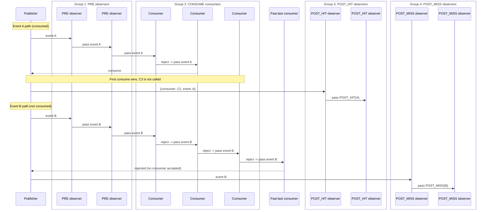
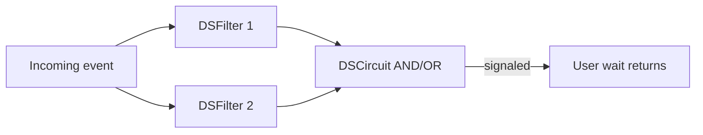

# Chapter 2: Publishers, Subscription Tiers, Filters and Observers; Events

## 2.1 Publisher -> Event -> Subscribers

The pubsub layer in DSSim is easiest to understand as a controlled event pipeline. A [publisher](glossary.md#publisher-dspub) emits one event, and the runtime decides who sees it, in what phase, and with what outcome.

At runtime, three questions are answered for every event:

1. Which subscribers are eligible in the current phase?
2. Did any consumer actually accept (consume) the event?
3. Which post-phase observers should be notified based on that outcome?

This is why DSSim pubsub feels deterministic in complex models. Delivery order and consume behavior are not hidden side effects; they are part of the explicit tier model.

Related terms: [Publisher](glossary.md#publisher-dspub), [Subscription Tier](glossary.md#subscription-tier), [Observer](glossary.md#observer), [Consumer](glossary.md#consumer).

## 2.2 Subscription Tiers (Phases)

`DSPub` uses four phases:

- `PRE`: observers that see the event before any consumer decision
- `CONSUME`: consumers that may accept or reject the event
- `POST_HIT`: observers notified when at least one consumer accepted
- `POST_MISS`: observers notified when no consumer accepted

The tier split exists for a reason. It separates monitoring from decision-making and from outcome handling. PRE hooks can log or annotate, CONSUME hooks decide ownership, and POST hooks react to result without duplicating consumer logic.

## 2.3 Minimal Example with Explanation

The following snippet creates one publisher, one PRE observer, one consumer, and two post observers:

```python
from dssim import DSSimulation, DSCallback, DSPub

sim = DSSimulation()
publisher = sim.publisher(name="publisher")

pre = DSCallback(lambda e: print("PRE:", e), sim=sim)
consume = DSCallback(lambda e: e == "A", sim=sim)  # accepts only "A"
post_hit = DSCallback(lambda e: print("POST_HIT:", e), sim=sim)
post_miss = DSCallback(lambda e: print("POST_MISS:", e), sim=sim)

publisher.add_subscriber(pre, DSPub.Phase.PRE)
publisher.add_subscriber(consume, DSPub.Phase.CONSUME)
publisher.add_subscriber(post_hit, DSPub.Phase.POST_HIT)
publisher.add_subscriber(post_miss, DSPub.Phase.POST_MISS)
```

Behavior is straightforward:

- for event `A`, consumer returns true, so `POST_HIT` runs
- for event `B`, consumer rejects, so `POST_MISS` runs

This pattern scales: add more consumers, add filters, or change notifier policy, while the phase semantics stay stable.

## 2.4 Event Flow "Animation" (Diagram)

The diagram below visualizes two event paths:

- Event `A` is consumed.
- Event `B` is rejected by all consumers.

Within `CONSUME`, rejection means "pass to next consumer". The first consumer that accepts returns `consume` to the publisher. If rejection propagates past the last consumer, the event returns as `rejected`, and the publisher routes to `POST_MISS`.



## 2.5 Advanced Publisher Techniques: Notifier Policies

Subscriber ordering inside a tier can be controlled by notifier strategy:

- `NotifierDict`: default mapping behavior; deterministic and simple.
- `NotifierRoundRobin`: rotates starting point to distribute opportunities among peers.
- `NotifierPriority`: evaluates by priority order when some subscribers should run earlier.

These policies do not change tier meaning. They only change dispatch order within a tier. That separation is useful because you can tune fairness or preference without rewriting event semantics.

## 2.6 Filtering Basics

In pubsub waits, conditions are first-class. Instead of waking on every event and re-checking in user code, you can express the condition directly in the wait call.

```python
event = await sim.wait(5, cond=lambda e: e + current_value >= 12)
```

```python
event = await sim.wait(5, cond=lambda e: queue0.full() and queue1.full())
```

These examples combine event content and model state. A timeout remains explicit, so every wait has a bounded horizon.

## 2.7 Filter Types and Composition

DSSim supports several filter forms:

- exact value match
- callable predicate
- `DSFilter`
- `DSCircuit` compositions (`AND` / `OR`, with reset behavior)

`DSFilter` wraps reusable logic. `DSCircuit` combines multiple filters into a signal-like expression. This is useful for multi-condition readiness such as "channel ready AND credit available" or "alarm OR timeout-like trigger".

See API: [PubSub Reference](../reference/pubsub.md).

## 2.8 No Spurious Event Principle

Pubsub waiting in DSSim is designed to avoid spurious user wakeups. User code resumes when condition logic actually matches, or when timeout/exception path requires it. This reduces boilerplate re-check loops and keeps process code closer to intent.

## 2.9 DSFilter / DSCircuit Conceptual Flow



Think of this flow in four steps:

1. An event arrives.
2. Each filter evaluates and updates its signal state.
3. The circuit recomputes combined truth.
4. If the circuit condition is met, waiting user code resumes.

Reset semantics define when the circuit is ready to fire again after a successful match.

## 2.10 Conclusion

Chapter 2 should leave you with a practical mental model:

- tiers define where logic belongs in the event lifecycle
- notifier strategy defines ordering policy, not meaning
- consume behavior is explicit: first accept wins, full reject routes to miss
- filter and circuit abstractions let waits express intent directly

With this model in place, the next chapter can focus on process authoring and wait patterns without re-explaining event routing fundamentals.
