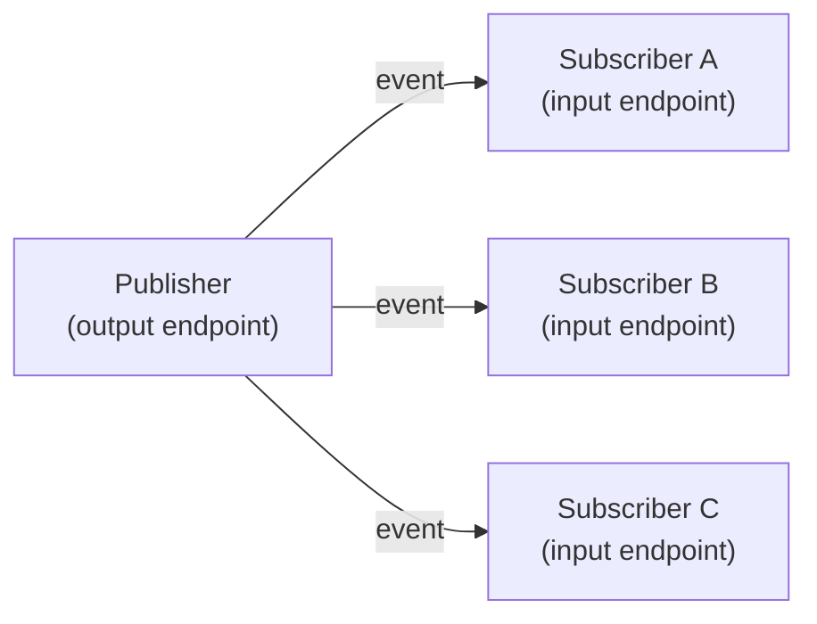
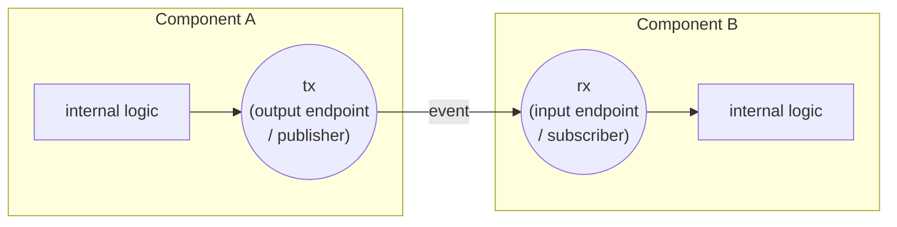
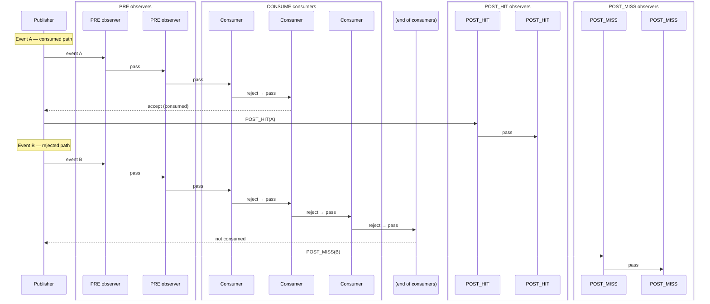

# Chapter 3: Publisher-Subscriber Principle

The publisher/subscriber principle is available in both Layer 2 profiles. A publisher is an output endpoint that fans events out to a list of subscribers. A subscriber is any object that implements `send(event)`.

LiteLayer2 covers the fan-out baseline: every event is delivered to every subscriber in registration order, with no further routing logic (`DSLitePub` / `DSLiteSub`).

PubSubLayer2 extends that baseline with routing richness: delivery tiers, condition filtering, and composable circuits. All PubSubLayer2 components — queues, resources, processes — are built on top of these routing primitives.

---

## 3.1 Sending Events Directly

A publisher is a routing convenience — it is not required. Events can be delivered to any subscriber directly using three simulation-level calls, each with different timing and safety characteristics.

### `sim.send_object(subscriber, event)` — immediate, synchronous

Calls `subscriber.send(event)` in-line before returning. The engine temporarily switches the process context to the receiver and restores it when the call completes.

```python
cb = sim.callback(lambda e: print("got:", e))
sim.send_object(cb, "hello")   # prints immediately: got: hello
```

This is the most performant path — no queue overhead, no extra dispatch cycle. However it is **only safe when the receiver does not signal back to the caller** during the same call. If the receiver re-enters the caller (directly or through a chain), Python raises `ValueError: generator already executing` — a cyclic coroutine dependency. Use it only when data flows strictly one way.

### `sim.signal(event, subscriber)` — zero delay, dispatch-safe

Enqueues the event onto the now-queue. It is delivered at the current simulation time but in a separate dispatch step, after the current step completes. No cyclic dependency is possible.

```python
proc = sim.process(my_coro()).schedule(0)
sim.signal("hello", proc)   # proc receives "hello" at t=sim.time, after this step
```

Use this when the receiver may signal back, or when strict same-time ordering between independent steps matters.

### `sim.schedule_event(delay, event, subscriber)` — future delivery, dispatch-safe

Enqueues the event onto the time queue for delivery at `sim.time + delay`. The receiver runs in a future dispatch step when time advances to that point.

```python
proc = sim.process(my_coro()).schedule(0)
sim.schedule_event(5, "alarm", proc)   # proc receives "alarm" at t=sim.time + 5
```

Use this for timer-driven wake-ups, timeouts, or any case where the event should arrive after a known delay.

### Summary

| Method | Delivery time | Dispatch step | Safe if receiver signals back? |
|---|---|---|---|
| `sim.send_object(sub, event)` | Immediate | Same — synchronous | No — cyclic risk |
| `sim.signal(event, sub)` | `sim.time` (now) | Next, in same time bucket | Yes |
| `sim.schedule_event(delay, event, sub)` | `sim.time + delay` | Future time bucket | Yes |

---

## 3.2 Subscriber Types

A subscriber is any object that implements `send(event)`. DSSim provides three ready-made subscriber types:

### Callback

A **callback** wraps a plain Python callable. `send(event)` calls the function and returns its return value. The return value matters in the CONSUME tier: a truthy return value means the event was accepted.

```python
cb = sim.callback(lambda e: print("got:", e))   # return value is None → falsy
cb = sim.callback(lambda e: e > 0)              # return value is bool → used for consume logic
```

Callbacks are synchronous — they run to completion during the dispatch step that called them.

### Coroutine / Process

A **process** wraps a generator or coroutine. `send(event)` resumes the suspended coroutine at its current `yield` / `await` point, passing the event as the return value of the wait.

```python
async def handler():
    event = await sim.wait(timeout=10)   # suspended here
    print("woken by:", event)

proc = sim.process(handler()).schedule(0)
# When proc.send("ping") is called, the coroutine resumes and prints: woken by: ping
```

Processes can suspend and resume many times. Each `wait` or `sleep` call is a suspension point; the simulation engine calls `send()` when the next event is due.

### ISubscriber / custom subscriber

Any object with a `send(event)` method qualifies. The formal interface is `ISubscriber` from `dssim.base`:

```python
from dssim.base import ISubscriber

class MyEndpoint(ISubscriber):
    def send(self, event):
        ...   # handle event; return value used in CONSUME tier
```

This is an open protocol — third-party components, migrated SimPy processes, and hardware model stubs all integrate through the same interface.

!!! tip "Prefer `ISubscriber` in LiteLayer2"
    In LiteLayer2, calling `sim.callback(fn)` wraps a plain function in a
    `DSLiteCallback` just to satisfy the subscriber interface. If you control
    the receiving class, implementing `ISubscriber` directly removes that
    translation layer — one fewer object, one fewer indirection per event.

---

## 3.3 Publishers and Subscribers

A **publisher** is a named output endpoint that delivers events to all registered subscribers. Use one when you need fan-out, tier routing, or decoupled wiring between components.



Create a publisher via the simulation factory:

```python
tx = sim.publisher(name="my_component.tx")
```

Add a subscriber and fire an event:

```python
cb = sim.callback(lambda e: print("received:", e))
tx.add_subscriber(cb)

tx.signal("hello")   # prints: received: hello
```

!!! note "PubSubLayer2"
    In PubSubLayer2, `add_subscriber` accepts an optional delivery tier argument (default is `CONSUME`):

    ```python
    tx.add_subscriber(cb, tx.Phase.CONSUME)
    ```

    In LiteLayer2, `add_subscriber` takes only the subscriber; there are no tiers.

---

## 3.4 Component Interfaces

Publishers and subscribers are the natural way to define a component's interface. An **output endpoint** sends events out — in routing terms, this is the **publisher**. An **input endpoint** accepts incoming events — in routing terms, this is the **subscriber**.

The two vocabularies refer to the same objects. Software engineers tend to think in terms of publishers and subscribers — the names used throughout the DSSim API (`add_subscriber`, `DSPub`, `DSSub`). Hardware engineers tend to think in terms of output and input ports, or endpoints — the language of signal interfaces and bus wiring diagrams. Both are correct descriptions of the same connection.



To connect two components, register B's subscriber (`rx`) on A's publisher (`tx`):

```python
A.tx.add_subscriber(B.rx)
```

That single line wires the two components together. Every event A sends on `tx` is delivered to `B.rx`. Neither component knows about the other's implementation — they only share the endpoint contract.

This composability is the core value of the publisher-subscriber principle: you can connect your component to a third-party component by subscribing to its output endpoint, or expose your own output endpoint so others can subscribe to it, without any adapter code.

---

## 3.5 Subscription Tiers

!!! note "PubSubLayer2"
    Subscription tiers are a PubSubLayer2-specific feature. LiteLayer2's `DSLitePub` delivers every event to all subscribers unconditionally.

A PubSubLayer2 publisher organizes its subscribers into four ordered phases, called **tiers**:

| Tier | Who uses it | Payload | Semantics |
|---|---|---|---|
| `PRE` | Observers, loggers, probes | original event | Always called; cannot consume the event |
| `CONSUME` | Active consumers | original event | First to accept claims the event; rest are skipped |
| `POST_HIT` | Reaction logic | `{'consumer': <who>, 'event': <original>}` | Called only when a consumer accepted |
| `POST_MISS` | Fallback logic | original event | Called only when no consumer accepted |

`POST_HIT` delivers a dict rather than the raw event so the handler knows which subscriber claimed it — useful for tracing which component processed a broadcast and for debugging routing decisions.

The tier split separates concerns cleanly: monitoring in `PRE`, ownership decision in `CONSUME`, follow-on reactions in `POST_*`. Each tier is independent; you can have any combination of subscribers in any tier.

### Event Routing Through the Tiers

The sequence diagram below shows how a publisher processes two events — one that is consumed and one that is not.



Key rules:

- **PRE** always runs in full, regardless of what happens in CONSUME.
- **CONSUME** stops at the first accepting subscriber. Later subscribers in the same tier do not see the event.
- **POST_HIT** runs if and only if at least one consumer accepted.
- **POST_MISS** runs if and only if no consumer accepted.

### Code Example

```python
from dssim import DSSimulation

sim = DSSimulation()
pub = sim.publisher(name="pub")

pub.add_subscriber(sim.callback(lambda e: print("PRE:", e)),       pub.Phase.PRE)
pub.add_subscriber(sim.callback(lambda e: e == "A"),               pub.Phase.CONSUME)
pub.add_subscriber(sim.callback(lambda e: print("POST_HIT:", e)),  pub.Phase.POST_HIT)
pub.add_subscriber(sim.callback(lambda e: print("POST_MISS:", e)), pub.Phase.POST_MISS)

sim.schedule_event(0, "A", pub)
sim.schedule_event(1, "B", pub)
sim.run(until=2)
# t=0: PRE: A  →  POST_HIT: A
# t=1: PRE: B  →  POST_MISS: B
```

---

## 3.6 Subscription Context Managers

!!! note "PubSubLayer2"
    Subscription context managers are a PubSubLayer2-specific feature.

Calling `add_subscriber` / `remove_subscriber` manually is error-prone when a subscription should only be active for the duration of one operation. PubSubLayer2 provides context managers that subscribe the current process on entry and unsubscribe it automatically on exit — even if an exception occurs.

```python
with sim.consume(pub):
    event = await sim.wait(timeout=5)
# process is no longer subscribed to pub after the block
```

The four context managers correspond directly to the four tiers:

| Context manager | Tier | The process… |
|---|---|---|
| `sim.observe_pre(pub)` | PRE | observes every event; cannot consume |
| `sim.consume(pub)` | CONSUME | competes to claim events |
| `sim.observe_consumed(pub)` | POST_HIT | sees events that were claimed by another consumer |
| `sim.observe_unconsumed(pub)` | POST_MISS | sees events that no consumer claimed |

### Multiple publishers

A single context manager can cover several publishers at once:

```python
with sim.consume(pub_a, pub_b):
    event = await sim.wait(timeout=10)
# events from either pub_a or pub_b may wake the process
```

### Combining context managers

Managers with different tiers can be merged with `+`:

```python
with sim.observe_pre(monitor_pub) + sim.consume(data_pub):
    event = await sim.wait(timeout=10)
```

The combined manager subscribes and unsubscribes both in a single `with` block.

### Nesting

Context managers stack naturally. Each level adds a subscription layer that is torn down when its block exits:

```python
with sim.observe_pre(log_pub):
    # subscribed to log_pub (PRE) here
    with sim.consume(data_pub):
        # also subscribed to data_pub (CONSUME) here
        event = await sim.wait(timeout=5)
    # data_pub subscription removed; log_pub still active
# log_pub subscription removed
```

This is particularly useful when outer context tracks a monitoring channel throughout a longer sequence while inner contexts handle individual protocol steps.

### `DSFuture` as a publisher argument

A `DSFuture` (or `DSProcess`) can be passed in place of a publisher. The context manager resolves the future's internal completion publisher and subscribes to it. This is useful when you want to combine task observation with other subscriptions or use a tier other than the default:

```python
task_a = sim.process(worker_a()).schedule(0)
task_b = sim.process(worker_b()).schedule(0)

with sim.observe_pre(task_a) + sim.observe_pre(task_b) + sim.consume(data_pub):
    while True:
        event = await sim.wait(timeout=50)
        if event is None:
            break
        if task_a.finished():
            print(f"task_a done at t={sim.time}")
        if task_b.finished():
            print(f"task_b done at t={sim.time}")
```

For waiting on a single future, `task.wait(timeout)` is the preferred shorthand — it handles subscription automatically. See [Section 4.1](04-condition-filtering.md#dsfuture-dsprocess-wait-for-completion) for the full explanation of futures as conditions.

---

## 3.7 Advanced: Notifier Policies

!!! note "PubSubLayer2"
    Notifier policies are a PubSubLayer2-specific feature. LiteLayer2 always notifies subscribers in insertion order.

Within each tier, a publisher holds a **notifier** — an object that controls the order in which subscribers are visited when an event is dispatched. The notifier is shared across all tiers of the same publisher and is set once at construction:

```python
from dssim import NotifierRoundRobin, NotifierPriority

pub = sim.publisher(name="my.pub", notifier=NotifierRoundRobin)
```

Three policies are available:

| Policy | Class | Dispatch order |
|---|---|---|
| Insertion order | `NotifierDict` *(default)* | Subscribers are visited in the order they were added. Deterministic, O(1). |
| Round-robin | `NotifierRoundRobin` | After each dispatch, the start position rotates to the subscriber after the last one visited. All subscribers get equal opportunity over time. |
| Priority | `NotifierPriority` | Subscribers are visited lowest-priority-number first. The priority is given per `add_subscriber` call. |

### `NotifierDict` — insertion order (default)

No configuration needed. Subscribers are always notified in the order they were registered:

```python
pub = sim.publisher(name="pub")   # NotifierDict is the default

pub.add_subscriber(sub_a, pub.Phase.CONSUME)   # notified first
pub.add_subscriber(sub_b, pub.Phase.CONSUME)   # notified second if sub_a rejects
```

### `NotifierRoundRobin` — fair distribution

Useful when multiple identical consumers compete for events and you want each to get an equal share over time. After each dispatch cycle, the internal queue rotates so the next event starts from where the previous one stopped:

```python
from dssim import NotifierRoundRobin

work_pub = sim.publisher(name="work", notifier=NotifierRoundRobin)

for i in range(4):
    work_pub.add_subscriber(workers[i], work_pub.Phase.CONSUME)

# Event 1: workers visited starting at index 0 → worker[0] gets first chance
# Event 2: visited starting at index 1 → worker[1] gets first chance
# Event 3: visited starting at index 2 → worker[2] gets first chance
# ...
```

Without round-robin, `worker[0]` would always be tried first and would absorb all events as long as it accepts them, starving the others.

### `NotifierPriority` — priority ordering

Subscribers are sorted by a numeric priority key; lower numbers are visited first. The priority is passed as an extra argument to `add_subscriber`:

```python
from dssim import NotifierPriority

alert_pub = sim.publisher(name="alerts", notifier=NotifierPriority)

alert_pub.add_subscriber(critical_handler, alert_pub.Phase.CONSUME, priority=0)
alert_pub.add_subscriber(normal_handler,   alert_pub.Phase.CONSUME, priority=10)
alert_pub.add_subscriber(low_handler,      alert_pub.Phase.CONSUME, priority=20)

# On each event: critical_handler is tried first, then normal_handler, then low_handler
```

This is the natural policy for preemptive resources and priority queues, where a higher-priority requester should always get first access.

When a process subscribes via a context manager, the `priority` keyword passes through to `add_subscriber` the same way:

```python
async def high_priority_worker():
    with sim.consume(alert_pub, priority=0):
        event = await sim.wait(timeout=10)

async def low_priority_worker():
    with sim.consume(alert_pub, priority=20):
        event = await sim.wait(timeout=10)
```

If both processes are blocked inside their `with` blocks simultaneously, `alert_pub` will always try `high_priority_worker` first.

### Choosing a policy

| Situation | Policy |
|---|---|
| Single consumer, or strict first-registered wins | `NotifierDict` (default) |
| Multiple identical workers, load balancing wanted | `NotifierRoundRobin` |
| Consumers have different priority levels | `NotifierPriority` |

---

## 3.8 Key Takeaways

- A publisher fans events out to all registered subscribers; a subscriber is any object with `send(event)`.
- Connecting two components is a single `add_subscriber` call on the publisher endpoint — no adapter code needed.
- LiteLayer2 (`DSLitePub`): simple fan-out, all subscribers receive every event unconditionally.
- PubSubLayer2 (`DSPub`): four tiers — PRE, CONSUME, POST_HIT, POST_MISS — separate monitoring, ownership, and reaction into distinct roles.
- PRE always runs in full; CONSUME stops at the first accepting subscriber; POST phases depend on the consume outcome.
- PubSubLayer2 subscription context managers (`sim.consume`, `sim.observe_pre`, `sim.observe_consumed`, `sim.observe_unconsumed`) subscribe the current process for the duration of a `with` block and unsubscribe automatically on exit. They can be combined with `+` and nested freely.
- Within each tier, dispatch order is controlled by the publisher's **notifier policy**: `NotifierDict` (insertion order, default), `NotifierRoundRobin` (rotating start, fair load distribution), or `NotifierPriority` (lowest number first, set per subscriber).
