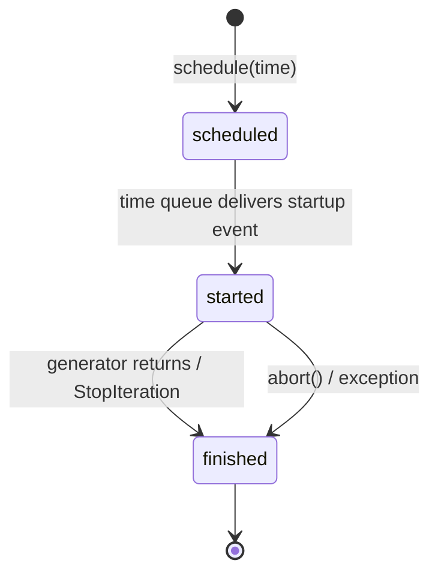

# Chapter 5: Processes

## 5.1 The Basic Concept

A _process_ in DSSim is a unit of simulation behavior that suspends at wait points and resumes when the right event arrives. From the outside, a process is just a Python object registered in the simulation. From the inside, it is a generator or coroutine that pauses at `yield` / `await` and resumes when the scheduler delivers a matching event.

There are several ways to write process logic in DSSim. The table below shows the trade-offs:

| Style | How it looks | Profile | Use case |
|---|---|---|---|
| Plain Python generator | `def proc(): yield ...` | Both | One-off, low overhead, no condition logic |
| `@DSSchedulable` function | `@DSSchedulable def proc(): return ...` | Both | Adapts a plain function to the scheduling protocol |
| `DSProcess` (recommended) | `sim.process(gen)` | PubSubLayer2 | Full lifecycle: conditions, abort, join, timeout |
| `DSAgent` subclass | `class W(DSAgent): async def process(self): ...` | PubSubLayer2 | High-level component with queue/resource helpers |

**Recommendation:** Use `DSProcess` (or `DSAgent`) in new code. Raw generators work in both profiles but lack condition filtering, abort support, and the join interface.

---

## 5.2 Creating and Scheduling a Process

A process wraps an already-instantiated generator or coroutine. You must pass either a generator object or a coroutine object — not a generator _function_:

```python
from dssim import DSSimulation

sim = DSSimulation()

def my_gen():
    print("started")
    yield  # suspend
    print("resumed")

p = sim.process(my_gen())   # wrap the generator instance
p.schedule(0)               # start at time 0
sim.run(until=10)
```

`schedule(time)` places the process in the time queue so the simulation kicks it off at `time`. Calling `schedule()` is usually the last step before `sim.run()`.

Shorthand:

```python
p = sim.process(my_gen()).schedule(0)
```

---

## 5.3 Waiting Inside a Process

The simulation only makes time advance by returning control to the scheduler at a wait point. There are three wait primitives:

### 5.3.1 `sleep` / `gsleep` — pure time delay

```python
async def ticker():
    while True:
        await sim.sleep(1)   # advance time by 1
        print(f"tick at {sim.time}")
```

`sleep` blocks for the given duration, ignoring all events. It is available in both profiles.

### 5.3.2 `wait` / `gwait` — wait with a condition

!!! note "PubSubLayer2"
    The `cond` parameter and the no-spurious-wakeup guarantee are PubSubLayer2-specific. In LiteLayer2, use `sleep` for timed delays; event-driven wake-up is handled through the queue/resource sentinel mechanism rather than a general condition.

```python
# async style (coroutine)
async def producer():
    while True:
        event = await sim.wait(timeout=5, cond=lambda e: isinstance(e, MyEvent))
        if event is None:
            print("timed out")
        else:
            print("got event:", event)

# generator style
def producer():
    while True:
        event = yield from sim.gwait(timeout=5, cond=lambda e: isinstance(e, MyEvent))
        ...
```

- `timeout` — maximum time to wait. If the timeout expires before any matching event arrives, the wait returns `None`.
- `cond` — callable or value that must match. Only events that pass the condition wake the process. Events that do not match are ignored without waking the caller.

This is the **no spurious wakeup** guarantee: user code only resumes when the condition is actually satisfied, or when the timeout expires.

### 5.3.3 `check_and_wait` — pre-check before blocking

!!! note "PubSubLayer2"
    `check_and_wait` relies on condition filtering and is available in PubSubLayer2 only.

```python
async def consumer(queue):
    # Check if already non-empty; if yes, return without blocking
    event = await sim.check_and_wait(timeout=10, cond=lambda _: len(queue) > 0)
```

`check_and_wait` evaluates the condition once immediately. If satisfied, it returns without entering the scheduler. If not satisfied, it behaves like `wait`.

---

## 5.4 `@DSSchedulable` — wrapping plain functions

Some frameworks expect a generator-compatible callable. `@DSSchedulable` turns a plain function into one:

```python
from dssim import DSSimulation, DSSchedulable

@DSSchedulable
def one_shot_task():
    return "done"

sim = DSSimulation()
p = sim.process(one_shot_task()).schedule(0)
sim.run()
print(p.value)  # "done"
```

The decorator is mainly useful for adapting non-generator code for use inside `DSProcess` or `sim.schedule()`. For new code, writing a generator or coroutine directly is usually clearer.

---

## 5.5 Process Lifecycle

!!! note "PubSubLayer2"
    The full lifecycle — including `abort()`, `join()`, and `DSFuture` integration — is a `DSProcess` (PubSubLayer2) feature. In LiteLayer2, processes are lightweight wrappers with scheduled/running/finished states but no abort or join interface.

A `DSProcess` transitions through three stages:



- **scheduled** — the process sits in the time queue, waiting for `time` to arrive. No generator code runs yet.
- **started** — the generator has received its first kick. Wait points are active.
- **finished** — the generator has returned (or failed). `p.value` holds the return value; `p.exc` holds the exception if it failed.

Check state at any time:

```python
p.started()    # True after first kick
p.finished()   # True after StopIteration or abort
p.value        # return value (set on each yield in generator style)
```

---

## 5.6 Joining Another Process

!!! note "PubSubLayer2"
    Joining relies on `DSFuture`, which is a PubSubLayer2 primitive.

You can wait for a process to complete from inside another process:

```python
async def master():
    worker = sim.process(worker_gen()).schedule(0)
    result = await sim.wait(cond=worker)   # wait until worker finishes
    print(worker.value)
```

When `cond` is a `DSFuture` (which `DSProcess` is a subtype of), DSSim automatically subscribes to the finish endpoint and resumes only when the future completes.

---

## 5.7 Aborting a Process

!!! note "PubSubLayer2"
    `abort()` and `DSAbortException` are part of the `DSProcess` lifecycle and are available in PubSubLayer2 only.

```python
p.abort()                          # sends DSAbortException into the process
p.abort(MyException("cancelled"))  # send a custom exception
```

Inside the process, `DSAbortException` behaves like any other exception — it can be caught or allowed to propagate:

```python
async def cancellable():
    try:
        await sim.sleep(100)
    except DSAbortException:
        print("I was cancelled, cleaning up")
```

If `abort()` is called before the process starts (still in scheduled state), the process is immediately marked as failed without running any generator code.

---

## 5.8 Subscribing to a Publisher Endpoint

!!! note "PubSubLayer2"
    Publisher subscription context managers use delivery tiers and are specific to PubSubLayer2. In LiteLayer2, use `DSLitePub.add_subscriber` directly; there are no tier-based context managers.

A process can register as a subscriber on a `DSPub` endpoint for the duration of a wait. DSSim provides context managers for this:

```python
async def listener(publisher):
    with sim.consume(publisher):          # subscribe to CONSUME phase
        event = await sim.wait(timeout=5)
    # automatically unsubscribed here
```

Available context managers:

| Method | Phase | Meaning |
|---|---|---|
| `sim.observe_pre(pub)` | `PRE` | See all events before consumers |
| `sim.consume(pub)` | `CONSUME` | Compete to consume events |
| `sim.observe_consumed(pub)` | `POST_HIT` | Notified after a consumer accepts |
| `sim.observe_unconsumed(pub)` | `POST_MISS` | Notified when all consumers reject |

These contexts can be combined:

```python
with sim.observe_pre(pub1) + sim.consume(pub2):
    event = await sim.wait(timeout=10)
```

A `DSProcess` used as a subscriber has its own condition stack. Events delivered to the process are checked against the current `cond` before the generator is resumed.

A minimal full example — a producer sends events, a consumer process listens:

```python
from dssim import DSSimulation, DSPub

sim = DSSimulation()
source = sim.publisher(name="source")

async def producer():
    for i in range(3):
        await sim.sleep(1)
        source.signal(i)

async def consumer():
    with sim.consume(source):
        while True:
            val = await sim.wait(timeout=5)
            if val is None:
                break
            print(f"t={sim.time}: got {val}")

sim.process(producer()).schedule(0)
sim.process(consumer()).schedule(0)
sim.run(until=10)
```

---

## 5.9 Advanced: Interruptible Context

!!! note "PubSubLayer2"
    `sim.interruptible()` uses condition filtering internally and is available in PubSubLayer2 only.

Sometimes a long sequence of waits should be cleanly interrupted when an external condition fires. The `sim.interruptible()` context manager handles this without scattering `try/except` through every wait:

```python
async def long_task(cancel_signal):
    with sim.interruptible(cond=cancel_signal) as ctx:
        # any wait inside this block can be interrupted
        await sim.sleep(10)
        event = await sim.wait(timeout=5, cond=lambda e: e == "data")
        await sim.sleep(3)
    # after the block:
    if ctx.interrupted():
        print(f"interrupted with value: {ctx.value}")
    else:
        print("completed normally")
```

When an event matches `cancel_signal` during any wait inside the `with` block, a `DSInterruptibleContextError` is raised internally and caught by the context manager. Execution continues after the `with` block. The `ctx.interrupted()` flag and `ctx.value` tell you what happened.

---

## 5.10 Advanced: Timeout Context

!!! note "PubSubLayer2"
    `sim.timeout()` is a `DSProcess` context manager available in PubSubLayer2 only.

`sim.timeout()` lets you set a deadline around a code block:

```python
async def bounded_task():
    with sim.timeout(time=5) as ctx:
        await sim.sleep(3)
        await some_long_operation()
    if ctx.interrupted():
        print("did not finish in time")
```

If the deadline fires before the `with` block exits, a `DSTimeoutContextError` is raised and caught. The `ctx.interrupted()` flag reflects whether the timeout fired.

You can also reschedule the timeout deadline:

```python
with sim.timeout(time=2) as ctx:
    result = await quick_attempt()
    ctx.reschedule(5)  # give more time if first phase succeeded
    result2 = await slow_attempt()
```

---

## 5.11 DSAgent — Process-Centric Components

!!! note "PubSubLayer2"
    `DSAgent` is built on `DSProcess` and is available in PubSubLayer2 only.

`DSAgent` is a base class that bundles a `DSProcess` with queue and resource helper methods. It is the recommended pattern when a component drives its own behavior:

```python
from dssim import DSSimulation, DSAgent

class Worker(DSAgent):
    def __init__(self, work_queue, **kwargs):
        self.work_queue = work_queue
        super().__init__(**kwargs)

    async def process(self):
        while True:
            item = await self.pop(self.work_queue, timeout=float('inf'))
            await self.sim.sleep(1)   # model processing time
            print(f"{self.name}: processed {item}")

sim = DSSimulation()
q = sim.queue(capacity=10)
worker = Worker(q, name="worker", sim=sim)

for i in range(5):
    q.put_nowait(f"task-{i}")

sim.run(until=20)
```

`DSAgent` auto-starts its own process at time 0. The `process()` method can be a coroutine (`async def`) or a generator function (`def ... yield`). Queue and resource helpers (`enter`, `pop`, `get`, `put`, etc.) are available as methods on the agent.

See [Chapter 6](06-components.md) for details on `DSQueue`, `DSContainer`, and `DSResource`.

---

## 5.12 Key Takeaways

- Plain generators and coroutines plus `sleep` are available in both profiles.
- `sim.wait(timeout, cond)` and `check_and_wait` are **PubSubLayer2** — condition filtering with no spurious wakeups.
- `DSProcess` full lifecycle (abort, join via `DSFuture`) is **PubSubLayer2**.
- Publisher subscription context managers (`sim.consume`, `sim.observe_pre`, etc.) are **PubSubLayer2** — they rely on delivery tiers.
- `sim.interruptible()` and `sim.timeout()` are **PubSubLayer2** context managers for bounded cancellation.
- `DSAgent` is the recommended self-driving component pattern and is **PubSubLayer2**.
