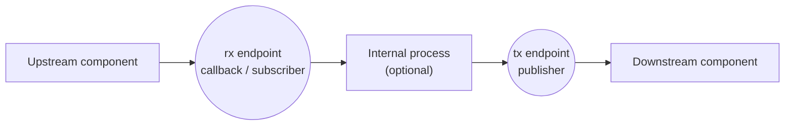

# Chapter 7: Basic HW Components

## 7.1 The DSComponent Concept

`DSComponent` is the base class for everything in DSSim that has an identity and belongs to a simulation. That means queues, resources, publishers, processes, agents, and every hardware model component all inherit from it.

The minimal obligations of `DSComponent` are:

1. A `name` string for identification and debugging.
2. A `sim` reference — the `DSSimulation` instance this component lives in.

```python
from dssim.base import DSComponent

class MyComponent(DSComponent):
    def __init__(self, **kwargs):
        super().__init__(**kwargs)   # accepts name=, sim=
        # component-level setup here
```

Components register with the simulation at construction time. The `sim` parameter can be omitted if a global singleton simulation exists (via `DSComponentSingleton`).

### Component Anatomy

A hardware-style component typically has:

- **Input endpoints** — callbacks or subscribers where events arrive.
- **Output endpoints** — publishers that send events downstream.
- **Internal process** — optional logic that advances between waits.
- **State** — fields updated as events flow.



This endpoint-to-process-to-endpoint pattern is the standard building block for hardware modeling in DSSim.

---

## 7.2 Building a Custom Component

Here is a minimal component that receives events on an input callback, delays them, and forwards them on an output publisher:

```python
from dssim import DSSimulation, DSComponent

class DelayedForwarder(DSComponent):
    def __init__(self, delay, **kwargs):
        super().__init__(**kwargs)
        self.delay = delay

        # input endpoint: any dict event arriving here is forwarded
        self.rx = self.sim.kw_callback(self._on_receive, name=self.name + ".rx")
        # output endpoint
        self.tx = self.sim.publisher(name=self.name + ".tx")

    def _on_receive(self, **event):
        # Schedule a delayed re-send on the output
        self.sim.schedule_event(self.delay, event, self.tx)

sim = DSSimulation()
fwd = DelayedForwarder(delay=2, name="forwarder", sim=sim)

# Wire up a callback to observe the output
obs = sim.callback(lambda e: print(f"t={sim.time}: forwarded {e}"))
fwd.tx.add_subscriber(obs, fwd.tx.Phase.CONSUME)

# Drive input with a few events
sim.schedule_event(0, {"msg": "hello"}, fwd.rx)
sim.schedule_event(1, {"msg": "world"}, fwd.rx)
sim.run(until=10)
```

Output:
```
t=2: forwarded {'msg': 'hello'}
t=3: forwarded {'msg': 'world'}
```

---

## 7.3 Adding a Process to a Component

Some components need richer internal behavior than a single callback. A component process lets you write wait logic inside the component:

```python
from dssim import DSSimulation, DSComponent

class Arbiter(DSComponent):
    def __init__(self, n_inputs, **kwargs):
        super().__init__(**kwargs)
        self.inputs = [self.sim.queue(name=f"{self.name}.in{i}") for i in range(n_inputs)]
        self.tx = self.sim.publisher(name=self.name + ".tx")
        # Start the internal process
        self.sim.process(self._run()).schedule(0)

    async def _run(self):
        while True:
            # Poll all input queues
            for q in self.inputs:
                item = q.get_nowait()
                if item is not None:
                    self.tx.signal(item)
                    break
            else:
                # None ready: wait for any queue to become non-empty
                await self.sim.sleep(1)
```

---

## 7.4 DSStatefulComponent

`DSStatefulComponent` extends `DSComponent` with a `tx_changed` publisher. Subclass it when your component maintains observable state:

```python
from dssim.pubsub.components.base import DSStatefulComponent

class Counter(DSStatefulComponent):
    def __init__(self, **kwargs):
        super().__init__(**kwargs)
        self._count = 0

    def increment(self):
        self._count += 1
        self.sim.signal(self.tx_changed, self)   # notify observers

    @property
    def count(self):
        return self._count
```

Observers can wait for count changes:

```python
async def watcher(counter):
    with sim.consume(counter.tx_changed):
        await sim.wait(timeout=10, cond=lambda e: e.count >= 5)
    print(f"counter reached 5 at t={sim.time}")
```

---

## 7.5 Built-in HW Components

DSSim includes two ready-made hardware models under `dssim.pubsub.components`.

### 7.5.1 Timer

`Timer` is a periodic clock with start/stop/pause/resume control. See [Section 5.6](06-components.md#66-timer-and-state) for the full API.

Typical use in a hardware model:

```python
from dssim.pubsub.components.time import Timer

sim = DSSimulation()

# A 10 MHz clock with limited cycle count
clk = Timer(period=0.1e-6, repeats=1000, sim=sim)
edge = sim.callback(lambda e: ...)
clk.tx.add_subscriber(edge, clk.tx.Phase.CONSUME)
clk.start(clk.period, clk.counter)
sim.run(until=1e-3)
```

### 7.5.2 UART

A noisy UART line model is provided in `dssim.pubsub.components.hw.uart`:

```python
from dssim.pubsub.components.hw.uart import UARTNoisyLine

line = UARTNoisyLine(bit_error_probability=1e-6, name="uart_line", sim=sim)
# line.rx — input endpoint (callback)
# line.tx — output publisher
```

The model introduces random bit errors based on a configurable probability. You connect `line.rx` to the transmitter and `line.tx` to the receiver.

---

## 7.6 Example: A Complete Producer-Processor Chain

The following ties together the concepts from this chapter into a small hardware-style pipeline:

```python
from dssim import DSSimulation, DSComponent

sim = DSSimulation()

# Stage 1: Packet source
class PacketSource(DSComponent):
    def __init__(self, tx, **kwargs):
        super().__init__(**kwargs)
        self.tx = tx
        self.sim.process(self._run()).schedule(0)

    async def _run(self):
        for seq in range(5):
            await self.sim.sleep(1)
            self.tx.signal({"seq": seq, "data": b"payload"})

# Stage 2: Processing queue
q = sim.queue(capacity=4)
bus = sim.publisher(name="bus")
q_feeder = sim.callback(lambda e: q.put_nowait(e))
bus.add_subscriber(q_feeder, bus.Phase.CONSUME)

# Stage 3: Consumer
async def worker():
    while True:
        pkt = await q.get(timeout=float('inf'))
        await sim.sleep(0.5)   # process time
        print(f"t={sim.time:.1f}: processed seq={pkt['seq']}")

sim.process(worker()).schedule(0)
PacketSource(tx=bus, name="source", sim=sim)
sim.run(until=20)
```

---

## 7.7 Key Takeaways

- `DSComponent` is the base for all named simulation objects; pass `name=` and `sim=` at construction.
- Hardware-style models have input endpoints (callbacks/subscribers), optional internal processes, and output endpoints (publishers).
- Use `DSStatefulComponent` when the component should broadcast state changes.
- `Timer` and `UARTNoisyLine` are ready-made building blocks.
- For custom components, wire up `sim.process(...)`, `sim.publisher(...)`, and `sim.kw_callback(...)` inside `__init__`.
