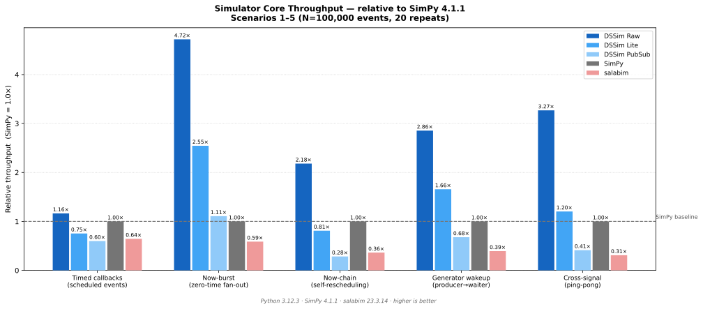
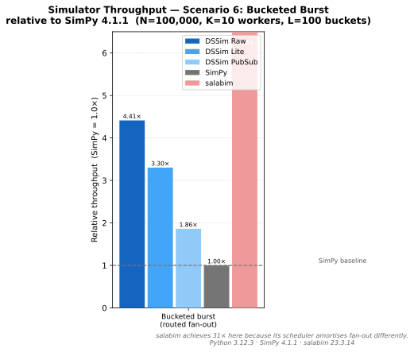
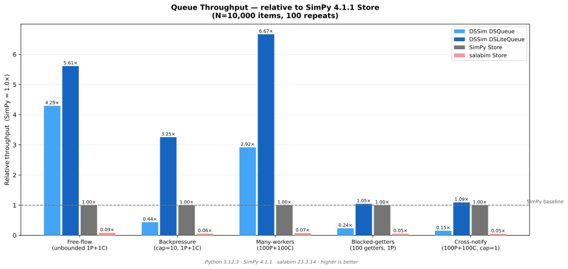
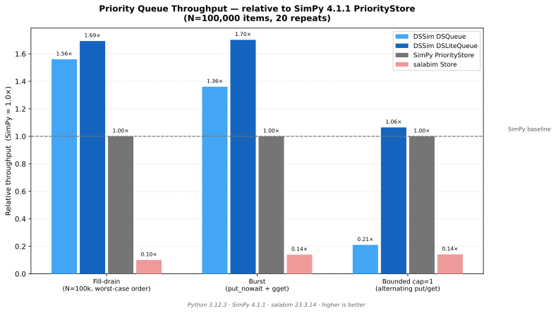
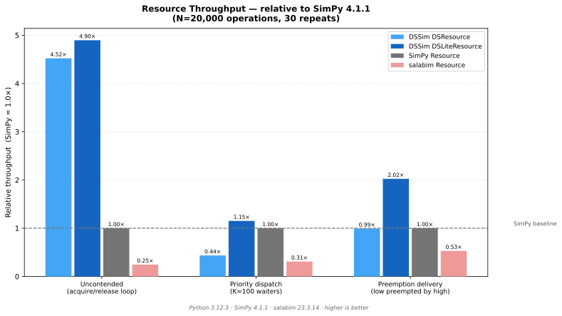
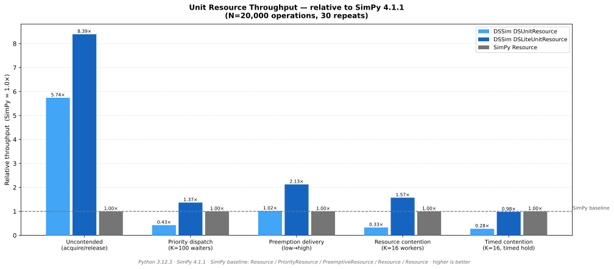

# Chapter 11: Benchmarks and Performance

## 11.1 Overview

DSSim ships a benchmark suite under `benchmarks/`. Each script isolates a specific aspect of simulation throughput.

All results on this page were collected on the same machine (Python 3.12.3, SimPy 4.1.1). **SimPy 4.1.1 is used as the performance baseline** — every table shows throughput relative to SimPy (1.0×). Higher is better.

Each DSSim row appears in two variants: **[BT]** = `TQBinTree` (default heap-based queue) and **[Bi]** = `TQBisect` (sorted-deque queue). See [Choosing a time queue](02-core-concepts.md#choosing-a-time-queue) for guidance on which to prefer.

Cell colours: <span class="perf-hi">green = faster than SimPy (> 1.15×)</span> · neutral = within ±15% of SimPy · <span class="perf-lo">red = slower than SimPy (< 0.85×)</span>.

To run the full DSSim + SimPy cross-TQ comparison on your own hardware:

```bash
python benchmarks/bench_simulator.py      --with-simpy --with-tq-bisect
python benchmarks/bench_queue.py          --with-simpy --with-tq-bisect
python benchmarks/bench_queue_priority.py --with-simpy --with-tq-bisect
python benchmarks/bench_resource.py       --with-simpy --with-tq-bisect
python benchmarks/bench_resource_unit.py  --with-simpy --with-tq-bisect
```

To include salabim (run separately to avoid CPU contention):

```bash
python benchmarks/bench_simulator.py --with-salabim --without-dssim-pubsub --without-dssim-lite
python benchmarks/bench_resource.py  --with-salabim
```

Absolute numbers will vary by machine. The relative ordering has been stable across environments.

---

## 11.2 Simulator Core Throughput

`bench_simulator` measures how fast the engine processes events in six scenarios, from simple timed callbacks to routed fan-out across multiple workers.

### Scenarios 1–5



| Scenario | Raw [BT] | Raw [Bi] | Lite [BT] | Lite [Bi] | PubSub [BT] | PubSub [Bi] | SimPy |
|---|---:|---:|---:|---:|---:|---:|---:|
| 1 — Timed callbacks | 1.14× | <span class="perf-hi">1.18×</span> | <span class="perf-lo">0.78×</span> | <span class="perf-lo">0.79×</span> | <span class="perf-lo">0.56×</span> | <span class="perf-lo">0.60×</span> | **1.0×** |
| 2 — Now-burst (zero-time fan-out) | <span class="perf-hi">5.01×</span> | <span class="perf-hi">5.09×</span> | <span class="perf-hi">2.59×</span> | <span class="perf-hi">2.73×</span> | 1.09× | 1.10× | **1.0×** |
| 3 — Now-chain (self-rescheduling) | <span class="perf-hi">2.24×</span> | <span class="perf-hi">2.26×</span> | <span class="perf-lo">0.83×</span> | <span class="perf-lo">0.80×</span> | <span class="perf-lo">0.28×</span> | <span class="perf-lo">0.28×</span> | **1.0×** |
| 4 — Generator wakeup (1 waiter + 1 producer) | <span class="perf-hi">3.29×</span> | <span class="perf-hi">3.16×</span> | <span class="perf-hi">1.76×</span> | <span class="perf-hi">1.79×</span> | <span class="perf-lo">0.67×</span> | <span class="perf-lo">0.68×</span> | **1.0×** |
| 5 — Cross-signal ping-pong (2 peers) | <span class="perf-hi">3.36×</span> | <span class="perf-hi">3.36×</span> | <span class="perf-hi">1.19×</span> | <span class="perf-hi">1.16×</span> | <span class="perf-lo">0.41×</span> | <span class="perf-lo">0.40×</span> | **1.0×** |

Key observations:

- **DSSim Raw** (no Layer 2) outperforms SimPy by 1.1–5.1×, peaking on zero-time dispatch where DSSim's now-queue avoids the binary-search time queue entirely.
- **DSSim Lite** beats SimPy on zero-time scenarios (2.6–2.7×) and generator wakeup (1.8×). The deficit in timed callbacks and now-chain reflects per-event scheduling overhead that SimPy's lighter callback dispatch avoids at those workloads.
- **DSSim PubSub** is slower than SimPy in most scenarios — the expected trade-off for tier routing, condition evaluation, and circuit machinery. Zero-time burst (S2) is now effectively at parity (1.09–1.10×).
- **TQBinTree ≈ TQBisect** across all S1–S5 scenarios (within 5%). TQ selection has negligible impact on these workloads.

### Scenario 6 — Bucketed Burst

Scenario 6 dispatches N events to K workers at L different time buckets — high routing diversity and many concurrent timestamps.



| Scenario | Raw [BT] | Raw [Bi] | Lite [BT] | Lite [Bi] | PubSub [BT] | PubSub [Bi] | SimPy |
|---|---:|---:|---:|---:|---:|---:|---:|
| 6 — Bucketed burst (K=10, L=100) | <span class="perf-hi">**7.87×**</span> | <span class="perf-hi">4.59×</span> | <span class="perf-hi">**4.95×**</span> | <span class="perf-hi">3.40×</span> | <span class="perf-hi">**2.29×**</span> | <span class="perf-hi">1.93×</span> | **1.0×** |

Key observations:

- **TQBinTree is the clear winner** on bucketed burst: 1.7–1.9× faster than TQBisect for DSSim. The heap-plus-bucket structure handles many concurrent distinct timestamps much better than the sorted deque's O(log N) bisection on every insert.
- This scenario is the primary guide for choosing `TQBinTree` when your model has high concurrent-timestamp diversity.

---

## 11.3 Queue Throughput

`bench_queue` compares `DSQueue` (PubSubLayer2) and `DSLiteQueue` (LiteLayer2) against SimPy `Store` on five producer/consumer patterns.



| Scenario | DSQueue [BT] | DSQueue [Bi] | DSLiteQueue [BT] | DSLiteQueue [Bi] | SimPy Store |
|---|---:|---:|---:|---:|---:|
| Free-flow (unbounded, 1P+1C) | <span class="perf-hi">4.10×</span> | <span class="perf-hi">4.07×</span> | <span class="perf-hi">5.97×</span> | <span class="perf-hi">6.01×</span> | **1.0×** |
| Backpressure (cap=10, 1P+1C) | <span class="perf-lo">0.45×</span> | <span class="perf-lo">0.45×</span> | <span class="perf-hi">3.21×</span> | <span class="perf-hi">3.21×</span> | **1.0×** |
| Many-workers (100P+100C) | <span class="perf-hi">2.87×</span> | <span class="perf-hi">3.04×</span> | <span class="perf-hi">6.02×</span> | <span class="perf-hi">5.87×</span> | **1.0×** |
| Blocked-getters (100 getters, 1P) | <span class="perf-lo">0.23×</span> | <span class="perf-lo">0.24×</span> | 1.12× | <span class="perf-hi">1.17×</span> | **1.0×** |
| Cross-notify (100P+100C, cap=1) | <span class="perf-lo">0.15×</span> | <span class="perf-lo">0.15×</span> | 1.05× | 1.07× | **1.0×** |

Key observations:

- **`DSLiteQueue` leads in every scenario** (1.0–6.0× faster than SimPy) by bypassing pubsub routing and condition evaluation entirely.
- **`DSQueue` (PubSubLayer2) is fast on free-flow and many-workers** but drops below SimPy under high contention (backpressure, blocked-getters, cross-notify). Each blocked put/get goes through a full condition-wait and subscriber-wakeup cycle. The upside is that `DSQueue` provides routing, condition filtering, probes, and circuit support that SimPy's `Store` does not.
- **TQBinTree ≈ TQBisect** for all queue scenarios (within 1–2%). TQ selection has no meaningful impact on queue throughput.

---

## 11.4 Priority Queue Throughput

`bench_queue_priority` benchmarks `DSQueue` and `DSLiteQueue` used as priority queues against SimPy's `PriorityStore`.



| Scenario | DSQueue [BT] | DSQueue [Bi] | DSLiteQueue [BT] | DSLiteQueue [Bi] | SimPy PriorityStore |
|---|---:|---:|---:|---:|---:|
| Fill-drain (N=100k, worst-case order) | <span class="perf-hi">1.45×</span> | <span class="perf-hi">1.47×</span> | <span class="perf-hi">1.61×</span> | <span class="perf-hi">1.61×</span> | **1.0×** |
| Burst — put_nowait + gget | <span class="perf-hi">1.42×</span> | <span class="perf-hi">1.39×</span> | <span class="perf-hi">1.59×</span> | <span class="perf-hi">1.61×</span> | **1.0×** |
| Burst — gput + gget | <span class="perf-hi">1.31×</span> | <span class="perf-hi">1.30×</span> | <span class="perf-hi">1.58×</span> | <span class="perf-hi">1.56×</span> | **1.0×** |
| Bounded cap=1 (alternating put/get) | <span class="perf-lo">0.23×</span> | <span class="perf-lo">0.23×</span> | 1.05× | 1.06× | **1.0×** |

Key observations:

- Both DSSim flavours beat SimPy on fill-drain and burst (1.3–1.6×) because heap operations are fast and scheduling overhead is low.
- `DSQueue` drops to 0.23× on the bounded scenario — same contention penalty seen in the regular queue benchmarks. `DSLiteQueue` maintains 1.05–1.06×.
- **TQBinTree ≈ TQBisect** across all priority queue scenarios (within 1%). TQ selection is irrelevant for queue-heavy workloads.

---

## 11.5 Resource Throughput

`bench_resource` benchmarks `DSResource` and `DSLiteResource` (variable-amount) against SimPy's `Container`. Priority/preemption scenarios have no `Container` equivalent, so SimPy rows are skipped there.



| Scenario | DSResource [BT] | DSResource [Bi] | DSLiteResource [BT] | DSLiteResource [Bi] | SimPy |
|---|---:|---:|---:|---:|---:|
| Uncontended acquire/release (N=20k) | <span class="perf-hi">3.08×</span> | <span class="perf-hi">3.27×</span> | <span class="perf-hi">3.22×</span> | <span class="perf-hi">3.10×</span> | **1.0×** |
| Priority dispatch (K=100 waiters) | <span class="perf-lo">37k ev/s</span> | <span class="perf-lo">38k ev/s</span> | 120k ev/s | 122k ev/s | — |
| Preemption delivery (N=20k) | 25k ev/s | 25k ev/s | 52k ev/s | 51k ev/s | — |
| Resource contention (K=16 workers) | <span class="perf-lo">0.32×</span> | <span class="perf-lo">0.31×</span> | <span class="perf-hi">1.28×</span> | <span class="perf-hi">1.29×</span> | **1.0×** |
| Timed contention (K=16, timed hold) | <span class="perf-lo">0.33×</span> | <span class="perf-lo">0.34×</span> | <span class="perf-hi">1.27×</span> | <span class="perf-hi">1.40×</span> | **1.0×** |

Key observations:

- **Uncontended resources**: both DSSim variants are ~3.1–3.3× faster than SimPy Container because uncontended acquire/release goes through a minimal fast path.
- **Priority dispatch**: `DSPriorityResource` (~37–38k ev/s) is slower than `DSLitePriorityResource` (~120–122k ev/s) — pubsub routing through 100 subscriber slots dominates for the PubSub variant.
- **Preemption**: `DSPriorityResource` (~25k ev/s) and `DSLitePriorityResource` (~52k ev/s) — no SimPy Container equivalent; Lite is ~2× faster by skipping condition evaluation.
- **Contention (S4, S5)**: `DSResource` (PubSub) drops to 0.31–0.34× under contention; `DSLiteResource` maintains 1.27–1.40×, beating SimPy Container.
- **TQBinTree ≈ TQBisect** across all resource scenarios (within 1–10%). Under timed contention TQBisect has a slight edge.

---

## 11.6 Unit Resource Throughput

`bench_resource_unit` benchmarks `DSUnitResource` and `DSLiteUnitResource` (unit-only, 1-token operations) against SimPy's `Resource`, `PriorityResource`, and `PreemptiveResource`.



| Scenario | DSUnitResource [BT] | DSUnitResource [Bi] | DSLiteUnitResource [BT] | DSLiteUnitResource [Bi] | SimPy |
|---|---:|---:|---:|---:|---:|
| Uncontended acquire/release (N=20k) | <span class="perf-hi">5.74×</span> | <span class="perf-hi">6.13×</span> | <span class="perf-hi">8.39×</span> | <span class="perf-hi">8.25×</span> | **1.0×** (Resource) |
| Priority dispatch (K=100 waiters) | <span class="perf-lo">0.43×</span> | <span class="perf-lo">0.44×</span> | <span class="perf-hi">1.37×</span> | <span class="perf-hi">1.44×</span> | **1.0×** (PriorityResource) |
| Preemption delivery (N=20k) | 1.02× | 1.02× | <span class="perf-hi">2.13×</span> | <span class="perf-hi">2.09×</span> | **1.0×** (PreemptiveResource) |
| Resource contention (K=16 workers) | <span class="perf-lo">0.33×</span> | <span class="perf-lo">0.33×</span> | <span class="perf-hi">1.57×</span> | <span class="perf-hi">1.66×</span> | **1.0×** (Resource) |
| Timed contention (K=16, timed hold) | <span class="perf-lo">0.28×</span> | <span class="perf-lo">0.29×</span> | 0.98× | 1.06× | **1.0×** (Resource) |

Key observations:

- **`DSLiteUnitResource` is the fastest DSSim resource** — up to 8.4× faster than SimPy `Resource` uncontended, and 1.6–1.7× faster under contention. Gains come from eliminating per-request `_Waiter` allocation and using a simpler dispatch loop (counter check only, no amount comparison).
- **`DSUnitResource` (PubSub)** has the same contention penalty as `DSResource` (0.28–0.43× under contention) due to pubsub routing overhead, but matches SimPy on preemption delivery (1.02×).
- **Priority dispatch**: `DSLiteUnitResource` (via `DSLitePriorityResource`) beats SimPy `PriorityResource` by 1.37–1.44×. `DSUnitResource` drops to 0.43–0.44× as pubsub routing over 100 blocked subscribers dominates.
- **Timed contention (S5)**: `DSLiteUnitResource` is at parity with SimPy `Resource` (0.98–1.06×). Both frameworks converge because the timed-hold workload is dominated by `time_queue` scheduling rather than dispatch overhead.
- **TQBinTree ≈ TQBisect** for most unit resource scenarios. TQBisect has a slight advantage in contention-heavy scenarios.

---

## 11.7 Generator vs. Coroutine

`bench_generator_vs_coroutine` confirms that the choice between generator syntax (`yield`) and coroutine syntax (`async def / await`) has negligible throughput impact for timed workloads, with a larger gap on zero-time burst.

| Scenario | DSSim raw generator | DSSim raw coroutine | DSSim lite generator | DSSim lite coroutine |
|---|---:|---:|---:|---:|
| Timed dispatch N=200k | ~292,000 | ~278,000 | ~227,000 | ~208,000 |
| Now-burst N=200k | ~1,537,000 | ~1,235,000 | ~800,000 | ~629,000 |

Choose based on readability. For timed workloads the cost difference is ~5–9% (negligible). For zero-time burst workloads the coroutine overhead is ~20–25% — prefer generators in tight now-queue loops if throughput matters.

---

## 11.8 Real Example: Crossroad Grid Simulation

`bench_crossroad` benchmarks a complete, domain-level simulation rather than a microbenchmark: a 2×2 grid of traffic-light-controlled intersections running for 1 simulated hour, each junction dispatching vehicles across four arms. The same model is implemented five ways:

- **DSSim PubSub** — `crossroad_pubsub.py` (PubSubLayer2, `DSLitePub` + `DSLiteCallback`)
- **DSSim Lite** — `crossroad_lite.py` (LiteLayer2, `DSLitePub` + `DSLiteCallback`)
- **DSSim Lite (direct)** — `crossroad_lite_direct.py` (LiteLayer2, simpy-like direct calls via plain callables + `ISubscriber`)
- **SimPy** — `crossroad_simpy.py`
- **salabim** — `crossroad_salabim.py`

To run it yourself:

```bash
python benchmarks/bench_crossroad.py
```

Results are shown relative to SimPy (1.0×). Higher is better.

### Scenario 1 — Straight-through routing (no travel delays)

| Implementation | Median | Performance delta vs. SimPy |
|---|---:|---:|
| DSSim PubSub [BT] | <span class="perf-lo">95.0 ms</span> | <span class="perf-lo">0.31×</span> |
| DSSim PubSub [Bi] | <span class="perf-lo">97.5 ms</span> | <span class="perf-lo">0.30×</span> |
| DSSim Lite [BT] | <span class="perf-lo">39.8 ms</span> | <span class="perf-lo">0.74×</span> |
| DSSim Lite [Bi] | <span class="perf-lo">42.2 ms</span> | <span class="perf-lo">0.70×</span> |
| DSSim Lite (direct) [BT] | <span class="perf-hi">20.9 ms</span> | <span class="perf-hi">**1.41×**</span> |
| DSSim Lite (direct) [Bi] | <span class="perf-hi">22.7 ms</span> | <span class="perf-hi">1.30×</span> |
| SimPy | 29.4 ms | **1.0×** |
| salabim | <span class="perf-lo">82.1 ms</span> | <span class="perf-lo">0.36×</span> |

### Scenario 2 — Aligned travel delays (12 s EW / 15 s NS)

Vehicles carry a timed delay between intersections, which increases the number of in-flight scheduled events at any given time.

| Implementation | Median | Performance delta vs. SimPy |
|---|---:|---:|
| DSSim PubSub [BT] | <span class="perf-lo">88.0 ms</span> | <span class="perf-lo">0.53×</span> |
| DSSim PubSub [Bi] | <span class="perf-lo">91.5 ms</span> | <span class="perf-lo">0.51×</span> |
| DSSim Lite [BT] | 45.2 ms | 1.03× |
| DSSim Lite [Bi] | 48.9 ms | 0.95× |
| DSSim Lite (direct) [BT] | <span class="perf-hi">21.6 ms</span> | <span class="perf-hi">**2.16×**</span> |
| DSSim Lite (direct) [Bi] | <span class="perf-hi">26.9 ms</span> | <span class="perf-hi">1.74×</span> |
| SimPy | 46.7 ms | **1.0×** |
| salabim | <span class="perf-lo">1332.2 ms</span> | <span class="perf-lo">0.04×</span> |

Key observations:

- **DSSim Lite (direct) [BT] is the fastest implementation** in both scenarios — 1.41× faster than SimPy in straight-through and 2.16× in the delay scenario — because direct `ISubscriber` bindings eliminate all pubsub translation overhead.
- **DSSim Lite [BT] matches SimPy** in the delay scenario (1.03×) and comes close in straight-through (0.74×), demonstrating that LiteLayer2 with `DSLiteCallback` is competitive for moderately complex models.
- **TQBinTree beats TQBisect** in both DSSim variants under delays, consistent with the S6 bucketed-burst finding: when many distinct future timestamps are in-flight simultaneously, the heap-based queue has an advantage.
- **salabim degrades by 16×** from scenario 1 to scenario 2 (82 ms → 1332 ms). Each timed delay spawns a heavyweight `Component` process, which dominates at scale. This is a fundamental design difference, not a tuning issue.
- **DSSim PubSub** pays a consistent penalty (~4–4.5× slower than Lite direct) from tier routing and condition evaluation on every vehicle dispatch.

---

## 11.9 Guidelines for Performance-Sensitive Models

1. **Use LiteLayer2** when you do not need pubsub routing, condition filtering, or circuit composition.
2. **Prefer `DSLiteUnitResource`** when all resource operations are 1-unit (mutex, semaphore, token-pool) — it eliminates per-request `_Waiter` allocation and uses a simpler dispatch loop, outperforming SimPy `Resource` by up to 8× uncontended and 1.6× under contention.
3. **Use `DSLiteQueue` / `DSLiteResource`** for high-contention components with variable amounts unless you need pubsub monitoring (`tx_nempty`, `tx_changed`).
4. **Choose `TQBinTree`** (default) when your model has many concurrent distinct timestamps or high event diversity — it wins decisively on bucketed workloads (S6) with no cost elsewhere.
5. **Choose `TQBisect`** if your model's events are predominantly sequential forward-in-time with few concurrent timestamps — it performs slightly better on timed-callback workloads (S1) with identical behavior elsewhere.
6. **Implement `ISubscriber` directly** instead of wrapping a callable in a `DSSub` / `DSLiteSub` object via `sim.subscriber()`. A class that implements `send(event)` satisfies the interface with zero translation overhead, eliminating the extra indirection layer that the built-in subscriber wrappers introduce.
7. **Keep subscriber counts small** in the CONSUME tier — hit-at-last-position throughput degrades as O(1/S).
8. **Put the most likely consumer first** in the subscriber list.
9. **Use `NotifierRoundRobin` / `NotifierPriority` only when needed** — they carry 20–40% overhead over `NotifierDict`.
10. **Batch zero-time events** where possible — `now_queue` events bypass the time-queue binary search and are significantly faster than timed events.
